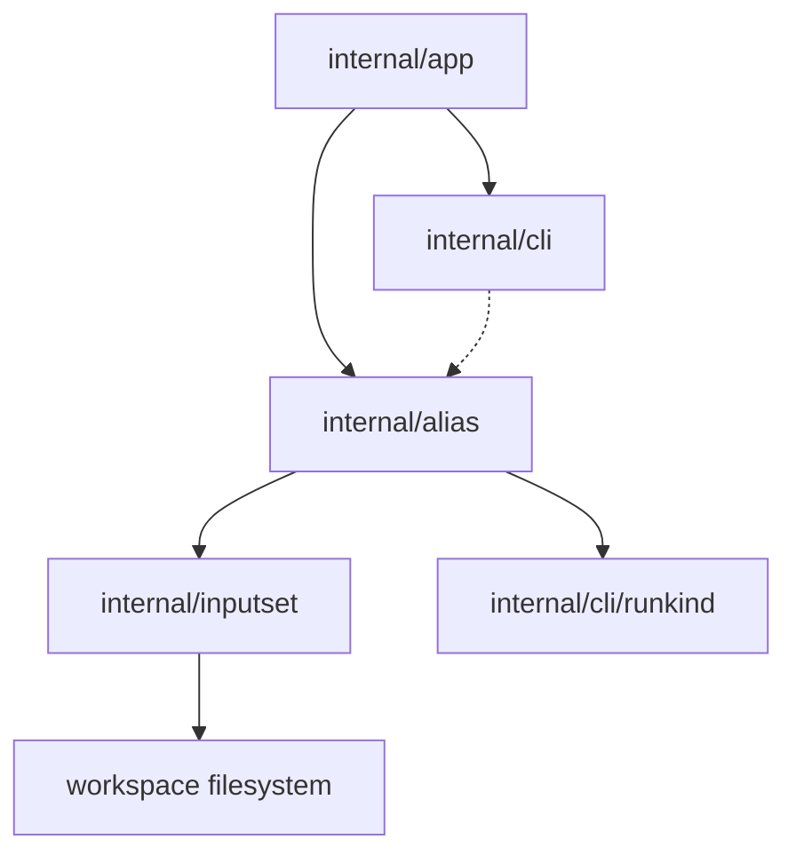

# Компонентная структура Alias Create

Этот документ определяет утвержденную внутреннюю компонентную структуру среза
`sqlrs alias create`.

Фокус: как CLI валидирует wrapped command, выводит path alias file, рендерит
repo-tracked alias payload и пишет его на диск, не смешивая это с read-only
inspection или discovery.

## 1. Scope и предпосылки

- Срез полностью **CLI-only**. Новые engine API, background service или remote
  workflow не добавляются.
- `sqlrs alias create` - единственная mutating alias-management команда в этом
  срезе.
- Команда переиспользует ту же wrapped-command grammar, что и execution:
  - `prepare:<kind>` для prepare aliases;
  - `run:<kind>` для run aliases.
- Shared file-bearing validation по-прежнему приходит из `internal/inputset`.
- `sqlrs discover --aliases` остается read-only и только печатает copy-paste
  `alias create` commands.

## 2. CLI-модули и ответственность

| Модуль | Ответственность | Примечание |
| --- | --- | --- |
| `internal/app` | Расширить command dispatch веткой `alias create`; парсить target ref, wrapped command и любые create-specific flags; резолвить workspace root / cwd; вызывать alias writer. | Владеет command-shape rules и mapping на exit codes. |
| `internal/alias` | Резолвить target alias file path, валидировать wrapped command, рендерить alias payloads и писать новые alias files. | Владеет alias-file creation semantics, а не execution semantics. |
| `internal/inputset` | Общий CLI-side источник истины для wrapped-command file-bearing semantics. | Переиспользуется execution, `diff`, `alias check`, `alias create` и discover analysis. |
| `internal/cli` | Рендерить human и JSON output для alias creation results; печатать copy-friendly command output. | Держит formatting отдельно от filesystem logic. |
| `internal/cli/runkind` | Продолжает владеть registry известных run kind. | Переиспользуется, когда create получает `run:<kind>`. |

## 3. Почему `internal/alias` владеет созданием

Создание alias - часть того же repository-facing alias lifecycle, что и scan и
inspection, но с другими обязанностями:

- валидация wrapped command делегируется в `internal/inputset`;
- вывод alias path - repo-level concern;
- запись файла и защита от accidental overwrite принадлежат alias lifecycle
  layer;
- discover pipeline остается read-only и только рендерит create commands.

Без такого разделения CLI либо продублирует wrapped-command validation, либо
смешает file-writing logic с discover/inspection code paths.

Утвержденный поток такой:

```text
resolve workspace context
-> parse wrapped command via internal/inputset
-> derive target alias path from <ref>
-> render alias payload
-> write repo-tracked alias file
-> report created file path
```

## 4. Предлагаемый layout пакетов/файлов

### `frontend/cli-go/internal/app`

- `alias_command.go`
  - Определяет `sqlrs alias create`.
  - Маршрутизирует в create handler.
  - Запрещает невалидные комбинации вроде отсутствующего wrapped command.
- `alias_command_parse.go`
  - Парсит target ref, wrapped command и create-specific flags.
  - Строит command-local option struct.

### `frontend/cli-go/internal/alias`

- `create.go`
  - Create orchestration и overwrite / workspace-boundary checks.
- `path.go`
  - Выводит target alias file path из logical ref и alias class.
- `render.go`
  - Рендерит canonical alias payload, который будет записан на диск.
- `write.go`
  - Persist-ит alias file и возвращает created path.

### `frontend/cli-go/internal/inputset`

- Shared per-kind components, выбираемые wrapped command:
  - `psql`
  - `liquibase`
  - `pgbench`

### `frontend/cli-go/internal/cli`

- `commands_alias.go`
  - `RunAliasCreate` renderers или thin orchestration wrappers.
- `alias_usage.go`
  - Usage/help text для `sqlrs alias`.

## 5. Ключевые типы и интерфейсы

- `alias.CreateOptions`
  - Workspace root, cwd, ref, wrapped command и output mode.
- `alias.CreatePlan`
  - Derived target path и rendered payload до записи файла.
- `alias.CreateResult`
  - Created path, alias class и summary для human / JSON output.
- `alias.TargetPath`
  - Workspace-bounded file path для нового alias.
- `alias.Template`
  - Canonical alias payload template, который использует writer.
- `inputset.CommandSpec`, `inputset.BoundSpec`
  - Общие staged интерфейсы, которые используются для проверки wrapped command
    до создания alias file.

## 6. Владение данными

- **Workspace root / cwd** принадлежат command context в `internal/app` и
  передаются в `internal/alias` для bounded resolution.
- **Create options и plans** живут только in-memory в рамках одного CLI
  invocation.
- **Rendered alias payloads** эфемерны до момента записи writer-ом.
- **Created alias files** становятся repository source of truth на диске.
- **No create cache** в этом срезе не вводится.

## 7. Deployment units

### CLI (`frontend/cli-go`)

Владеет всем поведением этого среза:

- command parsing;
- wrapped-command validation;
- alias file rendering;
- file creation и overwrite checks;
- human/JSON rendering.

### Local engine (`backend/local-engine-go`)

Изменений в этом срезе нет.

Alias creation не должен требовать:

- запуска engine;
- HTTP API calls;
- queue/task persistence.

### Services / remote deployments

Изменений в этом срезе нет.

Команда остается чисто локальной и repository-facing.

## 8. Диаграмма зависимостей



## 9. Ссылки

- User guide: [`../user-guides/sqlrs-aliases.md`](../user-guides/sqlrs-aliases.md)
- CLI contract: [`cli-contract.RU.md`](cli-contract.RU.md)
- Discover flow: [`discover-flow.RU.md`](discover-flow.RU.md)
- Discover component structure: [`discover-component-structure.RU.md`](discover-component-structure.RU.md)
- Shared inputset layer: [`inputset-component-structure.RU.md`](inputset-component-structure.RU.md)
- Existing CLI structure: [`cli-component-structure.RU.md`](cli-component-structure.RU.md)
