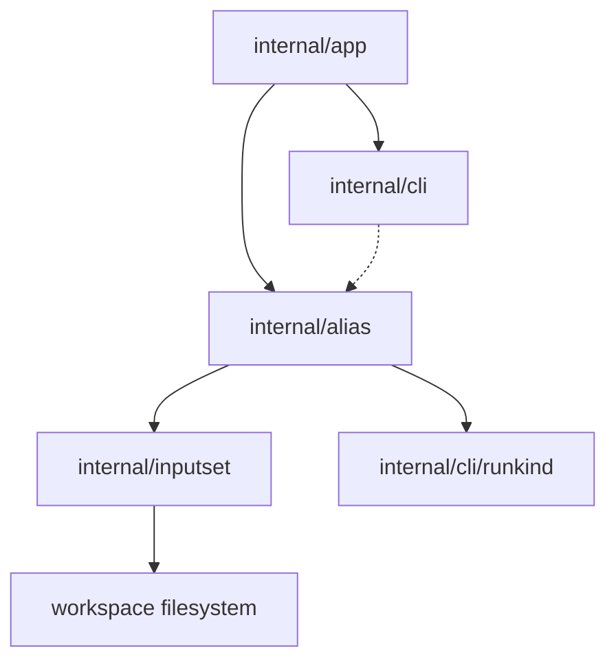

# Alias Create Component Structure

This document defines the approved internal component structure for the
`sqlrs alias create` slice.

The focus is on how the CLI validates a wrapped command, derives the alias file
path, renders the repo-tracked alias payload, and writes it to disk without
mixing that logic into read-only inspection or discovery.

## 1. Scope and assumptions

- The slice is **CLI-only**. No new engine API, background service, or remote
  workflow is introduced.
- `sqlrs alias create` is the only mutating alias-management command in this
  slice.
- The command reuses the same wrapped-command grammar as execution:
  - `prepare:<kind>` for prepare aliases;
  - `run:<kind>` for run aliases.
- Shared file-bearing validation still comes from `internal/inputset`.
- `sqlrs discover --aliases` remains read-only and only emits copy-paste
  `alias create` commands.

## 2. CLI modules and responsibilities

| Module | Responsibility | Notes |
| --- | --- | --- |
| `internal/app` | Extend command dispatch with `alias create`; parse the target ref, wrapped command, and any create-specific flags; resolve workspace root / cwd; call the alias writer. | Owns command-shape rules and exit-code mapping. |
| `internal/alias` | Resolve the target alias file path, validate the wrapped command, render alias payloads, and write new alias files. | Owns alias-file creation semantics, not execution semantics. |
| `internal/inputset` | Shared CLI-side source of truth for wrapped-command file-bearing semantics. | Reused by execution, `diff`, `alias check`, `alias create`, and discover analysis. |
| `internal/cli` | Render human and JSON output for alias creation results; print copy-friendly command output. | Keeps formatting separate from filesystem logic. |
| `internal/cli/runkind` | Continue to own the registry of known run kinds. | Reused when create receives `run:<kind>`. |

## 3. Why `internal/alias` owns creation

Alias creation is part of the same repository-facing alias lifecycle as scan
and inspection, but it has different responsibilities:

- validation of the wrapped command is delegated to `internal/inputset`;
- the alias path derivation is a repo-level concern;
- writing the file and guarding against accidental overwrite belong to the
  alias lifecycle layer;
- the discover pipeline stays read-only and only renders creation commands.

Without this split, the CLI would either duplicate wrapped-command validation
or mix file-writing logic into discover/inspection code paths.

The approved flow is:

```text
resolve workspace context
-> parse wrapped command via internal/inputset
-> derive target alias path from <ref>
-> render alias payload
-> write repo-tracked alias file
-> report created file path
```

## 4. Suggested package/file layout

### `frontend/cli-go/internal/app`

- `alias_command.go`
  - Detect `sqlrs alias create`.
  - Route to the create handler.
  - Reject invalid combinations such as a missing wrapped command.
- `alias_command_parse.go`
  - Parse the target ref, wrapped command, and create-specific flags.
  - Produce a command-local option struct.

### `frontend/cli-go/internal/alias`

- `create.go`
  - Create orchestration and overwrite / workspace-boundary checks.
- `path.go`
  - Derive the target alias file path from the logical ref and alias class.
- `render.go`
  - Render the canonical alias payload that will be written to disk.
- `write.go`
  - Persist the alias file and report the created path.

### `frontend/cli-go/internal/inputset`

- Shared per-kind components selected by the wrapped command:
  - `psql`
  - `liquibase`
  - `pgbench`

### `frontend/cli-go/internal/cli`

- `commands_alias.go`
  - `RunAliasCreate` renderers or thin orchestration wrappers.
- `alias_usage.go`
  - Usage/help text for `sqlrs alias`.

## 5. Key types and interfaces

- `alias.CreateOptions`
  - Workspace root, cwd, ref, wrapped command, and output mode.
- `alias.CreatePlan`
  - Derived target path and rendered payload before the file is written.
- `alias.CreateResult`
  - Created path, alias class, and summary for human / JSON output.
- `alias.TargetPath`
  - Workspace-bounded file path for the new alias.
- `alias.Template`
  - Canonical alias payload template used by the writer.
- `inputset.CommandSpec`, `inputset.BoundSpec`
  - Shared staged interfaces used to validate the wrapped command before the
    alias file is created.

## 6. Data ownership

- **Workspace root / cwd** is owned by command context in `internal/app` and
  passed into `internal/alias` for bounded resolution.
- **Create options and plans** live in memory only for one CLI invocation.
- **Rendered alias payloads** are ephemeral until the writer persists them.
- **Created alias files** become repository source of truth on disk.
- **No create cache** is introduced in this slice.

## 7. Deployment units

### CLI (`frontend/cli-go`)

Owns all behavior in this slice:

- command parsing;
- wrapped-command validation;
- alias file rendering;
- file creation and overwrite checks;
- human/JSON rendering.

### Local engine (`backend/local-engine-go`)

No changes in this slice.

Alias creation must not require:

- engine startup;
- HTTP API calls;
- queue/task persistence.

### Services / remote deployments

No changes in this slice.

The command remains purely local and repository-facing.

## 8. Dependency diagram



## 9. References

- User guide: [`../user-guides/sqlrs-aliases.md`](../user-guides/sqlrs-aliases.md)
- CLI contract: [`cli-contract.md`](cli-contract.md)
- Discover flow: [`discover-flow.md`](discover-flow.md)
- Discover component structure: [`discover-component-structure.md`](discover-component-structure.md)
- Shared inputset layer: [`inputset-component-structure.md`](inputset-component-structure.md)
- CLI component structure: [`cli-component-structure.md`](cli-component-structure.md)
