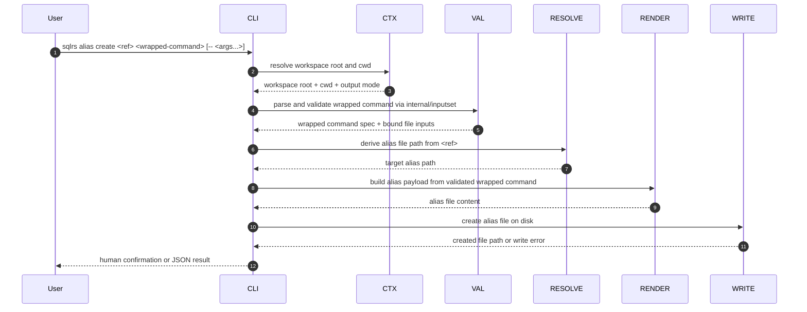

# Поток Alias Create

Этот документ описывает локальный поток взаимодействия для
`sqlrs alias create`.

Команда материализует repo-tracked alias file из wrapped execution command.
Это mutating-эквивалент read-only среза `alias ls` / `alias check`. `sqlrs
discover --aliases` может печатать copy-pasteable команду `alias create`, но
само файлы не пишет.

## 1. Участники

- **User** - вызывает `sqlrs alias create`.
- **CLI parser** - разбирает target ref и wrapped command.
- **Command context** - резолвит workspace root, cwd и output mode.
- **Wrapped-command validator** - парсит wrapped `prepare:<kind>` или
  `run:<kind>` invocation и проверяет его file-bearing inputs.
- **Alias target resolver** - маппит logical ref в path alias file.
- **Alias renderer** - преобразует валидированный wrapped command в alias file
  content.
- **Alias writer** - пишет новый alias file на диск.
- **Renderer** - печатает human или JSON result.

## 2. Поток: `sqlrs alias create`

## 3. Разбор стадий

### 3.1 Валидация wrapped command

`alias create` переиспользует ту же grammar wrapped command, что и execution
команды. Первый wrapped token выбирает семейство команды, например:

- `prepare:psql`
- `prepare:lb`
- `run:pgbench`

Валидация происходит до записи какого-либо файла. Если wrapped command
синтаксически неверен или его file-bearing arguments не проходят общие checks,
команда завершается с ошибкой.

### 3.2 Вывод target path

Target ref трактуется как cwd-relative logical stem. Команда пишет:

- `<ref>.prep.s9s.yaml` для `prepare:<kind>`
- `<ref>.run.s9s.yaml` для `run:<kind>`

При необходимости создаются parent directories. В начальном срезе существующий
target file считается ошибкой, overwrite не выполняется.

### 3.3 Рендеринг alias

Writer преобразует валидированный wrapped command в repo-tracked alias shape,
который затем используют остальные части CLI.

Начальный create-срез держит payload намеренно небольшим:

- обязательные alias class и kind;
- упорядоченные wrapped args;
- отсутствие изменений в unrelated workspace files;
- отсутствие зависимости от discovery output.

### 3.4 Интеграция с discover

`sqlrs discover --aliases` может выдать ready-to-copy команду
`sqlrs alias create ...` для каждого сильного кандидата.

Этот output advisory-only:

- discover не пишет файлы;
- пользователь может скопировать команду в shell или поправить её перед
  запуском;
- фильтрация и выбор остаются в discover, а mutation - в `alias create`.

## 4. Обработка ошибок

- Если workspace discovery не удаётся, команда завершается до валидации.
- Если wrapped command не проходит общую syntax или file-bearing validation,
  команда завершается без записи файла.
- Если target alias file уже существует, команда падает в начальном срезе.
- Если target path выходит за границы active workspace boundary, команда
  завершается с ошибкой.
- Ни один create-step не зависит от доступности engine или remote state.
