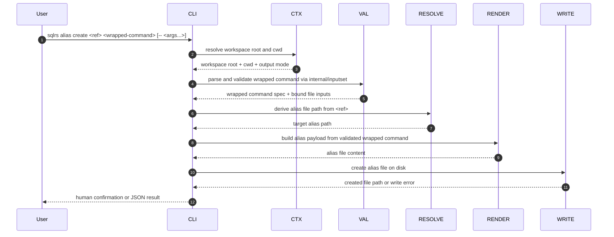

# Alias Create Flow

This document describes the local-only interaction flow for
`sqlrs alias create`.

The command materializes a repo-tracked alias file from a wrapped execution
command. It is the mutating counterpart to the read-only `alias ls` / `alias
check` slice. `sqlrs discover --aliases` may print a copy-pasteable `alias
create` command, but it never writes files itself.

## 1. Participants

- **User** - invokes `sqlrs alias create`.
- **CLI parser** - parses the target ref and wrapped command.
- **Command context** - resolves workspace root, cwd, and output mode.
- **Wrapped-command validator** - parses the wrapped `prepare:<kind>` or
  `run:<kind>` invocation and validates its file-bearing inputs.
- **Alias target resolver** - maps the logical ref to the output alias file
  path.
- **Alias renderer** - converts the validated wrapped command into alias file
  content.
- **Alias writer** - writes the new alias file to disk.
- **Renderer** - prints human or JSON results.

## 2. Flow: `sqlrs alias create`

## 3. Stage breakdown

### 3.1 Wrapped-command validation

`alias create` reuses the same wrapped-command grammar as execution commands.
The first wrapped token selects the command family, for example:

- `prepare:psql`
- `prepare:lb`
- `run:pgbench`

Validation happens before any file is written. If the wrapped command is
syntactically invalid or its file-bearing arguments fail the shared checks, the
command aborts.

### 3.2 Target path derivation

The target ref is treated as a cwd-relative logical stem. The command writes:

- `<ref>.prep.s9s.yaml` for `prepare:<kind>`
- `<ref>.run.s9s.yaml` for `run:<kind>`

Parent directories are created as needed. The initial slice treats an existing
target file as an error and does not overwrite it.

### 3.3 Alias rendering

The writer converts the validated wrapped command into the repo-tracked alias
shape used by the rest of the CLI.

The initial create slice keeps the payload intentionally small:

- required alias class and kind;
- ordered wrapped args;
- no mutation of unrelated workspace files;
- no dependence on discovery output.

### 3.4 Discovery integration

`sqlrs discover --aliases` may emit a ready-to-copy `sqlrs alias create ...`
command for each strong candidate.

That output is advisory only:

- no files are written by discover;
- the user can copy the command into the shell or edit it before running it;
- filtering and selection stay in discover, while the mutation stays in
  `alias create`.

## 4. Failure handling

- If workspace discovery fails, the command terminates before validation.
- If the wrapped command fails shared syntax or file-bearing validation, the
  command fails without writing a file.
- If the target alias file already exists, the command fails in the initial
  slice.
- If the target path escapes the active workspace boundary, the command fails.
- No create step depends on engine availability or remote state.
