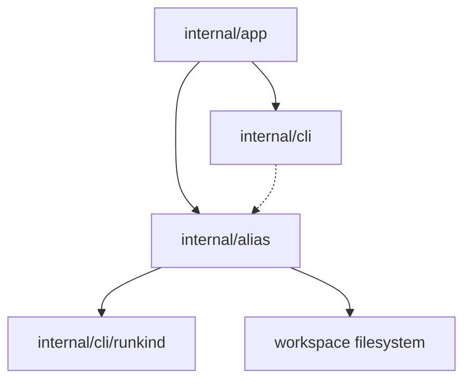

# Компонентная структура Alias Inspection

Этот документ определяет внутреннюю компонентную структуру среза
`sqlrs alias ls` / `sqlrs alias check` после CLI-контракта и дизайна
interaction flow.

Фокус документа: какие модули должны владеть scanning, single-alias
resolution, class-specific validation и output rendering.

## 1. Scope и предпосылки

- Первый срез полностью **CLI-only**. Новые engine API, background service или
  remote workflow не добавляются.
- Alias inspection должен переиспользовать уже принятые repository semantics для
  execution:
  - alias refs являются current-working-directory-relative;
  - exact-file escape использует trailing `.`;
  - file-bearing paths внутри alias files резолвятся относительно самого alias file.
- `sqlrs alias ls` остаётся inventory-first командой и терпимо относится к
  malformed files.
- `sqlrs alias check` делает только статическую проверку и никогда не запускает
  runtime work.

## 2. CLI-модули и ответственность

| Модуль                 | Ответственность                                                                                                                                                                                           | Примечание                                                                      |
| ---------------------- | --------------------------------------------------------------------------------------------------------------------------------------------------------------------------------------------------------- | ------------------------------------------------------------------------------- |
| `internal/app`         | Расширить command dispatch веткой `alias`; парсить `ls` vs `check`, selectors, scan-scope flags и single-alias mode. Резолвить workspace root / cwd и вызывать inspection services.                       | Владеет command-shape rules и mapping на exit codes.                            |
| `internal/alias` (new) | Общая локальная механика alias files: scan ограниченной directory scope, resolution одного alias target из `<ref>`, load alias files, classification alias class и validation class-specific constraints. | Это reusable library для inspection сейчас и для discover/diff follow-up позже. |
| `internal/cli`         | Рендерить human и JSON output для alias inventory и check results; печатать usage/help для `sqlrs alias`.                                                                                                 | Держит форматирование отдельно от filesystem-логики.                            |
| `internal/cli/runkind` | Продолжает владеть registry известных run kinds.                                                                                                                                                          | Переиспользуется run-alias validation.                                          |

### Почему нужен новый `internal/alias`

Существующие alias execution helpers лежат в `internal/app`, но иначе alias
inspection начнёт дублировать несколько file-level concerns:

- suffix-based detection alias class;
- workspace-bounded scan traversal;
- resolution по exact-file и stem;
- prepare-vs-run schema checks;
- alias-file-relative rebasing и existence checks для путей.

Отдельный пакет `internal/alias` делает эту механику reusable для:

- execution (`plan`, `prepare`, `run`);
- inspection (`alias ls`, `alias check`);
- последующего advisory tooling (`discover --aliases`);
- последующего repository-aware анализа (`diff` для alias-backed stages).

Первая реализация может мигрировать постепенно: `internal/app` остаётся
command orchestrator, а file-oriented alias logic уходит за границу
`internal/alias`.

## 3. Предлагаемый layout пакетов/файлов

### `frontend/cli-go/internal/app`

- `alias_command.go`
  - Определяет `sqlrs alias`.
  - Маршрутизирует в `ls` или `check`.
  - Запрещает невалидные сочетания флагов вроде `check <ref> --from ...`.
- `alias_command_parse.go`
  - Парсит selectors (`--prepare`, `--run`), scan-root options и `<ref>`.
  - Строит command-local option structs для `ls` и `check`.

### `frontend/cli-go/internal/alias` (new)

- `types.go`
  - Общие enum-ы и структуры.
- `scan.go`
  - Нормализация scan root, bounded traversal, deterministic ordering.
- `resolve.go`
  - Resolution одного alias из `<ref>` по cwd-relative stem rules и
    exact-file escape.
- `load.go`
  - Чтение YAML и минимальное извлечение alias class.
- `check.go`
  - Оркестрация статической проверки и aggregation issues.
- `prepare_handler.go`
  - Prepare-alias-specific parsing и checks.
- `run_handler.go`
  - Run-alias-specific parsing и checks.

### `frontend/cli-go/internal/cli`

- `commands_alias.go`
  - `RunAliasLs` и `RunAliasCheck` renderers или тонкие orchestration wrappers.
- `alias_usage.go`
  - Usage/help text для `sqlrs alias`.
- optional `alias_render.go`
  - Общие human/JSON rendering helpers, если output вырастет за рамки одного файла.

## 4. Ключевые типы и интерфейсы

### Базовые типы

- `alias.Class`
  - `prepare` или `run`.
- `alias.Depth`
  - `self`, `children`, `recursive`.
- `alias.ScanOptions`
  - Выбранные classes, scan root, scan depth, workspace boundary, cwd.
- `alias.Entry`
  - Inventory row для одного найденного alias file:
    - class
    - invocation ref
    - workspace-relative path
    - optional kind
    - optional lightweight read error
- `alias.Target`
  - Один resolved alias file для single-alias mode:
    - class
    - absolute path
    - invocation ref
- `alias.CheckResult`
  - Результат проверки одного alias file:
    - metadata target
    - valid flag
    - issues
- `alias.Issue`
  - Одна static validation finding:
    - code
    - message
    - optional argument/path reference

### Class-specific interface

```go
type ClassHandler interface {
    Class() Class
    Suffix() string
    Load(path string) (Definition, error)
    Check(def Definition, path string, workspaceRoot string) []Issue
}
```

Назначение:

- унифицировать prepare/run alias handling через один pipeline scanning и checking;
- не смешивать kind-specific rules с command parsing и rendering;
- дать будущим discover/diff интеграциям потреблять те же alias definitions.

`Definition` может оставаться внутренним sum type пакета `internal/alias`; app
слою не нужно знать детали YAML.

## 5. Владение данными

- **Workspace root / cwd**
  - принадлежат command context в `internal/app`; передаются в `internal/alias`
    для bounded resolution.
- **Scan results**
  - только in-memory на время одного CLI invocation.
- **Parsed alias definitions**
  - только in-memory; загружаются по требованию на файл.
- **Validation findings**
  - только in-memory; после rendering отбрасываются.
- **Repository files**
  - остаются source of truth на диске; alias cache или generated metadata в этом
    срезе не вводятся.

## 6. Deployment units

### CLI (`frontend/cli-go`)

Владеет всем новым поведением этого среза:

- command parsing;
- filesystem scanning;
- alias-file loading;
- static validation;
- human/JSON rendering.

### Local engine (`backend/local-engine-go`)

Изменений в этом срезе нет.

Alias inspection не должен требовать:

- запуска engine;
- HTTP API calls;
- queue/task persistence.

### Services / remote deployments

Изменений в этом срезе нет.

Команда остаётся чисто локальной и repository-facing.

## 7. Диаграмма зависимостей



## 8. Ссылки

- User guide: [`../user-guides/sqlrs-aliases.md`](../user-guides/sqlrs-aliases.md)
- CLI contract: [`cli-contract.RU.md`](cli-contract.RU.md)
- Interaction flow: [`alias-inspection-flow.RU.md`](alias-inspection-flow.RU.md)
- Existing CLI structure: [`cli-component-structure.RU.md`](cli-component-structure.RU.md)
