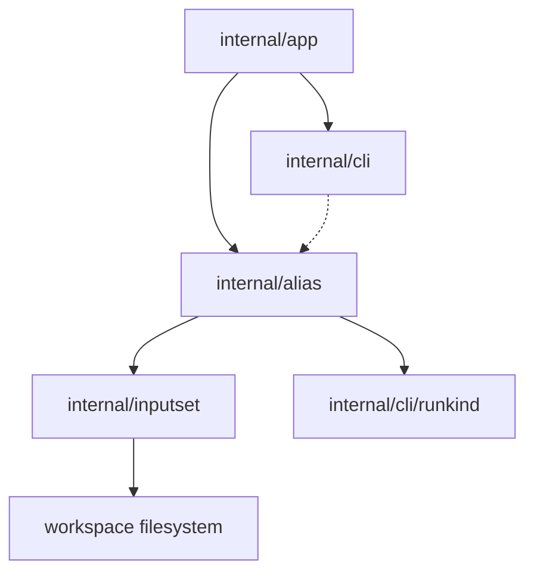

# Компонентная структура Alias Inspection

Этот документ определяет утвержденную внутреннюю компонентную структуру среза
`sqlrs alias ls` / `sqlrs alias check` после принятия shared слоя `inputset`
для kind-specific file semantics.

Фокус документа: какие модули владеют alias discovery и resolution, где живет
статическая валидация и как `alias check` переиспользует ту же file-bearing
семантику, что и execution с `diff`.

## 1. Scope и предпосылки

- Срез полностью **CLI-only**. Новые engine API, background service или remote
  workflow не добавляются.
- Alias inspection переиспользует те же repository semantics, что уже приняты
  для execution:
  - alias refs являются current-working-directory-relative;
  - exact-file escape использует trailing `.`;
  - file-bearing paths внутри alias files резолвятся относительно alias file;
  - kind-specific file semantics приходят из тех же компонентов
    `internal/inputset`, что используются execution и `diff`.
- `sqlrs alias ls` остается inventory-first командой и терпимо относится к
  malformed files.
- `sqlrs alias check` делает только статическую проверку и никогда не запускает
  runtime work.

## 2. CLI-модули и ответственность

| Модуль | Ответственность | Примечание |
|--------|-----------------|------------|
| `internal/app` | Расширить command dispatch веткой `alias`; парсить `ls` vs `check`, selectors, scan-scope flags и single-alias mode. Резолвить workspace root / cwd и вызывать inspection services. | Владеет command-shape rules и mapping на exit codes. |
| `internal/alias` | Общая механика alias files: bounded scan traversal, resolution одного alias из `<ref>`, загрузка YAML, выбор alias class и aggregation issues. | Владеет alias-specific repository semantics, но не парсит tool-kind file arguments. |
| `internal/inputset` | Общий CLI-side источник истины для file-bearing семантики `psql`, Liquibase и `pgbench`. | Переиспользуется execution, `diff` и `alias check`. |
| `internal/cli` | Рендерить human и JSON output для alias inventory и check results; печатать usage/help для `sqlrs alias`. | Держит форматирование отдельно от filesystem-логики. |
| `internal/cli/runkind` | Продолжает владеть registry известных run kind. | Переиспользуется, когда alias definition выбирает run kind. |

## 3. Почему `internal/alias` и `internal/inputset` разделены

Разделение намеренное:

- `internal/alias` владеет alias discovery, ref resolution, загрузкой YAML и
  правилами scan scope.
- `internal/inputset` владеет tool-kind file semantics, например `psql` `-f`,
  обработкой Liquibase changelog/defaults/search-path и include/graph closure.

Без такого разделения `alias check` либо продублирует логику `prepare` / `run`,
либо заставит `diff` и execution зависеть от alias-specific code path.

Утвержденный поток такой:

```text
resolve alias ref
-> load alias definition
-> choose the kind component from internal/inputset
-> bind with an alias-file-relative resolver
-> inspect DeclaredRefs() and, where enabled, Collect()
-> map findings to alias issues
```

## 4. Предлагаемый layout пакетов/файлов

### `frontend/cli-go/internal/app`

- `alias_command.go`
  - Определяет `sqlrs alias`.
  - Маршрутизирует в `ls` или `check`.
  - Запрещает невалидные сочетания флагов вроде `check <ref> --from ...`.
- `alias_command_parse.go`
  - Парсит selectors (`--prepare`, `--run`), scan-root options и `<ref>`.
  - Строит command-local option structs для `ls` и `check`.

### `frontend/cli-go/internal/alias`

- `types.go`
  - Общие enum-ы и структуры.
- `scan.go`
  - Нормализация scan root, bounded traversal, deterministic ordering.
- `resolve.go`
  - Resolution одного alias из `<ref>` по cwd-relative stem rules и
    exact-file escape.
- `load.go`
  - Чтение YAML и извлечение alias class, kind и raw command args.
- `check.go`
  - Оркестрация статической проверки и aggregation issues.
- `definition_prepare.go`
  - Prepare-alias-specific schema loading.
- `definition_run.go`
  - Run-alias-specific schema loading.

### `frontend/cli-go/internal/inputset`

- Shared per-kind компоненты, выбираемые alias definitions:
  - `psql`
  - `liquibase`
  - `pgbench`

### `frontend/cli-go/internal/cli`

- `commands_alias.go`
  - `RunAliasLs` и `RunAliasCheck` renderers или тонкие orchestration wrappers.
- `alias_usage.go`
  - Usage/help text для `sqlrs alias`.
- optional `alias_render.go`
  - Общие human/JSON rendering helpers, если output вырастет за рамки одного файла.

## 5. Ключевые типы и интерфейсы

- `alias.Class`
  - `prepare` или `run`.
- `alias.Depth`
  - `self`, `children`, `recursive`.
- `alias.ScanOptions`
  - Выбранные classes, scan root, scan depth, workspace boundary и cwd.
- `alias.Entry`
  - Inventory row для одного найденного alias file, включая invocation ref,
    workspace-relative path, optional kind и lightweight load error.
- `alias.Target`
  - Один resolved alias file для single-alias mode.
- `alias.Definition`
  - Загруженные alias metadata: class, выбранный kind и raw wrapped args.
- `alias.CheckResult`
  - Результат проверки одного alias file: metadata target, valid flag и issues.
- `alias.Issue`
  - Одна static validation finding.
- `inputset.PathResolver`, `inputset.CommandSpec`, `inputset.BoundSpec`
  - Общие staged интерфейсы, которые использует `alias check` после загрузки YAML.
- `inputset.DeclaredRef`, `inputset.InputSet`
  - Представления declared path и собранного closure, переиспользуемые для
    статической валидации.

## 6. Владение данными

- **Workspace root / cwd** принадлежат command context в `internal/app` и
  передаются в `internal/alias` для bounded resolution.
- **Scan results** живут только in-memory в рамках одного CLI invocation.
- **Parsed alias definitions** загружаются по требованию и живут в памяти
  только во время inspection.
- **Bound specs и collected input sets** эфемерны и производятся выбранным
  kind-компонентом `internal/inputset`.
- **Validation findings** живут только в памяти и отбрасываются после rendering.
- **Repository files** остаются source of truth на диске; alias cache или
  generated metadata в этом срезе не вводятся.

## 7. Deployment units

### CLI (`frontend/cli-go`)

Владеет всем поведением этого среза:

- command parsing;
- filesystem scanning;
- alias-file loading;
- reuse shared inputset;
- static validation;
- human/JSON rendering.

### Local engine (`backend/local-engine-go`)

Изменений в этом срезе нет.

Alias inspection не должен требовать:

- запуска engine;
- HTTP API calls;
- queue/task persistence.

### Services / remote deployments

Изменений в этом срезе нет.

Команда остается чисто локальной и repository-facing.

## 8. Диаграмма зависимостей



## 9. Ссылки

- User guide: [`../user-guides/sqlrs-aliases.md`](../user-guides/sqlrs-aliases.md)
- CLI contract: [`cli-contract.RU.md`](cli-contract.RU.md)
- Interaction flow: [`alias-inspection-flow.RU.md`](alias-inspection-flow.RU.md)
- Shared inputset layer: [`inputset-component-structure.RU.md`](inputset-component-structure.RU.md)
- Existing CLI structure: [`cli-component-structure.RU.md`](cli-component-structure.RU.md)
