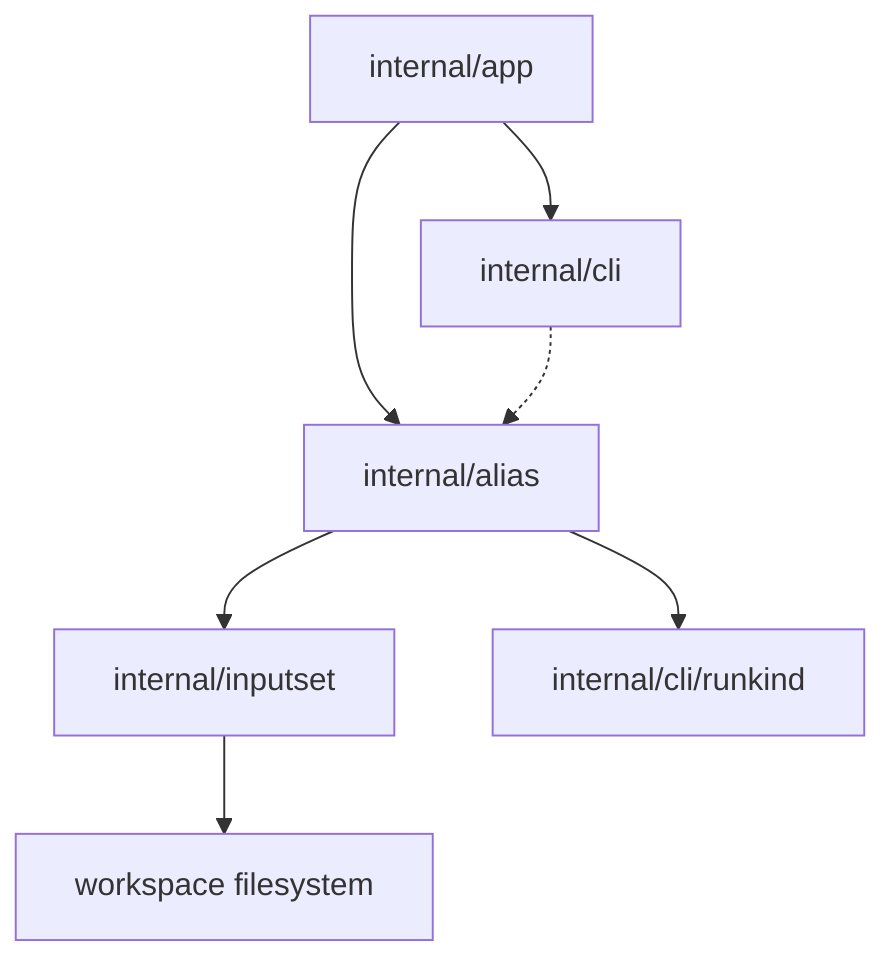

# Alias Inspection Component Structure

This document defines the approved internal component structure for the
`sqlrs alias ls` / `sqlrs alias check` slice after adopting the shared
`inputset` layer for kind-specific file semantics.

It focuses on which modules own alias discovery and resolution, where static
validation lives, and how `alias check` reuses the same file-bearing semantics
as execution and `diff`.

## 1. Scope and assumptions

- The slice is **CLI-only**. No new engine API, background service, or remote
  workflow is introduced.
- Alias inspection reuses the same repository semantics already accepted for
  execution:
  - alias refs are current-working-directory-relative;
  - exact-file escape uses a trailing `.`;
  - file-bearing paths inside alias files resolve relative to the alias file;
  - kind-specific file semantics come from the same `internal/inputset`
    components used by execution and `diff`.
- `sqlrs alias ls` is inventory-first and tolerant of malformed files.
- `sqlrs alias check` performs static validation only and never starts runtime
  work.

## 2. CLI modules and responsibilities

| Module                 | Responsibility                                                                                                                                                                  | Notes                                                                 |
| ---------------------- | ------------------------------------------------------------------------------------------------------------------------------------------------------------------------------- | --------------------------------------------------------------------- |
| `internal/app`         | Extend command dispatch with `alias`; parse `ls` vs `check`, selectors, scan-scope flags, and single-alias mode. Resolve workspace root / cwd and call the inspection services. | Owns command-shape rules and exit-code mapping.                       |
| `internal/alias`       | Shared alias-file mechanics: bounded scan traversal, single-alias resolution from `<ref>`, YAML loading, alias-class selection, and issue aggregation.                          | Owns alias-specific repository semantics, not tool-kind file parsing. |
| `internal/inputset`    | Shared CLI-side source of truth for `psql`, Liquibase, and `pgbench` file-bearing semantics.                                                                                    | Reused by execution, `diff`, and `alias check`.                       |
| `internal/cli`         | Render human and JSON output for alias inventory and check results; print alias usage/help.                                                                                     | Keeps formatting separate from filesystem logic.                      |
| `internal/cli/runkind` | Continue to own the registry of known run kinds.                                                                                                                                | Reused when alias definitions select a run kind.                      |

## 3. Why `internal/alias` and `internal/inputset` are separate

The separation is intentional:

- `internal/alias` owns alias discovery, ref resolution, YAML loading, and
  scan-scope rules.
- `internal/inputset` owns tool-kind file semantics such as `psql` `-f`,
  Liquibase changelog/defaults/search-path handling, and include/graph closure.

Without this split, `alias check` would either duplicate `prepare` / `run`
logic or force `diff` and execution to depend on alias-specific code paths.

The approved flow is:

```text
resolve alias ref
-> load alias definition
-> choose the kind component from internal/inputset
-> bind with an alias-file-relative resolver
-> inspect DeclaredRefs() and, where enabled, Collect()
-> map findings to alias issues
```

## 4. Suggested package/file layout

### `frontend/cli-go/internal/app`

- `alias_command.go`
  - Detect `sqlrs alias`.
  - Route to `ls` or `check`.
  - Reject invalid flag combinations such as `check <ref> --from ...`.
- `alias_command_parse.go`
  - Parse selectors (`--prepare`, `--run`), scan-root options, and `<ref>`.
  - Produce command-local option structs for `ls` and `check`.

### `frontend/cli-go/internal/alias`

- `types.go`
  - Shared enums and structs.
- `scan.go`
  - Scan-root normalization, bounded traversal, deterministic ordering.
- `resolve.go`
  - Single-alias resolution from `<ref>` using cwd-relative stem rules and
    exact-file escape.
- `load.go`
  - YAML reading and extraction of alias class, kind, and raw command args.
- `check.go`
  - Static validation orchestration and issue aggregation.
- `definition_prepare.go`
  - Prepare-alias-specific schema loading.
- `definition_run.go`
  - Run-alias-specific schema loading.

### `frontend/cli-go/internal/inputset`

- Shared per-kind components selected by alias definitions:
  - `psql`
  - `liquibase`
  - `pgbench`

### `frontend/cli-go/internal/cli`

- `commands_alias.go`
  - `RunAliasLs` and `RunAliasCheck` renderers or thin orchestration wrappers.
- `alias_usage.go`
  - Usage/help text for `sqlrs alias`.
- optional `alias_render.go`
  - Shared human/JSON rendering helpers if output grows beyond one file.

## 5. Key types and interfaces

- `alias.Class`
  - `prepare` or `run`.
- `alias.Depth`
  - `self`, `children`, `recursive`.
- `alias.ScanOptions`
  - Selected classes, scan root, scan depth, workspace boundary, and cwd.
- `alias.Entry`
  - Inventory row for one discovered alias file, including invocation ref,
    workspace-relative path, optional kind, and lightweight load error.
- `alias.Target`
  - One resolved alias file for single-alias mode.
- `alias.Definition`
  - Loaded alias metadata: class, selected kind, and raw wrapped args.
- `alias.CheckResult`
  - Validation result for one alias file: target metadata, valid flag, and
    issues.
- `alias.Issue`
  - One static validation finding.
- `inputset.PathResolver`, `inputset.CommandSpec`, `inputset.BoundSpec`
  - Shared staged interfaces used by `alias check` after YAML loading.
- `inputset.DeclaredRef`, `inputset.InputSet`
  - Declared-path and collected-closure views reused for static validation.

## 6. Data ownership

- **Workspace root / cwd** is owned by command context in `internal/app` and
  passed into `internal/alias` for bounded resolution.
- **Scan results** live in memory only for one CLI invocation.
- **Parsed alias definitions** are loaded on demand and remain in memory only
  while inspection runs.
- **Bound specs and collected input sets** are ephemeral and are produced by the
  selected `internal/inputset` kind component.
- **Validation findings** live in memory only and are discarded after rendering.
- **Repository files** remain the source of truth on disk; no alias cache or
  generated metadata is introduced in this slice.

## 7. Deployment units

### CLI (`frontend/cli-go`)

Owns all behavior in this slice:

- command parsing;
- filesystem scanning;
- alias-file loading;
- shared inputset reuse;
- static validation;
- human/JSON rendering.

### Local engine (`backend/local-engine-go`)

No changes in this slice.

Alias inspection must not require:

- engine startup;
- HTTP API calls;
- queue/task persistence.

### Services / remote deployments

No changes in this slice.

The command remains purely local and repository-facing.

## 8. Dependency diagram



## 9. References

- User guide: [`../user-guides/sqlrs-aliases.md`](../user-guides/sqlrs-aliases.md)
- CLI contract: [`cli-contract.md`](cli-contract.md)
- Interaction flow: [`alias-inspection-flow.md`](alias-inspection-flow.md)
- Shared inputset layer: [`inputset-component-structure.md`](inputset-component-structure.md)
- CLI component structure: [`cli-component-structure.md`](cli-component-structure.md)
