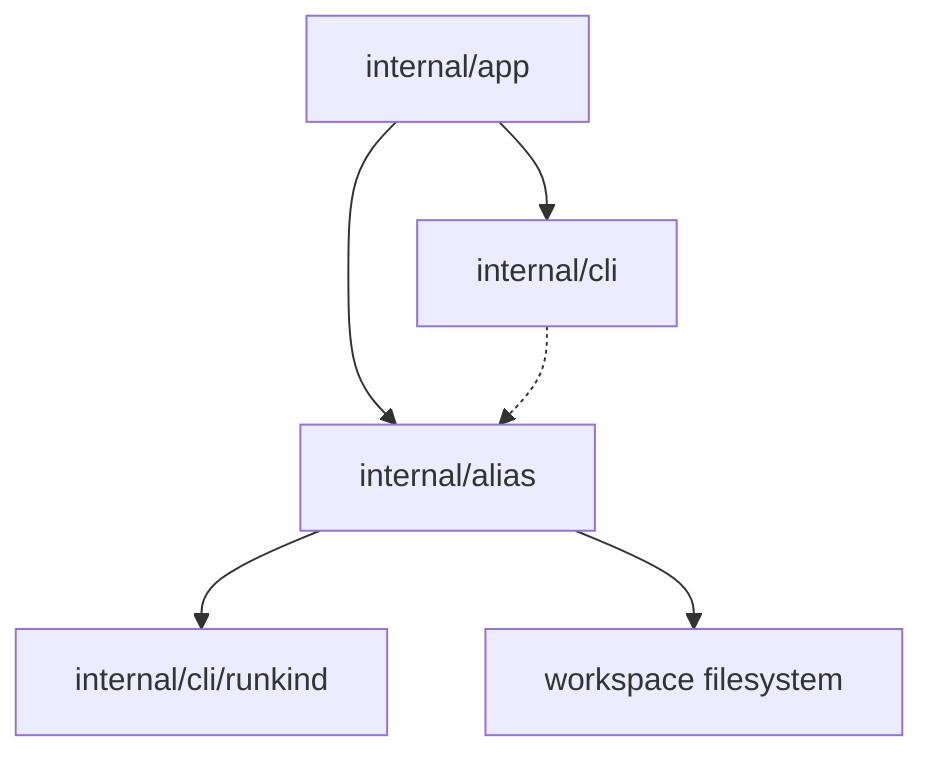

# Alias Inspection Component Structure

This document defines the internal component structure for the
`sqlrs alias ls` / `sqlrs alias check` slice after the CLI contract and the
interaction-flow design.

It focuses on which modules should own scanning, single-alias resolution,
class-specific validation, and output rendering.

## 1. Scope and assumptions

- The first slice is **CLI-only**. No new engine API, background service, or
  remote workflow is introduced.
- Alias inspection must reuse the same repository semantics already accepted for
  execution:
  - alias refs are current-working-directory-relative;
  - exact-file escape uses a trailing `.`;
  - file-bearing paths inside alias files resolve relative to the alias file.
- `sqlrs alias ls` is inventory-first and tolerant of malformed files.
- `sqlrs alias check` performs static validation only and never starts runtime
  work.

## 2. CLI modules and responsibilities

| Module                 | Responsibility                                                                                                                                                                            | Notes                                                                                        |
| ---------------------- | ----------------------------------------------------------------------------------------------------------------------------------------------------------------------------------------- | -------------------------------------------------------------------------------------------- |
| `internal/app`         | Extend command dispatch with `alias`; parse `ls` vs `check`, selectors, scan-scope flags, and single-alias mode. Resolve workspace root / cwd and call the inspection services.           | Owns command-shape rules and exit-code mapping.                                              |
| `internal/alias` (new) | Shared local alias-file mechanics: scan bounded directory scopes, resolve one alias target from `<ref>`, load alias files, classify alias class, and validate class-specific constraints. | This becomes the reusable library for inspection now and later for discover/diff follow-ups. |
| `internal/cli`         | Render human and JSON output for alias inventory and check results; print alias usage/help.                                                                                               | Keeps formatting separate from filesystem logic.                                             |
| `internal/cli/runkind` | Continue to own the registry of known run kinds.                                                                                                                                          | Reused by run-alias validation.                                                              |

### Why a new `internal/alias` package

The existing alias execution helpers live in `internal/app`, but alias
inspection would otherwise duplicate several file-level concerns:

- suffix-based alias-class detection;
- workspace-bounded scan traversal;
- exact-file and stem resolution;
- prepare-vs-run schema checks;
- alias-file-relative path rebasing and existence checks.

A dedicated `internal/alias` package keeps those mechanics reusable across:

- execution (`plan`, `prepare`, `run`);
- inspection (`alias ls`, `alias check`);
- later advisory tooling (`discover --aliases`);
- later repository-aware analysis (`diff` around alias-backed stages).

The first implementation can migrate incrementally: `internal/app` remains the
command orchestrator, while file-oriented alias logic moves behind
`internal/alias`.

## 3. Suggested package/file layout

### `frontend/cli-go/internal/app`

- `alias_command.go`
  - Detect `sqlrs alias`.
  - Route to `ls` or `check`.
  - Reject invalid flag combinations such as `check <ref> --from ...`.
- `alias_command_parse.go`
  - Parse selectors (`--prepare`, `--run`), scan-root options, and `<ref>`.
  - Produce command-local option structs for `ls` and `check`.

### `frontend/cli-go/internal/alias` (new)

- `types.go`
  - Shared enums and structs.
- `scan.go`
  - Scan-root normalization, bounded traversal, deterministic ordering.
- `resolve.go`
  - Single-alias resolution from `<ref>` using cwd-relative stem rules and
    exact-file escape.
- `load.go`
  - YAML reading and minimal class extraction.
- `check.go`
  - Static validation orchestration and issue aggregation.
- `prepare_handler.go`
  - Prepare-alias-specific parsing and checks.
- `run_handler.go`
  - Run-alias-specific parsing and checks.

### `frontend/cli-go/internal/cli`

- `commands_alias.go`
  - `RunAliasLs` and `RunAliasCheck` renderers or thin orchestration wrappers.
- `alias_usage.go`
  - Usage/help text for `sqlrs alias`.
- optional `alias_render.go`
  - Shared human/JSON rendering helpers if output grows beyond one file.

## 4. Key types and interfaces

### Core types

- `alias.Class`
  - `prepare` or `run`.
- `alias.Depth`
  - `self`, `children`, `recursive`.
- `alias.ScanOptions`
  - Selected classes, scan root, scan depth, workspace boundary, cwd.
- `alias.Entry`
  - Inventory row for one discovered alias file:
    - class
    - invocation ref
    - workspace-relative path
    - optional kind
    - optional lightweight read error
- `alias.Target`
  - One resolved alias file for single-alias mode:
    - class
    - absolute path
    - invocation ref
- `alias.CheckResult`
  - Validation result for one alias file:
    - target metadata
    - valid flag
    - issues
- `alias.Issue`
  - One static validation finding:
    - code
    - message
    - optional argument/path reference

### Class-specific interface

```go
type ClassHandler interface {
    Class() Class
    Suffix() string
    Load(path string) (Definition, error)
    Check(def Definition, path string, workspaceRoot string) []Issue
}
```

Purpose:

- unify prepare/run alias handling behind one scanning and checking pipeline;
- keep kind-specific rules out of command parsing and rendering;
- make future discover/diff integrations consume the same alias definitions.

`Definition` can remain an internal sum type owned by `internal/alias`; the app
layer does not need to know YAML details.

## 5. Data ownership

- **Workspace root / cwd**
  - Owned by command context in `internal/app`; passed into `internal/alias`
    for bounded resolution.
- **Scan results**
  - In-memory only for the duration of one CLI invocation.
- **Parsed alias definitions**
  - In-memory only; loaded on demand per file.
- **Validation findings**
  - In-memory only; discarded after rendering.
- **Repository files**
  - Remain the source of truth on disk; no alias cache or generated metadata is
    introduced in this slice.

## 6. Deployment units

### CLI (`frontend/cli-go`)

Owns all new behavior in this slice:

- command parsing;
- filesystem scanning;
- alias-file loading;
- static validation;
- human/JSON rendering.

### Local engine (`backend/local-engine-go`)

No changes in this slice.

Alias inspection must not require:

- engine startup;
- HTTP API calls;
- queue/task persistence.

### Services / remote deployments

No changes in this slice.

The command remains purely local and repository-facing.

## 7. Dependency diagram



## 8. References

- User guide: [`../user-guides/sqlrs-aliases.md`](../user-guides/sqlrs-aliases.md)
- CLI contract: [`cli-contract.md`](cli-contract.md)
- Interaction flow: [`alias-inspection-flow.md`](alias-inspection-flow.md)
- Existing CLI structure: [`cli-component-structure.md`](cli-component-structure.md)
