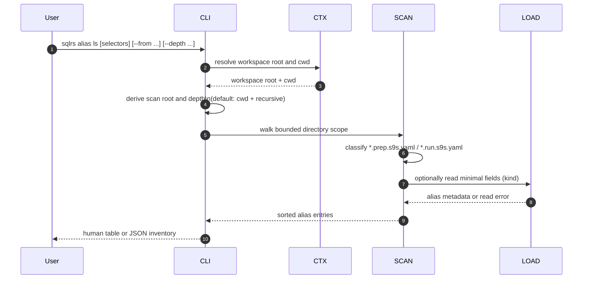
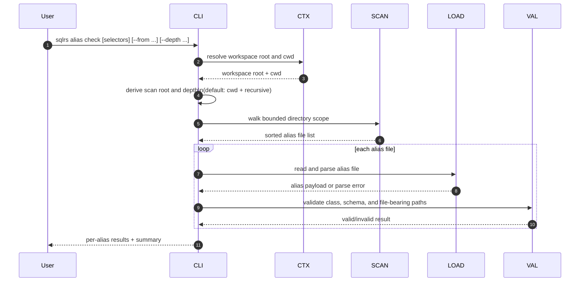
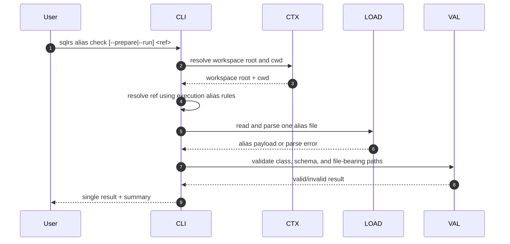

# Поток Alias Inspection

Этот документ описывает локальный поток взаимодействия для
`sqlrs alias ls` и `sqlrs alias check`.

Эти команды inspect-ят repo-tracked alias files внутри активного workspace.
Они не ходят в engine, не поднимают контейнеры и не зависят от Git-ref
resolution.

## 1. Участники

- **User** - вызывает команду alias inspection.
- **CLI parser** - разбирает subcommands, selectors и scan-scope options.
- **Command context** - резолвит workspace root и current working directory.
- **Alias scanner** - обходит выбранную directory scope и классифицирует
  `*.prep.s9s.yaml` / `*.run.s9s.yaml`.
- **Alias loader** - читает и парсит один alias file.
- **Alias validator** - применяет class-specific schema и path checks.

## 2. Поток: `sqlrs alias ls` (scan mode)

Примечания:

- `ls` требует только lightweight parsing.
- Malformed files, совпавшие по alias suffix, всё равно попадают в inventory.
- Scan root должен оставаться в пределах активной workspace boundary.

## 3. Поток: `sqlrs alias check` (scan mode)

Примечания:

- В scan mode проверяются все выбранные alias files в рамках scope.
- Exit status равен `0`, если все checked aliases валидны, `1`, если проверка
  завершилась хотя бы с одним invalid alias, и `2` для command-shape или alias
  selection errors.

## 4. Поток: `sqlrs alias check <ref>` (single-alias mode)

Примечания:

- Single-alias mode переиспользует те же current-working-directory-relative ref
  rules и exact-file escape, что и `plan`, `prepare` и `run`.
- `--from` и `--depth` в single-alias mode запрещены.
- Если один и тот же stem совпадает и с prepare-, и с run-alias file, команда
  падает, пока caller явно не выберет `--prepare`, `--run` или exact-file
  escape.

## 5. Обработка ошибок

- Если workspace discovery не удаётся, команда завершается до сканирования.
- Если выбранный scan root выходит за границы workspace, команда падает.
- `ls` терпимо относится к malformed alias files и показывает их как inventory
  entries с неполными metadata.
- `check` сообщает malformed alias files как invalid results.
- Ни одна inspection-команда не меняет runtime state и не запускает
  engine-side work.
