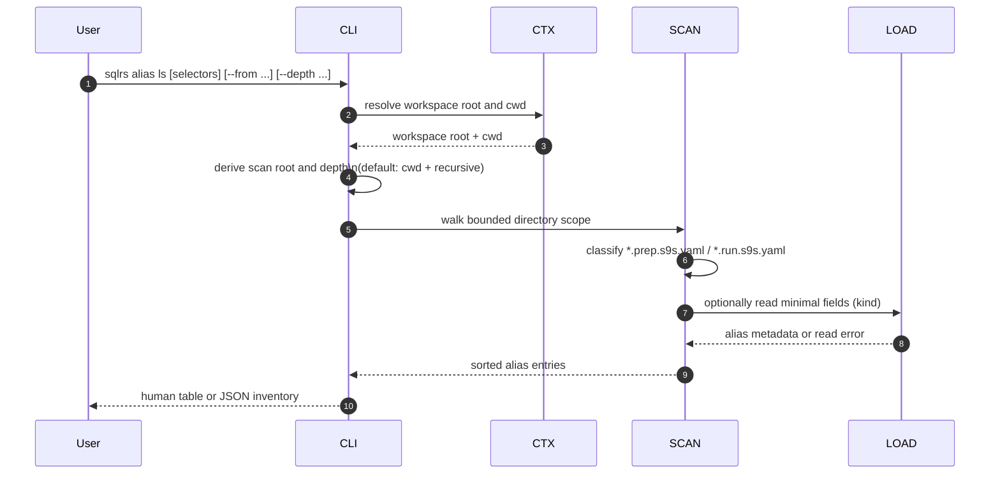
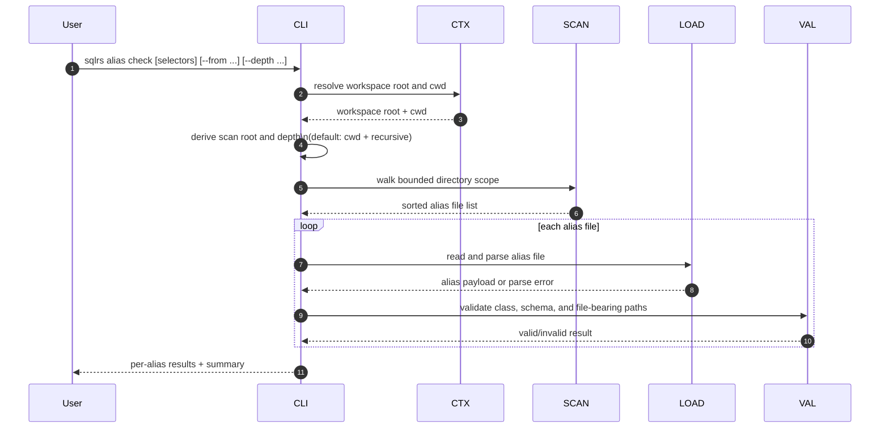
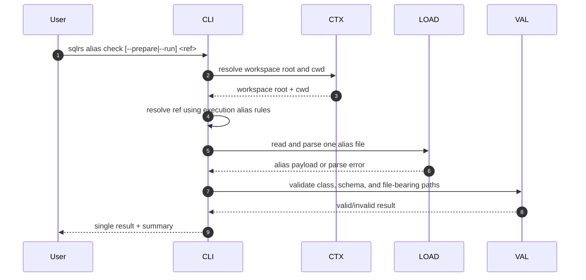

# Alias Inspection Flow

This document describes the local-only interaction flow for
`sqlrs alias ls` and `sqlrs alias check`.

These commands inspect repo-tracked alias files inside the active workspace.
They do not contact the engine, do not start containers, and do not depend on
Git-ref resolution.

## 1. Participants

- **User** - invokes an alias inspection command.
- **CLI parser** - parses subcommands, selectors, and scan-scope options.
- **Command context** - resolves workspace root and current working directory.
- **Alias scanner** - walks the selected directory scope and classifies
  `*.prep.s9s.yaml` / `*.run.s9s.yaml`.
- **Alias loader** - reads and parses one alias file.
- **Alias validator** - applies class-specific schema and path checks.

## 2. Flow: `sqlrs alias ls` (scan mode)

Notes:

- `ls` only needs lightweight parsing.
- Malformed files that match the alias suffix still appear in the inventory.
- The scan root must stay within the active workspace boundary.

## 3. Flow: `sqlrs alias check` (scan mode)

Notes:

- Scan mode validates every selected alias file in scope.
- Exit status is `0` when all checked aliases are valid, `1` when validation
  completes with at least one invalid alias, and `2` for command-shape or alias
  selection errors.

## 4. Flow: `sqlrs alias check <ref>` (single-alias mode)

Notes:

- Single-alias mode reuses the same current-working-directory-relative ref
  rules and exact-file escape as `plan`, `prepare`, and `run`.
- `--from` and `--depth` are not allowed in single-alias mode.
- If both prepare and run alias files match the same stem, the command fails
  until the caller disambiguates via `--prepare`, `--run`, or an exact-file
  escape.

## 5. Failure handling

- If workspace discovery fails, the command terminates before scanning.
- If the chosen scan root escapes the workspace boundary, the command fails.
- `ls` tolerates malformed alias files and reports them as inventory entries with
  incomplete metadata.
- `check` reports malformed alias files as invalid results.
- No inspection command mutates runtime state or starts engine-side work.
