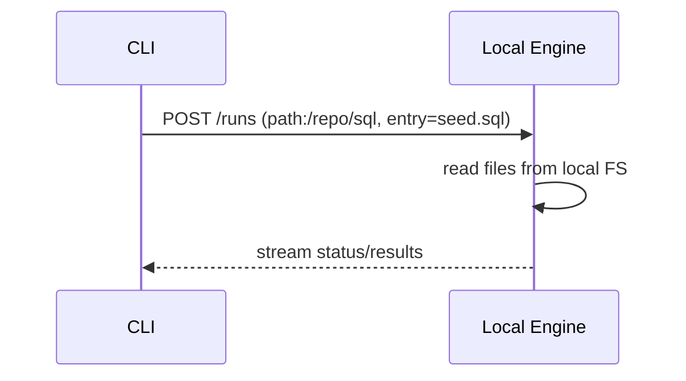
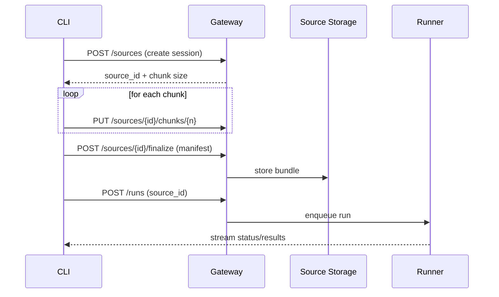
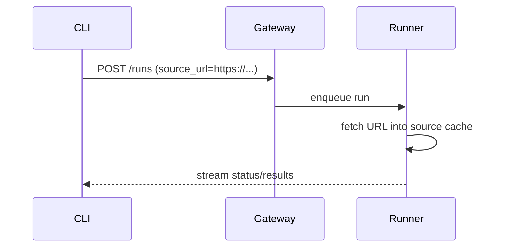
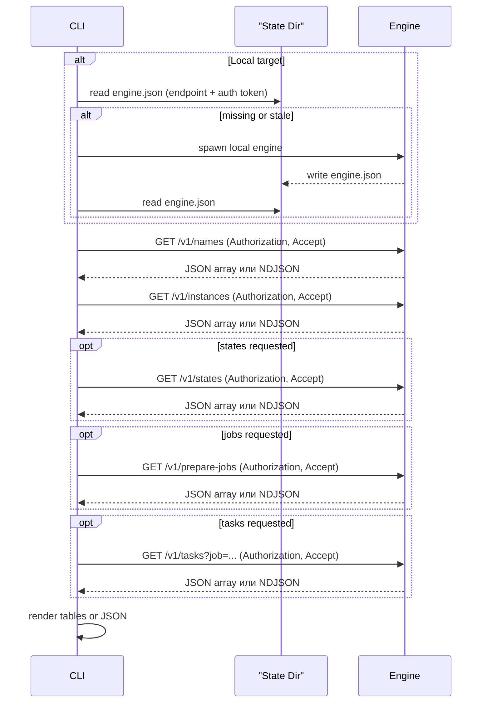
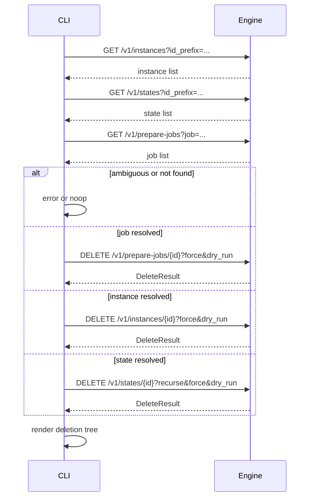
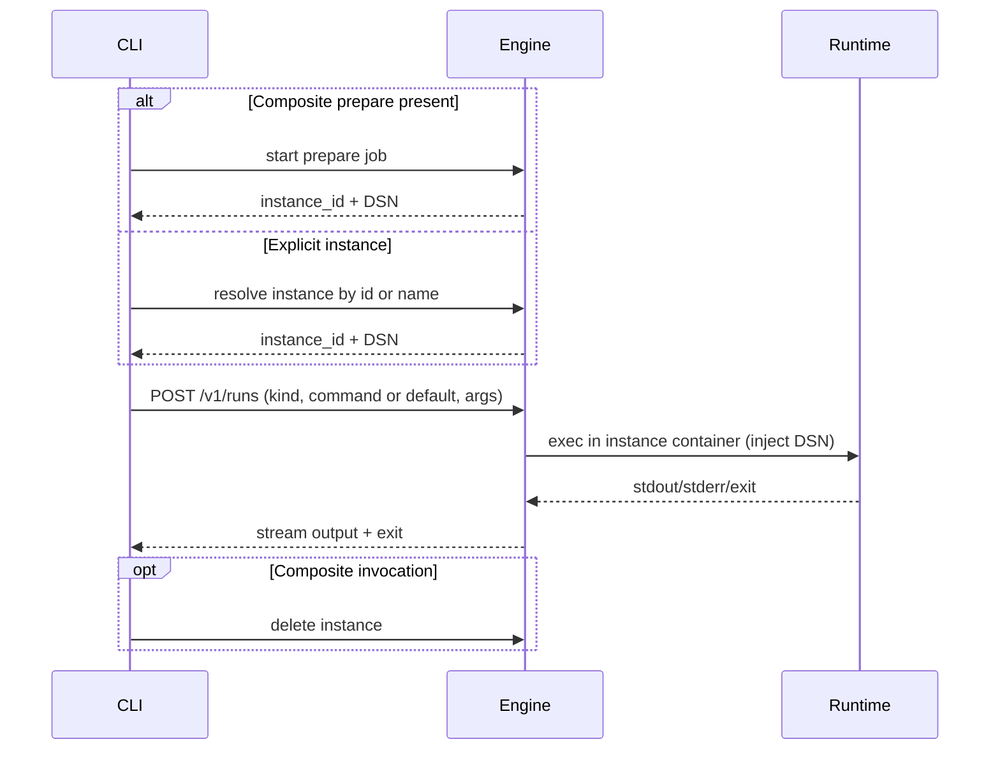

# Архитектура CLI (локально и удаленно)

Этот документ описывает, как CLI `sqlrs` разрешает входы и общается с SQL Runner в локальном и shared-деплойментах, включая обработку путей/URL и загрузку источников.

Примечание: ссылки на `POST /runs` в этом документе описывают **runner API**
для shared-деплоймента (дизайн на будущее). В текущем MVP локальный engine
использует `POST /v1/prepare-jobs` для prepare и `POST /v1/runs` для `sqlrs run`.

## 1. Цели

- Поддержать одинаковый UX CLI для локальных и удаленных целей.
- Разрешать входы как локальные файлы или публичные URL везде, где ожидается "файл".
- Избегать больших тел запросов в `POST /runs`.
- Обеспечить возобновляемые, контент-адресуемые загрузки для удаленного выполнения.

## 2. Ключевые понятия

- **Target**: endpoint движка (локальный loopback или удаленный gateway).
- **Source**: содержимое проекта (скрипты, changelog, конфиги).
- **Source ref**: локальный путь, публичный URL или серверный `source_id`.
- **Source storage**: хранилище контента на стороне сервиса, ключи по хешам и `source_id`.

## 3. Правила разрешения

Для любого флага CLI, который ожидает файл или директорию, CLI принимает:

- **Локальный путь** (файл или директория).
- **Публичный URL** (HTTP/HTTPS).
- **Серверный source ID** (ранее загруженный bundle).

Матрица решений:

| Target | Input | Действие CLI |
|---|---|---|
| Local engine | Local path | передать путь в engine |
| Local engine | Public URL | передать URL в engine |
| Remote engine | Public URL | передать URL в engine |
| Remote engine | Local path | загрузить в source storage, затем передать `source_id` |

## 4. Потоки

### 4.1 Локальная цель, локальные файлы

### 4.2 Удаленная цель, локальные файлы (сначала загрузка)

### 4.3 Удаленная цель, публичный URL

### 4.4 Список (sqlrs ls)

Примечания:

- Для remote target используются те же list endpoint-ы; CLI берёт credentials из конфигурации профиля.
- По умолчанию CLI запрашивает names и instances; states, jobs и tasks запрашиваются явно.
- Вывод tasks можно отфильтровать по job id (`--job`).

### 4.5 Удаление (sqlrs rm)

### 4.6 Run (sqlrs run)

Примечания:

- `run:psql` передает DSN как позиционный connection string; `run:pgbench`
  использует `-h/-p/-U/-d`.
- Команды выполняются внутри контейнера инстанса (тот же runtime, что и
  `prepare:psql`).
- Если `--instance` задан вместе с предыдущим `prepare`, CLI завершает работу с
  явной ошибкой неоднозначности.

## 5. Детали загрузки (remote)

- CLI режет файлы на чанки, считает хеши и загружает только отсутствующие чанки.
- Manifest сопоставляет пути файлов и хеши чанков; это дает rsync-style delta.
- `source_id` контент-адресуемый и может переиспользоваться между запусками.
- Большие загрузки возобновляемые; сбойные чанки можно повторить без рестарта.

## 6. Наличие Liquibase

- Если Liquibase доступен, CLI может запросить Liquibase-aware планирование на runner.
- Если Liquibase недоступен, CLI строит явный step-план (упорядоченный список скриптов) и передает его в запросе запуска.
- Одни и те же правила загрузки/разрешения применяются в обоих режимах.
