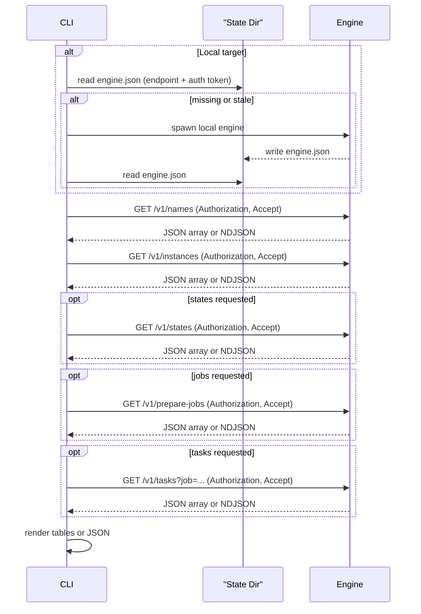
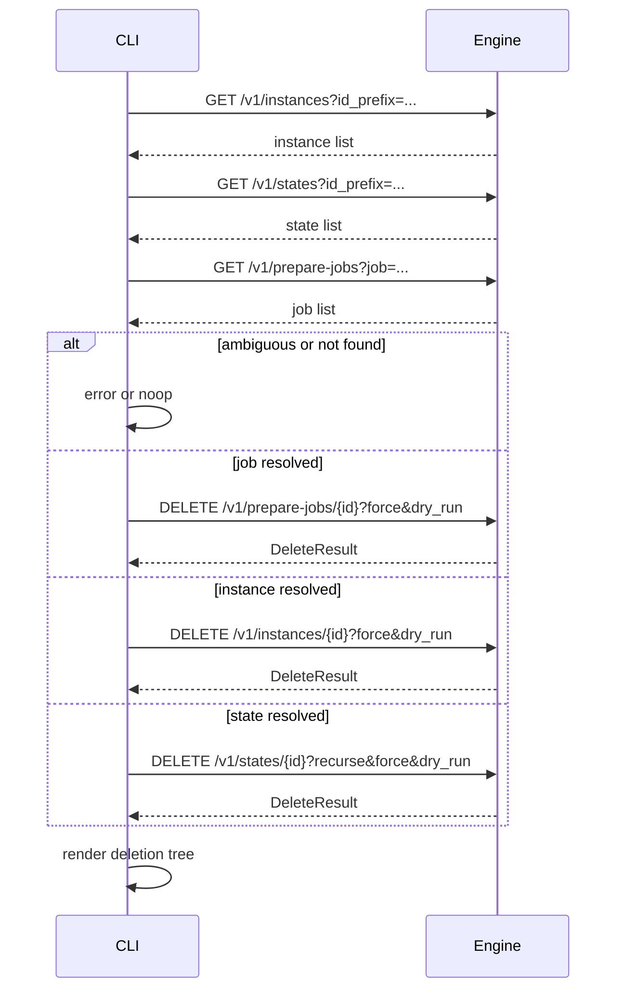
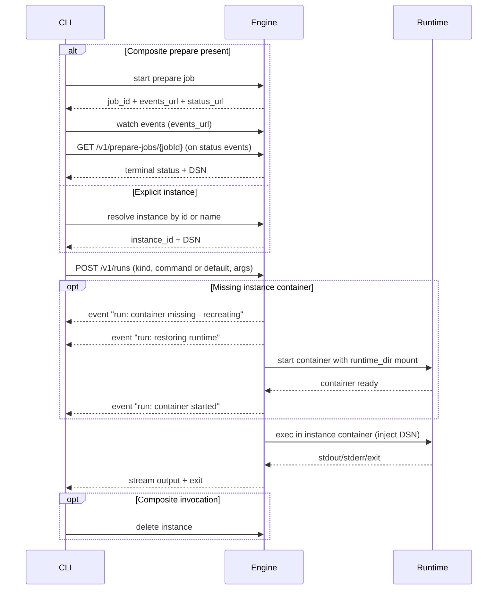

# CLI Architecture (Local and Remote)

This document describes how the `sqlrs` CLI resolves inputs and talks to the SQL Runner in local and shared deployments, including file vs URL handling and upload flows.

Note: references to `POST /runs` in this document describe the **runner API**
used in shared deployments (future). The current MVP local engine uses
`POST /v1/prepare-jobs` for prepare and `POST /v1/runs` for `sqlrs run`.

## 1. Goals

- Support the same CLI UX for local and remote targets.
- Allow inputs as local files or public URLs wherever a "file" is expected.
- Avoid large request bodies in `POST /runs`.
- Provide resumable, content-addressed uploads for remote execution.

## 2. Key Concepts

- **Target**: engine endpoint (local loopback or remote gateway).
- **Source**: project content (scripts, changelogs, configs).
- **Source ref**: either a local path, a public URL, or a server-side `source_id`.
- **Source storage**: service-side content store keyed by hashes and `source_id`.

## 3. Resolution Rules

For any CLI flag that expects a file or directory, the CLI accepts:

- **Local path** (file or directory).
- **Public URL** (HTTP/HTTPS).
- **Server-side source ID** (previously uploaded bundle).

Decision matrix:

| Target        | Input      | CLI action                                      |
| ------------- | ---------- | ----------------------------------------------- |
| Local engine  | Local path | pass path to engine                             |
| Local engine  | Public URL | pass URL to engine                              |
| Remote engine | Public URL | pass URL to engine                              |
| Remote engine | Local path | upload to source storage, then pass `source_id` |

## 4. Flows

### 4.1 Local target, local files

### 4.2 Remote target, local files (upload then run)

### 4.3 Remote target, public URL

### 4.4 Listing (sqlrs ls)

Notes:

- Remote targets use the same list endpoints; the CLI supplies credentials from profile configuration.
- The CLI defaults to listing names and instances; states, jobs, and tasks are requested explicitly.
- Task listing can be filtered by job id (`--job`).

### 4.5 Removal (sqlrs rm)

### 4.6 Run (sqlrs run)

Notes:

- `run:psql` passes DSN as a positional connection string; `run:pgbench` uses
  `-h/-p/-U/-d`.
- Commands run inside the instance container (same runtime as `prepare:psql`).
- If the instance container is missing and `runtime_dir` exists, the engine
  recreates the container and emits run events before execution.
- If `--instance` is provided together with a preceding `prepare`, the CLI fails
  with an explicit ambiguity error.
- Prepare monitoring is events-first; the CLI validates terminal status via
  `GET /v1/prepare-jobs/{jobId}` when status events arrive.

## 5. Upload Details (Remote)

- CLI chunks files, computes hashes, and uploads only missing chunks.
- A manifest maps file paths to chunk hashes; enables rsync-style delta.
- `source_id` is content-addressed and can be reused across runs.
- Large uploads are resumable; failed chunks can be retried without restarting.

## 6. Liquibase Presence

- If Liquibase is available, the CLI can request Liquibase-aware planning on the runner.
- If Liquibase is not available, CLI builds an explicit step plan (ordered script list) and passes it with the run request.
- The same upload/resolution rules apply in both modes.
