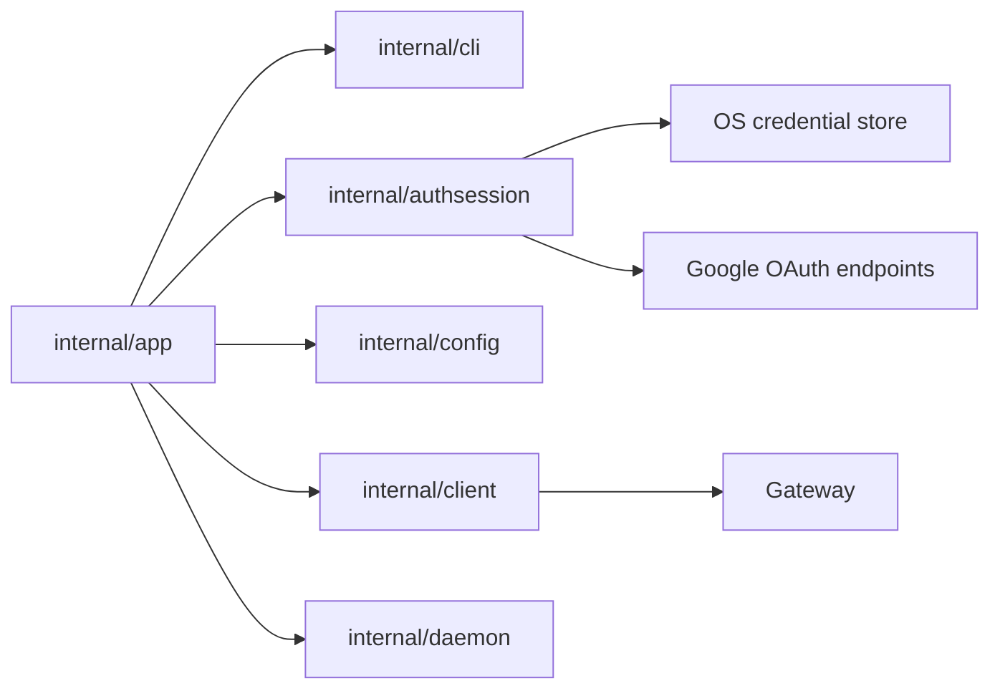

# Компонентная структура CLI Auth

Этот документ определяет proposed internal component structure для CLI-среза
Google OIDC auth.

Он следует:

- CLI guide: [`../user-guides/sqlrs-auth.md`](../user-guides/sqlrs-auth.md)
- Interaction flow: [`cli-auth-flow.RU.md`](cli-auth-flow.RU.md)
- ADR:
  [`../adr/2026-07-01-google-oidc-cli-auth.md`](../adr/2026-07-01-google-oidc-cli-auth.md)

## 1. Scope и предпосылки

- Срез покрывает:
  - `sqlrs auth login google`
  - `sqlrs auth status`
  - `sqlrs auth logout`
  - effective bearer-token resolution для protected remote API commands.
- Первая provider implementation - только Google OIDC.
- Выбранный remote profile должен использовать `auth.mode: oidcSession` для
  stored OIDC sessions.
- `SQLRS_TOKEN` остается самым приоритетным override и bypass-ит stored
  sessions.
- Gateway принимает только short-lived Google ID token-ы. Refresh token-ы
  остаются client-only.

## 2. Deployment units

### CLI (`frontend/cli-go`)

CLI владеет login orchestration, local session storage, token refresh, command
rendering и protected-command bearer-token resolution.

| Module | Responsibility |
| --- | --- |
| `internal/app` | Dispatch `auth` commands; парсить auth subcommands; резолвить profile/mode/output; отклонять local profiles; вызывать auth session manager; разрешать effective bearer token до protected remote API commands. |
| `internal/cli` | Определять auth command option/result types и human/JSON renderers. Не допускать token-bearing values в rendered output. |
| `internal/authsession` | Владеть PKCE, генерацией state/nonce, сборкой Google auth URL, validation loopback callback, token exchange/refresh/revoke, decoding ID-token claims, refresh decision, credential-store access и effective bearer-token selection. |
| `internal/config` | Загружать auth profile settings: `auth.mode`, `auth.tokenEnv`, legacy `auth.token`, `auth.clientID`, временный `auth.clientSecret` и `auth.issuer`. Никогда не хранит refresh token-ы или raw ID token-ы. |
| `internal/client` | Продолжает владеть sqlrs `/v1/*` API calls. Получает уже resolved bearer token и не знает, пришел ли он из `SQLRS_TOKEN`, refreshed OIDC session или legacy static token. |
| `internal/paths` | Предоставляет OS-specific config/state paths, когда auth session manager нужны stable application names или diagnostic context. |

Предлагаемый package/file layout:

```text
frontend/cli-go/internal/authsession/
  manager.go
  pkce.go
  claims.go
  google.go
  loopback.go
  store.go
  store_windows.go
  store_darwin.go
  store_linux.go
```

Auth session code остается вне `internal/client`, чтобы sqlrs API client не
становился одновременно Google OAuth client. Он остается вне `internal/config`,
чтобы config loading не становился session storage.

### Local engine (`backend/local-engine-go`)

Компоненты local engine не добавляются и не меняются.

Local engine продолжает принимать существующий local bearer token из
`engine.json` для protected local endpoints. Он никогда не видит Google refresh
token-ы и не участвует в командах `sqlrs auth`.

### Shared services и gateway

Этот срез не добавляет новый shared service endpoint.

Gateway должен проверять Google ID token-ы, отправленные CLI, и должен
принимать CLI OAuth client ID как allowed audience. Если gateway сейчас
поддерживает только один accepted audience, а CLI использует отдельный Google
OAuth client ID, multiple-audience gateway configuration является отдельной
follow-up задачей.

Gateway не должен принимать, хранить или refresh-ить Google refresh token-ы.

## 3. Auth profile configuration

`internal/config.AuthConfig` расширяется Google OIDC profile fields:

```go
type AuthConfig struct {
    Mode         string `yaml:"mode"`
    TokenEnv     string `yaml:"tokenEnv"`
    Token        string `yaml:"token"`
    ClientID     string `yaml:"clientID"`
    ClientSecret string `yaml:"clientSecret"`
    Issuer       string `yaml:"issuer"`
}
```

Rules:

- `mode: fileToken` остается local-daemon auth.
- `mode: bearer` остается legacy explicit bearer-token path.
- `mode: oidcSession` включает stored OIDC session lookup и refresh.
- `tokenEnv` defaults to `SQLRS_TOKEN` для `oidcSession` profiles, когда
  omitted.
- `issuer` defaults to `https://accounts.google.com` для Google login, когда
  omitted.
- `clientID` required для `auth login google` и OIDC session refresh.
- `clientSecret` - временная compatibility-настройка для Google Desktop OAuth.
  CLI отправляет ее только в Google token endpoint для authorization-code и
  refresh-token grants, и не отправляет ее в sqlrs gateway.

## 4. Ключевые типы и interfaces

### Auth session manager

`authsession.Manager` - основной package service.

```go
type Manager struct {
    Store CredentialStore
    HTTP  OAuthHTTPClient
    Clock Clock
    Rand  io.Reader
    OpenBrowser BrowserOpener
}
```

Required operations:

- `LoginGoogle(ctx, LoginOptions) (LoginResult, error)`
- `Status(ctx, StatusOptions) (StatusResult, error)`
- `Logout(ctx, LogoutOptions) (LogoutResult, error)`
- `ResolveBearerToken(ctx, ResolveOptions) (ResolvedBearerToken, error)`

### Credential store abstraction

```go
type CredentialStore interface {
    Get(ctx context.Context, key CredentialKey) (Session, bool, error)
    Put(ctx context.Context, key CredentialKey, session Session) error
    Delete(ctx context.Context, key CredentialKey) error
}
```

Platform implementations:

- Windows: Windows Credential Manager.
- macOS: Keychain.
- Linux: Secret Service/libsecret.

Недоступность Linux credential store возвращает понятную setup error. Plaintext
fallback для refresh token отсутствует.

### Credential key и session

Active session lookup scoped к одному remote profile и OAuth client:

```go
type CredentialKey struct {
    ProfileName string
    Endpoint    string
    Provider    string // "google" in this slice
    Issuer      string
    ClientID    string
}
```

`CredentialKey` не включает `subject`, потому что `auth status` и protected
commands должны найти active session до decoding ID token. Успешный login
перезаписывает active session для того же key, так пользователь переключает
Google account для profile.

```go
type Session struct {
    Provider      string
    Issuer        string
    ClientID      string
    Subject       string
    Email         string
    Scopes        []string
    RefreshToken  string
    CachedIDToken string
    IDTokenExpiry time.Time
    CreatedAt     time.Time
    UpdatedAt     time.Time
}
```

`RefreshToken` и `CachedIDToken` являются secret values и не должны
render-иться. `Subject`, `Email`, `Issuer`, `ClientID`, `Scopes` и expiry
timestamps являются safe metadata при соблюдении правил auth user guide.

### Token and claim types

```go
type PKCEPair struct {
    Verifier  string
    Challenge string
    Method    string // "S256"
}

type IDTokenClaims struct {
    Issuer   string
    Audience []string
    Subject  string
    Email    string
    Expiry   time.Time
    Nonce    string
}
```

CLI локально decode-ит ID token claims для expiry и diagnostic metadata.
Signature verification остается gateway-owned для API authorization. Local
claim checks все равно обязательны для login nonce, issuer, audience и expiry
sanity до caching session metadata.

### Test seams

Компонент должен inject-ить эти dependencies, а не использовать globals
напрямую:

- clock;
- random source;
- OAuth HTTP client;
- browser opener;
- loopback receiver или listener factory;
- credential store.

Конкретные tests проектируются на следующем этапе процесса, после approval этой
component structure.

## 5. Command wiring

### `sqlrs auth login google`

`internal/app` парсит flags, resolves profile и вызывает
`authsession.Manager.LoginGoogle`.

Inputs:

- profile name;
- endpoint;
- `auth.clientID`;
- временный `auth.clientSecret`;
- `auth.issuer`;
- optional `--login-hint`;
- `--no-browser`;
- output mode.

Output:

- safe login summary with provider, email, issuer, audience/client ID, profile
  и endpoint.

### `sqlrs auth status`

`internal/app` вызывает `authsession.Manager.Status`.

Status inspect-ит:

- задан ли `SQLRS_TOKEN` override;
- использует ли selected profile `auth.mode: oidcSession`;
- содержит ли OS credential store local session;
- expiry cached ID-token, если доступен.

Он не делает refresh только ради печати status. Он может сообщить, что cached
ID token expired, хотя session остается refresh-capable.

### `sqlrs auth logout`

`internal/app` вызывает `authsession.Manager.Logout`.

Logout пытается Google revocation, если не задан `--no-revoke`, затем удаляет
local credential store entry. Deletion выполняется, даже если revocation fails.

### Protected remote commands

`internal/app` разрешает effective bearer token до построения command options
для protected remote API commands:

1. Если `tokenEnv` или default `SQLRS_TOKEN` задан, используется это значение.
2. Если `auth.mode: oidcSession`, вызывается `Manager.ResolveBearerToken`.
3. Если `auth.mode: bearer`, используется legacy static bearer behavior.
4. Если token для protected remote request недоступен, команда fails до вызова
   `internal/client`.

Local mode продолжает использовать `internal/daemon` и local `fileToken`
behavior.

## 6. Владение данными

- **Workspace/global config** владеет auth profile settings, включая временный
  `auth.clientSecret`, но никогда не хранит refresh token-ы или raw ID token-ы.
- **OS credential store** владеет refresh token-ами и optional cached ID
  token-ами.
- **Auth session metadata**, например provider, issuer, audience, email,
  subject и expiry, хранится вместе с credential и может копироваться в
  in-memory command results.
- **PKCE verifier, state и nonce** находятся только в памяти и живут один login
  attempt.
- **Loopback callback data** находится только в памяти и отбрасывается после
  successful или failed login.
- **Effective bearer token** находится только в памяти одного command
  invocation.
- **Gateway actor claims** являются server-side request context и не кешируются
  CLI.

## 7. Dependency diagram



## 8. References

- User guide: [`../user-guides/sqlrs-auth.md`](../user-guides/sqlrs-auth.md)
- Flow: [`cli-auth-flow.RU.md`](cli-auth-flow.RU.md)
- CLI contract: [`cli-contract.RU.md`](cli-contract.RU.md)
- General CLI component structure:
  [`cli-component-structure.RU.md`](cli-component-structure.RU.md)
