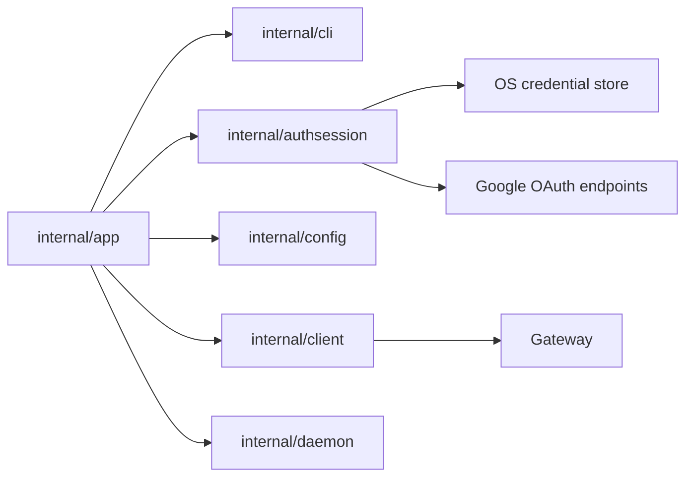

# CLI Auth Component Structure

This document defines the proposed internal component structure for the Google
OIDC CLI auth slice.

It follows:

- CLI guide: [`../user-guides/sqlrs-auth.md`](../user-guides/sqlrs-auth.md)
- Interaction flow: [`cli-auth-flow.md`](cli-auth-flow.md)
- ADR:
  [`../adr/2026-07-01-google-oidc-cli-auth.md`](../adr/2026-07-01-google-oidc-cli-auth.md)

## 1. Scope and assumptions

- The slice covers:
  - `sqlrs auth login google`
  - `sqlrs auth status`
  - `sqlrs auth logout`
  - effective bearer-token resolution for protected remote API commands.
- The first provider implementation is Google OIDC only.
- The selected remote profile must use `auth.mode: oidcSession` for stored
  OIDC sessions.
- `SQLRS_TOKEN` remains the highest-priority override and bypasses stored
  sessions.
- The gateway accepts only short-lived Google ID tokens. Refresh tokens remain
  client-only.

## 2. Deployment units

### CLI (`frontend/cli-go`)

The CLI owns login orchestration, local session storage, token refresh, command
rendering, and protected-command bearer-token resolution.

| Module | Responsibility |
| --- | --- |
| `internal/app` | Dispatch `auth` commands; parse auth subcommands; resolve profile/mode/output; reject local profiles; call the auth session manager; resolve effective bearer tokens before protected remote API commands. |
| `internal/cli` | Define auth command option/result types and human/JSON renderers. Keep token-bearing values out of rendered output. |
| `internal/authsession` | Own PKCE, state/nonce generation, Google auth URL construction, loopback callback validation, token exchange/refresh/revoke, ID-token claim decoding, refresh decision, credential-store access, and effective bearer-token selection. |
| `internal/config` | Load non-secret auth profile settings: `auth.mode`, `auth.tokenEnv`, legacy `auth.token`, `auth.clientID`, and `auth.issuer`. It never stores refresh tokens. |
| `internal/client` | Continue to own sqlrs `/v1/*` API calls. It receives an already resolved bearer token and does not know whether it came from `SQLRS_TOKEN`, a refreshed OIDC session, or a legacy static token. |
| `internal/paths` | Provide OS-specific config/state paths when the auth session manager needs stable application names or diagnostic context. |

Suggested package/file layout:

```text
frontend/cli-go/internal/authsession/
  manager.go
  pkce.go
  claims.go
  google.go
  loopback.go
  store.go
  store_windows.go
  store_darwin.go
  store_linux.go
```

The auth session code stays out of `internal/client` so the sqlrs API client
does not also become a Google OAuth client. It stays out of `internal/config`
so config loading remains non-secret.

### Local engine (`backend/local-engine-go`)

No local engine component is added or changed.

The local engine continues to accept its existing local bearer token from
`engine.json` for protected local endpoints. It never sees Google refresh
tokens and does not participate in `sqlrs auth` commands.

### Shared services and gateway

No new shared service endpoint is added by this slice.

The gateway must validate Google ID tokens sent by the CLI and must accept the
CLI OAuth client ID as an allowed audience. If the gateway currently supports
only one accepted audience and the CLI uses a distinct Google OAuth client ID,
multiple-audience gateway configuration is a separate follow-up task.

The gateway must not accept, store, or refresh Google refresh tokens.

## 3. Auth profile configuration

`internal/config.AuthConfig` is extended with non-secret OIDC fields:

```go
type AuthConfig struct {
    Mode     string `yaml:"mode"`
    TokenEnv string `yaml:"tokenEnv"`
    Token    string `yaml:"token"`
    ClientID string `yaml:"clientID"`
    Issuer   string `yaml:"issuer"`
}
```

Rules:

- `mode: fileToken` remains local-daemon auth.
- `mode: bearer` remains the legacy explicit bearer-token path.
- `mode: oidcSession` enables stored OIDC session lookup and refresh.
- `tokenEnv` defaults to `SQLRS_TOKEN` for `oidcSession` profiles when omitted.
- `issuer` defaults to `https://accounts.google.com` for Google login when
  omitted.
- `clientID` is required for `auth login google` and for OIDC session refresh.

## 4. Key types and interfaces

### Auth session manager

`authsession.Manager` is the main package service.

```go
type Manager struct {
    Store CredentialStore
    HTTP  OAuthHTTPClient
    Clock Clock
    Rand  io.Reader
    OpenBrowser BrowserOpener
}
```

Required operations:

- `LoginGoogle(ctx, LoginOptions) (LoginResult, error)`
- `Status(ctx, StatusOptions) (StatusResult, error)`
- `Logout(ctx, LogoutOptions) (LogoutResult, error)`
- `ResolveBearerToken(ctx, ResolveOptions) (ResolvedBearerToken, error)`

### Credential store abstraction

```go
type CredentialStore interface {
    Get(ctx context.Context, key CredentialKey) (Session, bool, error)
    Put(ctx context.Context, key CredentialKey, session Session) error
    Delete(ctx context.Context, key CredentialKey) error
}
```

Platform implementations:

- Windows: Windows Credential Manager.
- macOS: Keychain.
- Linux: Secret Service/libsecret.

Linux credential-store unavailability returns a clear setup error. There is no
plaintext refresh-token fallback.

### Credential key and session

The active session lookup is scoped to one remote profile and OAuth client:

```go
type CredentialKey struct {
    ProfileName string
    Endpoint    string
    Provider    string // "google" in this slice
    Issuer      string
    ClientID    string
}
```

`CredentialKey` does not include `subject`, because `auth status` and protected
commands need to locate the active session before decoding an ID token. A
successful login overwrites the active session for the same key, which is how a
user switches Google accounts for that profile.

```go
type Session struct {
    Provider      string
    Issuer        string
    ClientID      string
    Subject       string
    Email         string
    Scopes        []string
    RefreshToken  string
    CachedIDToken string
    IDTokenExpiry time.Time
    CreatedAt     time.Time
    UpdatedAt     time.Time
}
```

`RefreshToken` and `CachedIDToken` are secret values and must never be rendered.
`Subject`, `Email`, `Issuer`, `ClientID`, `Scopes`, and expiry timestamps are
safe metadata when printed under the rules in the auth user guide.

### Token and claim types

```go
type PKCEPair struct {
    Verifier  string
    Challenge string
    Method    string // "S256"
}

type IDTokenClaims struct {
    Issuer   string
    Audience []string
    Subject  string
    Email    string
    Expiry   time.Time
    Nonce    string
}
```

The CLI decodes ID token claims locally for expiry and diagnostic metadata.
Signature verification remains gateway-owned for API authorization. Local
claim checks are still required for login nonce, issuer, audience, and expiry
sanity before caching session metadata.

### Test seams

The component must inject these dependencies rather than using globals directly:

- clock;
- random source;
- OAuth HTTP client;
- browser opener;
- loopback receiver or listener factory;
- credential store.

The concrete tests are designed in the next process stage, after this component
structure is approved.

## 5. Command wiring

### `sqlrs auth login google`

`internal/app` parses flags, resolves the profile, and calls
`authsession.Manager.LoginGoogle`.

Inputs:

- profile name;
- endpoint;
- `auth.clientID`;
- `auth.issuer`;
- optional `--login-hint`;
- `--no-browser`;
- output mode.

Output:

- safe login summary with provider, email, issuer, audience/client ID, profile,
  and endpoint.

### `sqlrs auth status`

`internal/app` calls `authsession.Manager.Status`.

Status inspects:

- whether `SQLRS_TOKEN` override is set;
- whether the selected profile uses `auth.mode: oidcSession`;
- whether the OS credential store contains a local session;
- cached ID-token expiry when available.

It never refreshes solely to print status. It may report that the cached ID
token is expired while the session is still refresh-capable.

### `sqlrs auth logout`

`internal/app` calls `authsession.Manager.Logout`.

Logout attempts Google revocation unless `--no-revoke` is set, then deletes the
local credential store entry. Deletion happens even when revocation fails.

### Protected remote commands

`internal/app` resolves the effective bearer token before constructing command
options for protected remote API commands:

1. If `tokenEnv` or default `SQLRS_TOKEN` is set, use that value.
2. If `auth.mode: oidcSession`, call `Manager.ResolveBearerToken`.
3. If `auth.mode: bearer`, use legacy static bearer behavior.
4. If no token is available for a protected remote request, fail before calling
   `internal/client`.

Local mode continues to use `internal/daemon` and local `fileToken` behavior.

## 6. Data ownership

- **Workspace/global config** owns only non-secret auth settings.
- **OS credential store** owns refresh tokens and optional cached ID tokens.
- **Auth session metadata** such as provider, issuer, audience, email, subject,
  and expiry is stored with the credential and may be copied into in-memory
  command results.
- **PKCE verifier, state, and nonce** are in-memory only and live for one login
  attempt.
- **Loopback callback data** is in-memory only and discarded after login
  succeeds or fails.
- **Effective bearer token** is in-memory only for one command invocation.
- **Gateway actor claims** are server-side request context and are not cached by
  the CLI.

## 7. Dependency diagram



## 8. References

- User guide: [`../user-guides/sqlrs-auth.md`](../user-guides/sqlrs-auth.md)
- Flow: [`cli-auth-flow.md`](cli-auth-flow.md)
- CLI contract: [`cli-contract.md`](cli-contract.md)
- General CLI component structure:
  [`cli-component-structure.md`](cli-component-structure.md)
