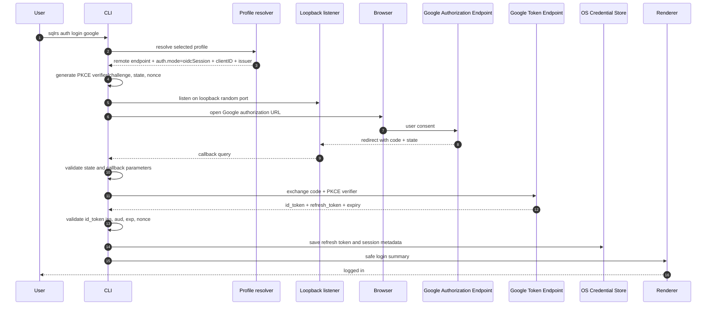
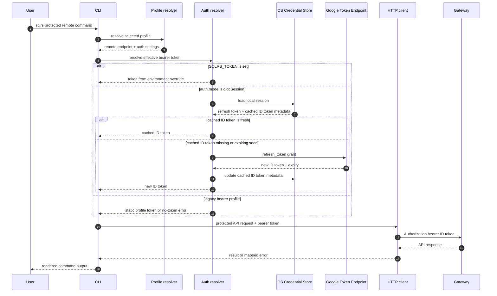
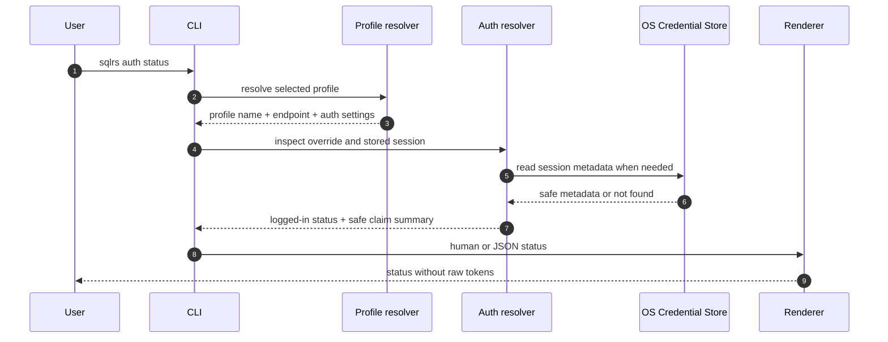
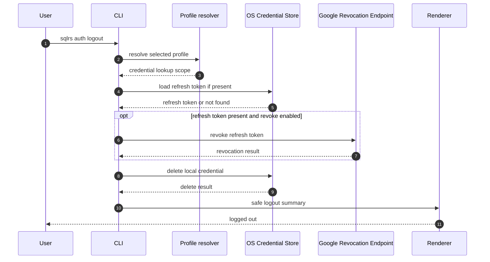

# Поток CLI Auth

Этот документ описывает interaction flow для CLI-среза Google OIDC auth.

Он следует утвержденному CLI-синтаксису в
[`../user-guides/sqlrs-auth.md`](../user-guides/sqlrs-auth.md) и принятому
решению в
[`../adr/2026-07-01-google-oidc-cli-auth.md`](../adr/2026-07-01-google-oidc-cli-auth.md).

Этот срез не вводит изменений sqlrs HTTP API. Gateway по-прежнему получает
только short-lived Google ID token как bearer token.

## 1. Scope

В scope:

- `sqlrs auth login google`
- `sqlrs auth status`
- `sqlrs auth logout`
- effective bearer-token resolution для protected remote API commands

Вне scope:

- server-side refresh-token storage;
- изменения local engine auth;
- новые user/org API endpoint-ы;
- OIDC providers кроме Google;
- device code flow, если loopback login позже не окажется impractical.

## 2. Участники

- **User** - вызывает `sqlrs auth` или protected remote command.
- **CLI parser** - разбирает global flags, profile, output mode и auth
  subcommand arguments.
- **Profile resolver** - загружает выбранный profile, endpoint, `auth.mode`,
  client ID, issuer и имя debug override environment variable.
- **Auth resolver** - владеет auth-session decisions для одного CLI invocation:
  приоритет `SQLRS_TOKEN`, проверки expiry cached ID token, refresh и
  login-required errors.
- **Loopback listener** - слушает `127.0.0.1:<random-port>` во время login и
  получает Google authorization callback.
- **Browser** - открывает Google authorization URL для user consent.
- **Google Authorization Endpoint** - возвращает authorization code через
  loopback redirect.
- **Google Token Endpoint** - обменивает authorization code и refresh token на
  ID token-ы.
- **Google Revocation Endpoint** - revoke-ит refresh token во время logout,
  если это возможно.
- **OS Credential Store** - хранит refresh token и optional cached ID token:
  Windows Credential Manager, macOS Keychain или Linux Secret Service/libsecret.
- **HTTP client** - отправляет sqlrs API requests с effective bearer token.
- **Gateway** - проверяет short-lived Google ID token и выводит actor claims.
- **Renderer** - печатает human или JSON output без raw token-ов.

## 3. Flow: `sqlrs auth login google`

Rules:

- Callback принимается только на `127.0.0.1`.
- `state` mismatch, OAuth `error` или missing `code` завершают login до token
  exchange.
- Missing `refresh_token` завершает login с troubleshooting hint. CLI просит у
  Google offline access через `access_type=offline` и `prompt=consent`.
- Refresh token хранится только в OS credential store.
- Raw refresh token-ы и raw ID token-ы никогда не печатаются.

## 4. Flow: Protected Remote API Token Resolution

Rules:

- `SQLRS_TOKEN` имеет приоритет над stored sessions и static profile token-ами.
- OIDC sessions refresh-ят cached ID token, когда он missing, expired или
  истекает в течение пяти минут.
- Refresh-token failures останавливают команду до protected sqlrs API request
  и предлагают пользователю выполнить `sqlrs auth login google`.
- Gateway получает только effective bearer token. Он никогда не получает
  refresh token.

## 5. Flow: `sqlrs auth status`

Rules:

- Status показывает `logged in` или `not logged in`, provider, email, issuer,
  audience/client ID, token expiry, profile, endpoint и override source.
- Если `SQLRS_TOKEN` задан, status показывает override без вывода его value.
- Verbose output может включать только safe claim summary fields: `iss`, `aud`,
  masked `sub`, `email` и `exp`.

## 6. Flow: `sqlrs auth logout`

Rules:

- `logout` удаляет local credentials, даже если Google revocation failed.
- `--no-revoke` пропускает Google revocation request.
- `logout` не unset-ит и не меняет `SQLRS_TOKEN`.
- Команда idempotent, когда local session отсутствует.

## 7. Failure Handling

| Failure | Behavior |
| --- | --- |
| Local profile selected | Fail before opening browser or reading credentials. |
| `auth.mode` is not `oidcSession` for login | Fail with profile configuration guidance. |
| Credential store unavailable | Fail without plaintext refresh-token fallback. |
| Callback `state` mismatch | Fail login and discard callback data. |
| Callback contains OAuth `error` | Fail login with the provider error summary. |
| Callback is missing `code` | Fail login before token exchange. |
| Token endpoint omits `refresh_token` on login | Fail login and suggest consent/client configuration checks. |
| Cached ID token expired and refresh succeeds | Store the new ID token metadata and continue. |
| Refresh token revoked or rejected | Delete or mark the local session unusable and tell the user to run `sqlrs auth login google`. |
| Gateway rejects ID token with `401` | Surface the API auth error; audience/issuer troubleshooting belongs in the auth guide. |

## 8. Security Invariants

- Refresh token-ы никогда не покидают client machine, кроме запросов к Google
  token или revocation endpoint.
- sqlrs gateway никогда не получает refresh token-ы.
- Workspace config хранит только non-secret auth configuration.
- Raw refresh token-ы и raw ID token-ы никогда не печатаются в normal, JSON или
  verbose output.
- Loopback listener bind-ится только к `127.0.0.1` и принимает один callback
  для одной login attempt.
- `state` и `nonce` high entropy и single-use.
- PKCE использует `S256`.

## 9. References

- User guide: [`../user-guides/sqlrs-auth.md`](../user-guides/sqlrs-auth.md)
- ADR: [`../adr/2026-07-01-google-oidc-cli-auth.md`](../adr/2026-07-01-google-oidc-cli-auth.md)
- CLI contract: [`cli-contract.RU.md`](cli-contract.RU.md)
- CLI architecture: [`cli-architecture.RU.md`](cli-architecture.RU.md)
- CLI auth component structure:
  [`cli-auth-component-structure.RU.md`](cli-auth-component-structure.RU.md)
- User/org flow: [`user-org-flow.RU.md`](user-org-flow.RU.md)
