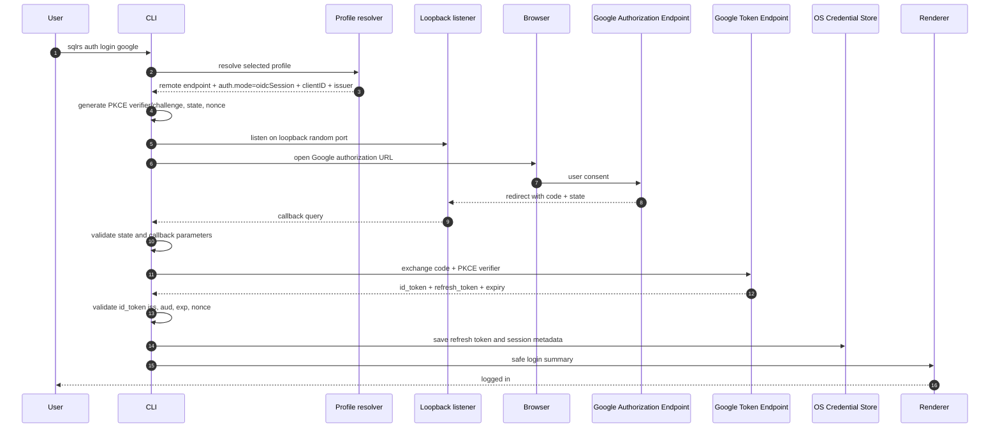
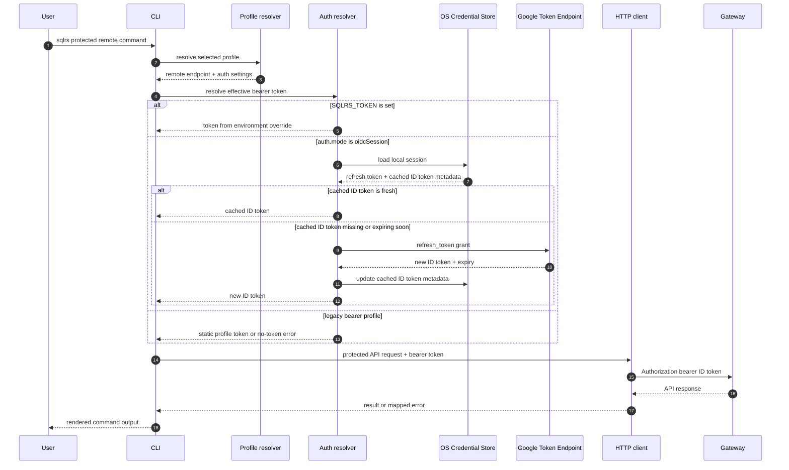
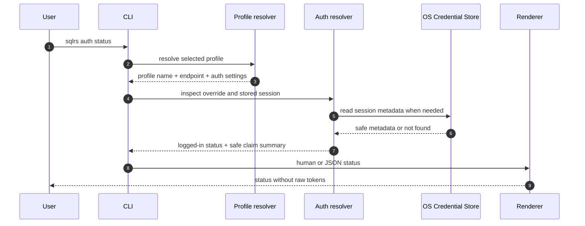
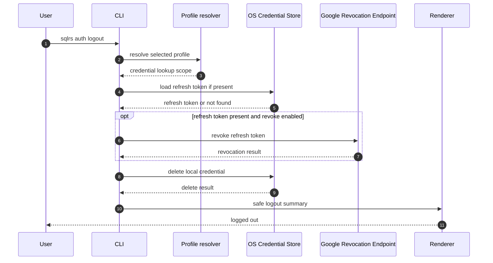

# CLI Auth Flow

This document describes the interaction flow for the Google OIDC CLI auth
slice.

It follows the approved CLI syntax in
[`../user-guides/sqlrs-auth.md`](../user-guides/sqlrs-auth.md) and the accepted
decision in
[`../adr/2026-07-01-google-oidc-cli-auth.md`](../adr/2026-07-01-google-oidc-cli-auth.md).

No sqlrs HTTP API change is introduced by this slice. The gateway continues to
receive only short-lived Google ID tokens as bearer tokens.

## 1. Scope

In scope:

- `sqlrs auth login google`
- `sqlrs auth status`
- `sqlrs auth logout`
- effective bearer-token resolution for protected remote API commands

Out of scope:

- server-side refresh-token storage;
- local engine auth changes;
- new user/org API endpoints;
- non-Google OIDC providers;
- device code flow unless loopback login later proves impractical.

## 2. Participants

- **User** - invokes `sqlrs auth` or a protected remote command.
- **CLI parser** - parses global flags, profile, output mode, and auth
  subcommand arguments.
- **Profile resolver** - loads selected profile, endpoint, `auth.mode`, client
  ID, issuer, and debug override environment variable name.
- **Auth resolver** - owns auth-session decisions for one CLI invocation:
  `SQLRS_TOKEN` priority, cached ID-token expiry checks, refresh, and
  login-required errors.
- **Loopback listener** - listens on `127.0.0.1:<random-port>` during login and
  receives the Google authorization callback.
- **Browser** - opens the Google authorization URL for user consent.
- **Google Authorization Endpoint** - returns the authorization code through
  the loopback redirect.
- **Google Token Endpoint** - exchanges authorization codes and refresh tokens
  for ID tokens.
- **Google Revocation Endpoint** - revokes refresh tokens during logout when
  possible.
- **OS Credential Store** - stores refresh tokens and optional cached ID tokens:
  Windows Credential Manager, macOS Keychain, or Linux Secret Service/libsecret.
- **HTTP client** - sends sqlrs API requests with the effective bearer token.
- **Gateway** - validates short-lived Google ID tokens and derives actor claims.
- **Renderer** - prints human or JSON output without raw tokens.

## 3. Flow: `sqlrs auth login google`

Rules:

- The callback is accepted only on `127.0.0.1`.
- `state` mismatch, OAuth `error`, or missing `code` fails login before token
  exchange.
- Missing `refresh_token` fails login with a troubleshooting hint. The CLI asks
  Google for offline access with `access_type=offline` and `prompt=consent`.
- The refresh token is stored only in the OS credential store.
- Raw refresh tokens and raw ID tokens are never printed.

## 4. Flow: Protected Remote API Token Resolution

Rules:

- `SQLRS_TOKEN` has priority over stored sessions and static profile tokens.
- OIDC sessions refresh cached ID tokens when they are missing, expired, or
  within five minutes of expiry.
- Refresh-token failures stop the command before the protected sqlrs API
  request and tell the user to run `sqlrs auth login google`.
- The gateway receives only the effective bearer token. It never receives the
  refresh token.

## 5. Flow: `sqlrs auth status`

Rules:

- Status reports `logged in` or `not logged in`, provider, email, issuer,
  audience/client ID, token expiry, profile, endpoint, and override source.
- If `SQLRS_TOKEN` is set, status reports the override without printing its
  value.
- Verbose output may include only safe claim summary fields: `iss`, `aud`,
  masked `sub`, `email`, and `exp`.

## 6. Flow: `sqlrs auth logout`

Rules:

- `logout` deletes local credentials even if Google revocation fails.
- `--no-revoke` skips the Google revocation request.
- `logout` does not unset or modify `SQLRS_TOKEN`.
- The command is idempotent when no local session exists.

## 7. Failure Handling

| Failure | Behavior |
| --- | --- |
| Local profile selected | Fail before opening browser or reading credentials. |
| `auth.mode` is not `oidcSession` for login | Fail with profile configuration guidance. |
| Credential store unavailable | Fail without plaintext refresh-token fallback. |
| Callback `state` mismatch | Fail login and discard callback data. |
| Callback contains OAuth `error` | Fail login with the provider error summary. |
| Callback is missing `code` | Fail login before token exchange. |
| Token endpoint omits `refresh_token` on login | Fail login and suggest consent/client configuration checks. |
| Cached ID token expired and refresh succeeds | Store the new ID token metadata and continue. |
| Refresh token revoked or rejected | Delete or mark the local session unusable and tell the user to run `sqlrs auth login google`. |
| Gateway rejects ID token with `401` | Surface the API auth error; audience/issuer troubleshooting belongs in the auth guide. |

## 8. Security Invariants

- Refresh tokens never leave the client machine except to Google's token or
  revocation endpoint.
- The sqlrs gateway never receives refresh tokens.
- Workspace config stores only non-secret auth configuration.
- Raw refresh tokens and raw ID tokens are never printed in normal, JSON, or
  verbose output.
- The loopback listener binds only to `127.0.0.1` and accepts one callback for
  one login attempt.
- `state` and `nonce` are high entropy and single-use.
- PKCE uses `S256`.

## 9. References

- User guide: [`../user-guides/sqlrs-auth.md`](../user-guides/sqlrs-auth.md)
- ADR: [`../adr/2026-07-01-google-oidc-cli-auth.md`](../adr/2026-07-01-google-oidc-cli-auth.md)
- CLI contract: [`cli-contract.md`](cli-contract.md)
- CLI architecture: [`cli-architecture.md`](cli-architecture.md)
- CLI auth component structure:
  [`cli-auth-component-structure.md`](cli-auth-component-structure.md)
- User/org flow: [`user-org-flow.md`](user-org-flow.md)
