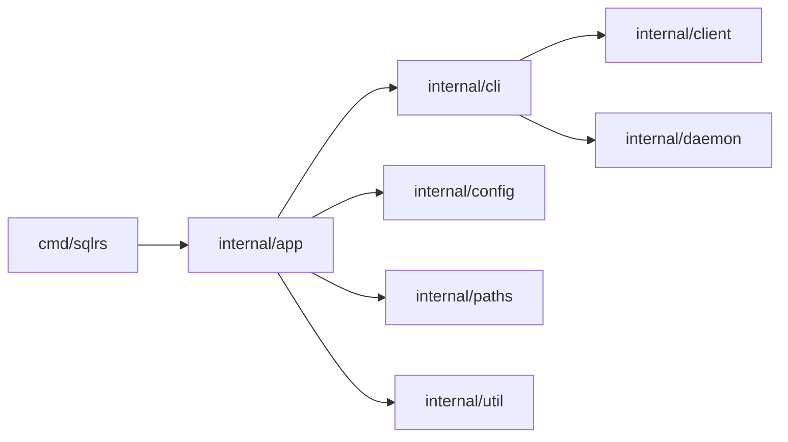

# Компонентная структура CLI

Документ описывает внутреннюю структуру sqlrs CLI.

## 1. Цели

- Явно зафиксировать границы модулей до реализации.
- Отделить логику команд от I/O и транспорта.
- Централизовать форматирование вывода для единого UX.

## 2. Пакеты и ответственность

- `cmd/sqlrs`
  - Entrypoint; вызывает `app.Run`.
- `internal/app`
  - Глобальные флаги и диспетчер команд.
  - Загружает config и workspace.
- `internal/cli`
  - Логика команд (status, init, ls, rm, prepare, plan, config).
  - Выбор режима вывода и рендер human/json.
- `internal/client`
  - HTTP клиент, auth headers, обработка redirect.
  - JSON/NDJSON парсинг.
  - Config endpoints (`/v1/config`, `/v1/config/schema`).
- `internal/daemon`
  - Discovery/launch локального engine.
  - Читает `engine.json`.
- `internal/config`
  - Парсинг и merge локального CLI конфигура.
- `internal/paths`
  - Определение путей для config/cache/state.
- `internal/util`
  - IO-хелперы (атомарная запись, NDJSON reader).

## 3. Ключевые типы и интерфейсы

- `cli.LsOptions`, `cli.LsResult`
  - Селекторы включают jobs/tasks и фильтр `job`.
  - Результаты содержат опциональные списки jobs/tasks рядом с names/instances/states.

- `cli.PrepareOptions`
  - Общие опции для prepare/plan (endpoint, auth, image id, args).
  - Дополняется флагом `PlanOnly` для `sqlrs plan`.
- `client.PrepareJobRequest`
  - HTTP payload для `POST /v1/prepare-jobs` (включая `plan_only`).
- `client.PrepareJobStatus`
  - Payload статуса с опциональным списком `tasks` для plan-only.
- `client.PrepareJobEntry`
  - Payload списка для `GET /v1/prepare-jobs`.
- `client.TaskEntry`
  - Payload списка для `GET /v1/tasks`.
- `cli.PlanResult`
  - CLI-представление `tasks` для рендера.
- `client.ConfigValue`, `client.ConfigSchema`
  - HTTP payload для config get/set/schema.
- `cli.ConfigOptions`
  - Path/value/effective/опции для `sqlrs config` команд.

## 4. Владение данными

- Локальный CLI конфиг хранится в файлах проекта; CLI загружает его в память на время команды.
- Server config запрашивается через HTTP и не сохраняется на диск со стороны CLI.

## 5. Диаграмма зависимостей

