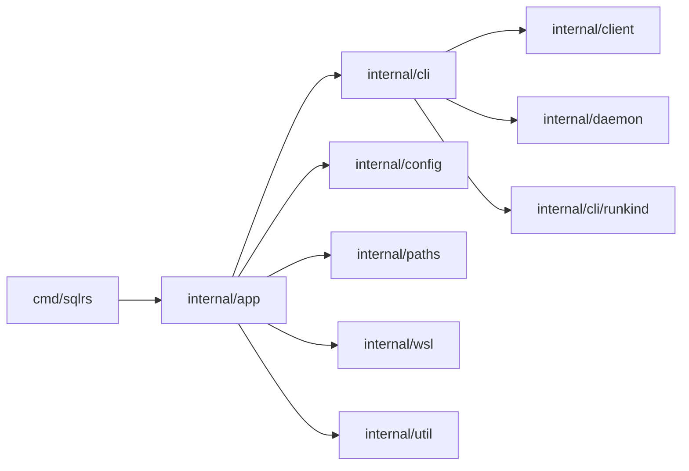

# Компонентная структура CLI

Документ описывает текущую внутреннюю структуру `sqlrs` CLI.

## 1. Цели

- Разделить парсинг команд, оркестрацию, транспорт и рендеринг.
- Использовать единый транспортный слой для local и remote профилей.
- Держать нормализацию аргументов команд в одном месте.

## 2. Пакеты и ответственность

- `cmd/sqlrs`
  - Точка входа; вызывает `app.Run` и маппит ошибки в exit code.
- `internal/app`
  - Загружает workspace/global config, выбирает профиль и режим.
  - Диспетчеризует граф команд (`prepare:*`, `plan:*`, `run:*`, `ls`, `rm`, `status`, `config`, `init`).
  - Нормализует file/path аргументы до вызовов transport-слоя.
- `internal/cli`
  - Исполнители команд на стороне клиента (`RunLs`, `RunPrepare`, `RunPlan`, `RunRun`, `RunStatus`, `RunConfig`, `RunRm`).
  - Рендеринг человекочитаемого вывода (таблицы/plan/status).
- `internal/cli/runkind`
  - Реестр поддерживаемых run-kind (`psql`, `pgbench`).
- `internal/client`
  - HTTP клиент для `/v1/*` endpoint-ов.
  - NDJSON-стриминг событий prepare и вывода run.
- `internal/daemon`
  - Autostart/discovery локального engine (`engine.json`, lock/state orchestration).
- `internal/config`
  - Загрузка и merge CLI-конфига, typed lookup (`dbms.image`, настройки Liquibase, timeout-ы).
- `internal/paths`
  - OS-aware разрешение директорий config/cache/state.
- `internal/wsl`
  - Определение WSL и выбор дистрибутива для `init local` и Windows local mode.
- `internal/util`
  - Общие хелперы (NDJSON reader, атомарный IO, error helpers).

## 3. Ключевые типы и интерфейсы

- `cli.GlobalOptions`, `cli.Command`
  - Распарсенные top-level опции CLI и сегменты команд.
- `cli.LsOptions`, `cli.LsResult`
  - Селекторы list-операций и агрегированный payload names/instances/states/jobs/tasks.
- `cli.PrepareOptions`, `cli.PlanResult`
  - Общие опции prepare/plan и модель рендера плана.
- `cli.RunOptions`, `cli.RunStep`, `cli.RunResult`
  - Параметры запуска (kind, args, stdin/steps) и терминальный результат run.
- `client.PrepareJobRequest`, `client.PrepareJobStatus`, `client.PrepareJobEvent`
  - Payload prepare API, включая `plan_only` и список задач плана.
- `client.RunRequest`, `client.RunEvent`
  - Payload run API и стрим событий (`stdout`, `stderr`, `exit`, `error`, `log`).
- `cli.ConfigOptions`, `client.ConfigValue`
  - Опции config-команд и API payload для значений.

## 4. Владение данными

- CLI-конфиг файловый (workspace + global), в память грузится на время запуска команды.
- Состояние discovery локального engine (`engine.json`, lock/process metadata) ведется через `internal/daemon`.
- Server config принадлежит engine-side storage и читается/изменяется по HTTP (`/v1/config*`), без локального кеширования в CLI.

## 5. Диаграмма зависимостей

