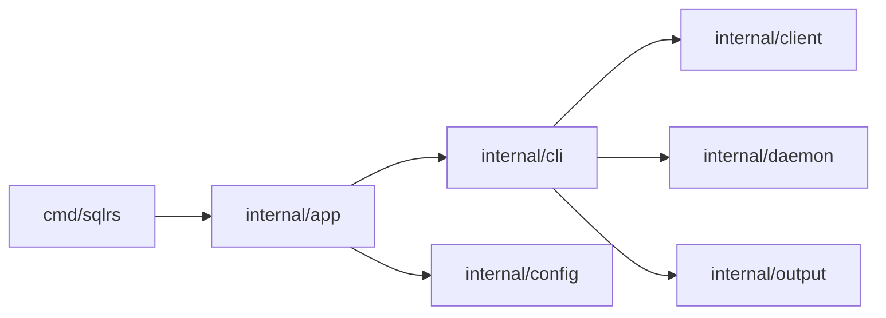

# Компонентная структура CLI

Документ описывает внутреннюю структуру sqlrs CLI.

## 1. Цели

- Явно зафиксировать границы модулей до реализации.
- Отделить логику команд от I/O и транспорта.
- Централизовать форматирование вывода для единого UX.

## 2. Пакеты и ответственность

- `cmd/sqlrs`
  - Entrypoint; вызывает `app.Run`.
- `internal/app`
  - Глобальные флаги и диспетчер команд.
  - Загружает config и workspace.
- `internal/cli`
  - Логика команд (status, init, ls, rm).
  - Выбор режима вывода.
- `internal/client`
  - HTTP клиент, auth headers, обработка redirect.
  - JSON/NDJSON парсинг.
- `internal/daemon`
  - Discovery/launch локального engine.
  - Читает `engine.json`.
- `internal/output`
  - Форматирование таблиц и JSON вывод.
- `internal/config`
  - Парсинг и merge конфигов.

## 3. Диаграмма зависимостей

