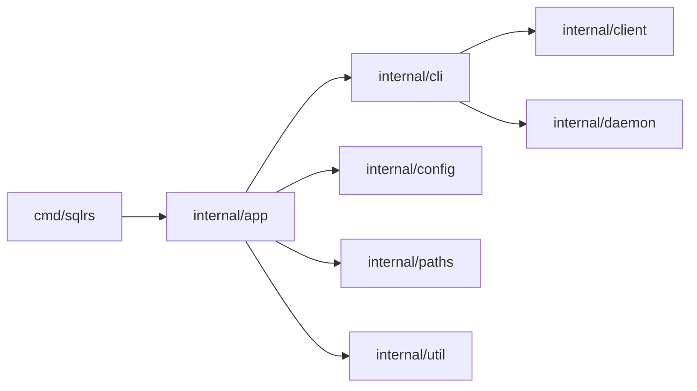

# Компонентная структура CLI

Документ описывает внутреннюю структуру sqlrs CLI.

## 1. Цели

- Явно зафиксировать границы модулей до реализации.
- Отделить логику команд от I/O и транспорта.
- Централизовать форматирование вывода для единого UX.

## 2. Пакеты и ответственность

- `cmd/sqlrs`
  - Entrypoint; вызывает `app.Run`.
- `internal/app`
  - Глобальные флаги и диспетчер команд.
  - Загружает config и workspace.
- `internal/cli`
  - Логика команд (status, init, ls, rm, prepare, plan).
  - Выбор режима вывода и рендер human/json.
- `internal/client`
  - HTTP клиент, auth headers, обработка redirect.
  - JSON/NDJSON парсинг.
- `internal/daemon`
  - Discovery/launch локального engine.
  - Читает `engine.json`.
- `internal/config`
  - Парсинг и merge конфигов.
- `internal/paths`
  - Определение путей для config/cache/state.
- `internal/util`
  - IO-хелперы (атомарная запись, NDJSON reader).

## 3. Ключевые типы и интерфейсы

- `cli.PrepareOptions`
  - Общие опции для prepare/plan (endpoint, auth, image id, args).
  - Дополняется флагом `PlanOnly` для `sqlrs plan`.
- `client.PrepareJobRequest`
  - HTTP payload для `POST /v1/prepare-jobs` (включая `plan_only`).
- `client.PrepareJobStatus`
  - Payload статуса с опциональным списком `tasks` для plan-only.
- `cli.PlanResult`
  - CLI-представление `tasks` для рендера.

## 4. Диаграмма зависимостей

