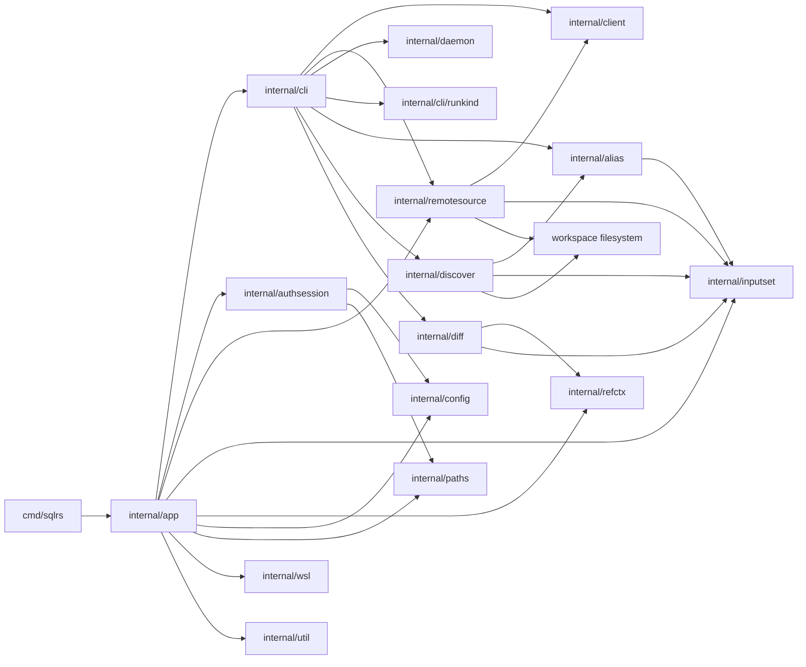

# Компонентная структура CLI

Документ описывает утвержденную внутреннюю структуру `sqlrs` CLI после
добавления общего слоя `inputset` для file-bearing семантики команд.

## 1. Цели

- Разделить парсинг команд, оркестрацию, shared input semantics, транспорт и
  рендеринг.
- Держать один CLI-side источник истины для file-bearing аргументов и правил
  замыкания по каждому поддерживаемому tool kind.
- Переиспользовать одни и те же kind-компоненты между execution, `diff`,
  `alias check`, `alias create`, а также `discover`.
- Использовать единый transport-слой для local и remote профилей.

## 2. Пакеты и ответственность

- `cmd/sqlrs`
  - Точка входа; вызывает `app.Run` и маппит ошибки в exit code.
- `internal/app`
  - Загружает workspace/global config, выбирает профиль и режим.
  - Диспетчеризует граф команд (`prepare:*`, `plan:*`, `run:*`, `ls`, `rm`,
    `status`, `cache`, `config`, `init`, `auth`, `alias`, `discover`, `diff`,
    `user`, `org`).
  - Собирает command context и выбирает path resolver-ы и runtime projection-ы
    из `internal/inputset`.
  - Собирает remote source-sync options для remote `plan`, `prepare` и
    `cache explain` stages, включая выбор ref-backed filesystem, и владеет
    выбором presentation между verbose lines и delayed spinner.
  - Отклоняет remote-only команды управления пользователями и организациями в
    local mode до discovery или autostart локального engine.
  - Владеет package-local helper-ами ref-aware run binding для standalone
    `run --ref`, чтобы raw и alias-backed run flow переиспользовали общие
    boundaries `refctx`, `alias` и `inputset`, не входя в
    prepare-oriented stage pipeline.
  - Владеет package-local prepare-trace helper-ами для `--provenance-path` и
    `cache explain`, чтобы diagnostics переиспользовали тот же bound
    single-stage prepare path, что и реальное execution.
  - Владеет package-local helper-ами оркестрации WSL/init для Windows local
    mode, включая split bootstrap/storage, переиспользование path translation
    и terminal cleanup/progress helper-ы.
- `internal/discover`
  - Advisory workspace-analysis pipeline для `sqlrs discover`.
  - Владеет candidate scoring, topology ranking, alias-coverage suppression,
    copy-paste `alias create` command synthesis и aggregation report.
  - Переиспользует `internal/alias` и `internal/inputset` для aliases
    анализатора.
- `internal/refctx`
  - Общий ref-backed filesystem context для `plan` / `prepare --ref`,
    standalone `run --ref` и ref-mode у `diff`.
  - Владеет поиском repo root, локальным разрешением ref, mapping projected
    cwd, lifecycle detached worktree и setup blob-backed filesystem.
- `internal/remotesource`
  - CLI-side цикл синхронизации remote source-input, описанный в
    `remote-source-input-sync-flow.RU.md`.
  - Владеет расширением `source_manifest`, bounded retry для
    `source_inputs_missing`, безопасным workspace-relative path resolution,
    хэшированием и upload-ом запрошенных source blob-ов, logical context
    workspace root/work dir и emission typed progress events. Package не
    проверяет TTY state и не рендерит terminal output.
- `internal/inputset`
  - Общий CLI-side источник истины для file-bearing семантики команд.
  - Владеет staged абстракциями parse/bind/collect/project и общими типами.
- `internal/inputset/psql`
  - File-bearing аргументы `psql` и include-closure семантика, переиспользуемые
    в `prepare:psql`, `plan:psql`, `run:psql`, `diff`, `alias check`,
    `alias create` и `discover`.
- `internal/inputset/liquibase`
  - Path-bearing аргументы Liquibase, binding search path и семантика
    changelog graph, переиспользуемые в `prepare:lb`, `plan:lb`, `diff`,
    `alias check`, `alias create` и `discover`.
- `internal/inputset/pgbench`
  - File-bearing аргументы `pgbench` и runtime projection, переиспользуемые в
    `run:pgbench` и alias validation / alias creation.
- `internal/alias`
  - Discovery alias files, обработка scan scope, resolution одного alias,
    загрузка YAML, создание alias file и оркестрация статической валидации.
  - Делегирует kind-specific file semantics в `internal/inputset`.
- `internal/diff`
  - Парсинг diff scope, resolution корней сторон, сравнение и рендеринг.
  - Делегирует file semantics вложенной команды в `internal/inputset`.
- `internal/cli`
  - Исполнители клиентских команд и human/JSON renderers, включая auth command
    rendering, read-only cache-explain rendering и rendering remote-only
    управления пользователями и организациями.
- `internal/cli/runkind`
  - Реестр поддерживаемых run kind.
- `internal/authsession`
  - CLI-side OAuth/OIDC session management для `sqlrs auth` и protected remote
    API token resolution.
  - Владеет PKCE/state/nonce generation, Google token endpoint calls, loopback
    callback validation, local credential-store access, cached ID-token refresh
    и safe auth status metadata.
- `internal/client`
  - HTTP клиент для `/v1/*` endpoint-ов.
  - Read-only cache explanation requests для bound prepare stages.
  - Upload source blob-ов и parsing структурированной ошибки
    `source_inputs_missing` для remote source-input synchronization.
  - Запросы управления пользователями и организациями для remote/shared
    деплойментов.
  - NDJSON-стриминг событий prepare и вывода run.
- `internal/daemon`
  - Autostart/discovery локального engine (`engine.json`, lock/state orchestration).
- `internal/config`
  - Загрузка и merge CLI-конфига, typed lookup (`dbms.image`, настройки
    Liquibase, timeout-ы и per-profile `sourceSync` policy).
  - Предоставляет non-secret auth settings remote profile, но не владеет OIDC
    refresh token-ами или cached ID token-ами.
- `internal/paths`
  - OS-aware разрешение директорий config/cache/state.
- `internal/wsl`
  - Примитивы определения WSL и выбора дистрибутива, которые `internal/app`
    использует для `init local` и Windows local mode.
- `internal/util`
  - Общие хелперы (NDJSON reader, atomic I/O, error helpers).

## 3. Ключевые типы и интерфейсы

- `cli.GlobalOptions`, `cli.Command`
  - Распарсенные top-level опции CLI и сегменты команд.
- `cli.LsOptions`, `cli.LsResult`
  - Селекторы list-операций и агрегированный payload names/instances/states/jobs/tasks.
- `cli.PrepareOptions`, `cli.PlanResult`
  - Общие опции prepare/plan и модель рендера плана.
- `cli.RunOptions`, `cli.RunStep`, `cli.RunResult`
  - Параметры запуска (kind, args, stdin/steps) и терминальный результат run.
- `alias.CreateOptions`, `alias.CreatePlan`, `alias.CreateResult`
  - Опции alias creation, derived write plan и terminal result.
- `inputset.PathResolver`, `inputset.CommandSpec`, `inputset.BoundSpec`
  - Общие staged интерфейсы для parsing, host-side binding и сбора file-bearing
    входов.
- `inputset.InputSet`, `inputset.InputEntry`
  - Детерминированное представление объявленных и обнаруженных файлов.
- `alias.Target`, `alias.CheckResult`
  - Цель single-alias resolution и результат статической проверки.
- `discover.Report`, `discover.Finding`, `discover.Candidate`
  - Advisory discovery output, одно finding и scored workspace file candidate,
    включая copy-paste create commands.
- `diff.Scope`, `diff.Context`, `diff.DiffResult`
  - Область сравнения `diff`, резолвленные корни сторон и модель результата.
- `client.PrepareJobRequest`, `client.PrepareJobStatus`, `client.PrepareJobEvent`
  - Payload prepare API, включая `plan_only` и список задач плана.
- `client.CacheExplainPrepareRequest`, `client.CacheExplainPrepareResponse`
  - read-only cache-explain API payload-ы для одного bound single-stage prepare
    decision.
- `client.SourceManifest`, `client.SourceInputsMissingErrorResponse`,
  `client.SourceInputsMissingError`
  - Payload remote source-sync manifest и recoverable missing-input response.
- `remotesource.Options`, `remotesource.Uploader`
  - Опции выполнения remote source-sync и boundary для upload source blob-ов.
- `remotesource.ProgressEvent`, `remotesource.ProgressSink`
  - Execution-local semantic progress stream и presentation-neutral consumer
    boundary. Events содержат relative paths, shortened digests, counts и
    фактически переданные bytes, но не source bytes или absolute host paths.
- `remotesource.ClientWorkspaceContext`
  - Передаёт absolute logical client workspace root и effective working
    directory, используемые для отображения bound paths `psql` и Liquibase в
    manifest keys.
- `client.RunRequest`, `client.RunEvent`
  - Payload run API и стрим событий (`stdout`, `stderr`, `exit`, `error`,
    `log`).
- `cli.ConfigOptions`, `client.ConfigValue`
  - Опции config-команд и API payload значений.
- `authsession.Manager`, `authsession.Session`, `authsession.CredentialStore`
  - CLI auth session manager, stored OIDC session model и OS credential store
    abstraction.
- `cli.UserOptions`, `cli.OrganizationOptions`
  - Remote-only опции команд для `sqlrs user` и `sqlrs org`.
- `client.UserProfile`, `client.ExternalIdentity`, `client.Organization`,
  `client.OrganizationMembership`
  - API payload-ы пользователей и организаций. Уникальность external identity
    принадлежит серверу и задается по `provider + issuer + subject`.

## 4. Владение данными

- CLI-конфиг файловый (workspace + global) и загружается в память на время
  запуска команды.
- OIDC refresh token-ы не являются данными CLI config. Это локальные
  credentials auth session layer, которые хранятся в OS credential store.
- Raw argv принадлежит command orchestrator-у, пока не передан выбранному
  kind-компоненту `internal/inputset`.
- Parsed specs, bound specs и collected input sets эфемерны и живут только
  в рамках одного CLI invocation.
- Remote source manifests, retry state для missing-input и тела uploaded source
  blob-ов эфемерны в рамках одного invocation. CLI может отправлять source
  blob-ы только в аутентифицированный remote API и не сохраняет их в CLI config.
- HTTP client разделяет deadlines control requests и source transfer; default
  source-transfer deadline равен 15 минутам.
- Состояние discovery локального engine (`engine.json`, daemon lock/process
  metadata) ведется через `internal/daemon`.
- Rendered alias-create commands эфемерны и существуют только в CLI output.
- Server config принадлежит engine-side storage и читается/изменяется по HTTP
  (`/v1/config*`), без локального кеширования в CLI.
- Профили пользователей, external identities, организации и memberships
  принадлежат remote/shared control-plane store. CLI не кеширует их, а
  discovery-состояние локального engine в этих командах не участвует.

## 5. Диаграмма зависимостей

```mermaid
flowchart LR
  CMD["cmd/sqlrs"]
  APP["internal/app"]
  CLI["internal/cli"]
  AUTH["internal/authsession"]
  REMOTESOURCE["internal/remotesource"]
  INPUTSET["internal/inputset"]
  ALIAS["internal/alias"]
  DISCOVER["internal/discover"]
  REFCTX["internal/refctx"]
  DIFF["internal/diff"]
  RUNKIND["internal/cli/runkind"]
  CLIENT["internal/client"]
  DAEMON["internal/daemon"]
  CONFIG["internal/config"]
  PATHS["internal/paths"]
  WSL["internal/wsl"]
  UTIL["internal/util"]
  FS["workspace filesystem"]

  CMD --> APP
  APP --> CLI
  APP --> AUTH
  APP --> REMOTESOURCE
  APP --> INPUTSET
  APP --> REFCTX
  APP --> CONFIG
  APP --> PATHS
  APP --> WSL
  APP --> UTIL
  AUTH --> CONFIG
  AUTH --> PATHS
  CLI --> CLIENT
  CLI --> REMOTESOURCE
  CLI --> DAEMON
  CLI --> RUNKIND
  CLI --> ALIAS
  CLI --> DISCOVER
  CLI --> DIFF
  REMOTESOURCE --> CLIENT
  REMOTESOURCE --> INPUTSET
  REMOTESOURCE --> FS
  DIFF --> REFCTX
  ALIAS --> INPUTSET
  DISCOVER --> ALIAS
  DISCOVER --> INPUTSET
  DISCOVER --> FS
  DIFF --> INPUTSET
```
