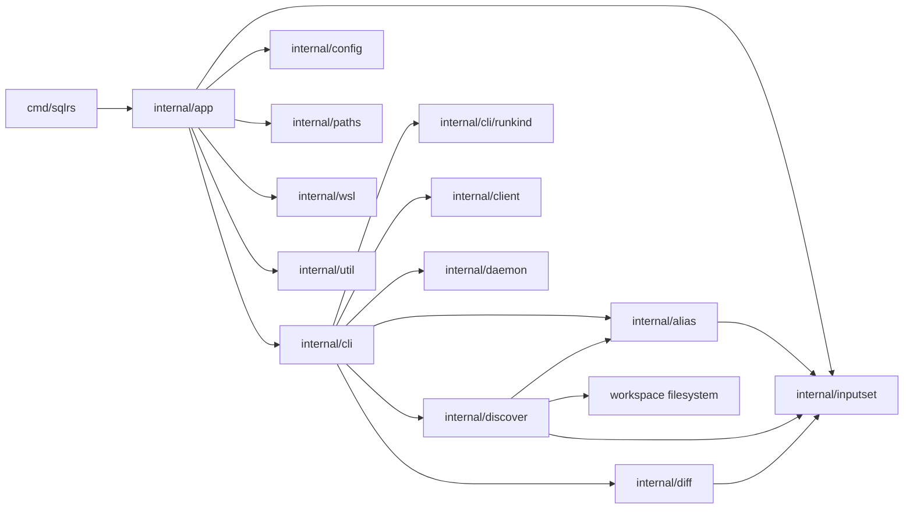

# Компонентная структура CLI

Документ описывает утвержденную внутреннюю структуру `sqlrs` CLI после
добавления общего слоя `inputset` для file-bearing семантики команд.

## 1. Цели

- Разделить парсинг команд, оркестрацию, shared input semantics, транспорт и
  рендеринг.
- Держать один CLI-side источник истины для file-bearing аргументов и правил
  замыкания по каждому поддерживаемому tool kind.
- Переиспользовать одни и те же kind-компоненты между execution, `diff`,
  `alias check`, `alias create`, а также `discover`.
- Использовать единый transport-слой для local и remote профилей.

## 2. Пакеты и ответственность

- `cmd/sqlrs`
  - Точка входа; вызывает `app.Run` и маппит ошибки в exit code.
- `internal/app`
  - Загружает workspace/global config, выбирает профиль и режим.
  - Диспетчеризует граф команд (`prepare:*`, `plan:*`, `run:*`, `ls`, `rm`,
    `status`, `config`, `init`, `alias`, `discover`, `diff`).
  - Собирает command context и выбирает path resolver-ы и runtime projection-ы
    из `internal/inputset`.
- `internal/discover`
  - Advisory workspace-analysis pipeline для `sqlrs discover`.
  - Владеет candidate scoring, topology ranking, alias-coverage suppression,
    copy-paste `alias create` command synthesis и aggregation report.
  - Переиспользует `internal/alias` и `internal/inputset` для aliases
    анализатора.
- `internal/inputset`
  - Общий CLI-side источник истины для file-bearing семантики команд.
  - Владеет staged абстракциями parse/bind/collect/project и общими типами.
- `internal/inputset/psql`
  - File-bearing аргументы `psql` и include-closure семантика, переиспользуемые
    в `prepare:psql`, `plan:psql`, `run:psql`, `diff`, `alias check`,
    `alias create` и `discover`.
- `internal/inputset/liquibase`
  - Path-bearing аргументы Liquibase, binding search path и семантика
    changelog graph, переиспользуемые в `prepare:lb`, `plan:lb`, `diff`,
    `alias check`, `alias create` и `discover`.
- `internal/inputset/pgbench`
  - File-bearing аргументы `pgbench` и runtime projection, переиспользуемые в
    `run:pgbench` и alias validation / alias creation.
- `internal/alias`
  - Discovery alias files, обработка scan scope, resolution одного alias,
    загрузка YAML, создание alias file и оркестрация статической валидации.
  - Делегирует kind-specific file semantics в `internal/inputset`.
- `internal/diff`
  - Парсинг diff scope, resolution корней сторон, сравнение и рендеринг.
  - Делегирует file semantics вложенной команды в `internal/inputset`.
- `internal/cli`
  - Исполнители клиентских команд и human/JSON renderers.
- `internal/cli/runkind`
  - Реестр поддерживаемых run kind.
- `internal/client`
  - HTTP клиент для `/v1/*` endpoint-ов.
  - NDJSON-стриминг событий prepare и вывода run.
- `internal/daemon`
  - Autostart/discovery локального engine (`engine.json`, lock/state orchestration).
- `internal/config`
  - Загрузка и merge CLI-конфига, typed lookup (`dbms.image`, настройки
    Liquibase, timeout-ы).
- `internal/paths`
  - OS-aware разрешение директорий config/cache/state.
- `internal/wsl`
  - Определение WSL и выбор дистрибутива для `init local` и Windows local mode.
- `internal/util`
  - Общие хелперы (NDJSON reader, atomic I/O, error helpers).

## 3. Ключевые типы и интерфейсы

- `cli.GlobalOptions`, `cli.Command`
  - Распарсенные top-level опции CLI и сегменты команд.
- `cli.LsOptions`, `cli.LsResult`
  - Селекторы list-операций и агрегированный payload names/instances/states/jobs/tasks.
- `cli.PrepareOptions`, `cli.PlanResult`
  - Общие опции prepare/plan и модель рендера плана.
- `cli.RunOptions`, `cli.RunStep`, `cli.RunResult`
  - Параметры запуска (kind, args, stdin/steps) и терминальный результат run.
- `alias.CreateOptions`, `alias.CreatePlan`, `alias.CreateResult`
  - Опции alias creation, derived write plan и terminal result.
- `inputset.PathResolver`, `inputset.CommandSpec`, `inputset.BoundSpec`
  - Общие staged интерфейсы для parsing, host-side binding и сбора file-bearing
    входов.
- `inputset.InputSet`, `inputset.InputEntry`
  - Детерминированное представление объявленных и обнаруженных файлов.
- `alias.Target`, `alias.CheckResult`
  - Цель single-alias resolution и результат статической проверки.
- `discover.Report`, `discover.Finding`, `discover.Candidate`
  - Advisory discovery output, одно finding и scored workspace file candidate,
    включая copy-paste create commands.
- `diff.Scope`, `diff.Context`, `diff.DiffResult`
  - Область сравнения `diff`, резолвленные корни сторон и модель результата.
- `client.PrepareJobRequest`, `client.PrepareJobStatus`, `client.PrepareJobEvent`
  - Payload prepare API, включая `plan_only` и список задач плана.
- `client.RunRequest`, `client.RunEvent`
  - Payload run API и стрим событий (`stdout`, `stderr`, `exit`, `error`,
    `log`).
- `cli.ConfigOptions`, `client.ConfigValue`
  - Опции config-команд и API payload значений.

## 4. Владение данными

- CLI-конфиг файловый (workspace + global) и загружается в память на время
  запуска команды.
- Raw argv принадлежит command orchestrator-у, пока не передан выбранному
  kind-компоненту `internal/inputset`.
- Parsed specs, bound specs и collected input sets эфемерны и живут только
  в рамках одного CLI invocation.
- Состояние discovery локального engine (`engine.json`, daemon lock/process
  metadata) ведется через `internal/daemon`.
- Rendered alias-create commands эфемерны и существуют только в CLI output.
- Server config принадлежит engine-side storage и читается/изменяется по HTTP
  (`/v1/config*`), без локального кеширования в CLI.

## 5. Диаграмма зависимостей

```mermaid
flowchart LR
  CMD["cmd/sqlrs"]
  APP["internal/app"]
  CLI["internal/cli"]
  INPUTSET["internal/inputset"]
  ALIAS["internal/alias"]
  DISCOVER["internal/discover"]
  DIFF["internal/diff"]
  RUNKIND["internal/cli/runkind"]
  CLIENT["internal/client"]
  DAEMON["internal/daemon"]
  CONFIG["internal/config"]
  PATHS["internal/paths"]
  WSL["internal/wsl"]
  UTIL["internal/util"]
  FS["workspace filesystem"]

  CMD --> APP
  APP --> CLI
  APP --> INPUTSET
  APP --> CONFIG
  APP --> PATHS
  APP --> WSL
  APP --> UTIL
  CLI --> CLIENT
  CLI --> DAEMON
  CLI --> RUNKIND
  CLI --> ALIAS
  CLI --> DISCOVER
  CLI --> DIFF
  ALIAS --> INPUTSET
  DISCOVER --> ALIAS
  DISCOVER --> INPUTSET
  DISCOVER --> FS
  DIFF --> INPUTSET
```
