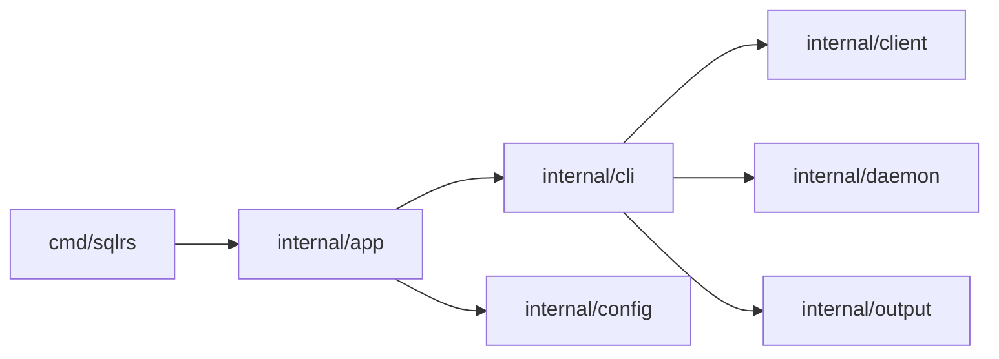

# CLI Component Structure

This document defines the internal component layout of the sqlrs CLI.

## 1. Goals

- Make module boundaries explicit before implementation.
- Keep command logic separate from I/O and transport.
- Centralize output formatting for consistent UX.

## 2. Packages and responsibilities

- `cmd/sqlrs`
  - Entrypoint; invokes `app.Run`.
- `internal/app`
  - Global flags and command dispatch.
  - Loads config and workspace.
- `internal/cli`
  - Command logic (status, init, ls, rm).
  - Chooses output mode.
- `internal/client`
  - HTTP client, auth headers, redirect handling.
  - JSON/NDJSON parsing.
- `internal/daemon`
  - Local engine discovery and spawn.
  - Reads `engine.json`.
- `internal/output`
  - Table formatting and JSON output helpers.
- `internal/config`
  - Config parsing and merging.

## 3. Dependency diagram

