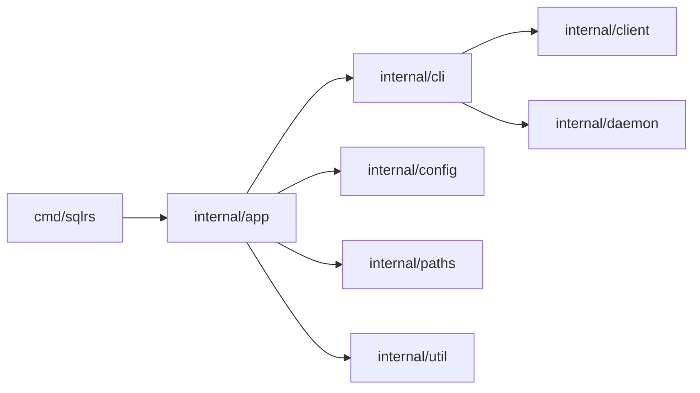

# CLI Component Structure

This document defines the internal component layout of the sqlrs CLI.

## 1. Goals

- Make module boundaries explicit before implementation.
- Keep command logic separate from I/O and transport.
- Centralize output formatting for consistent UX.

## 2. Packages and responsibilities

- `cmd/sqlrs`
  - Entrypoint; invokes `app.Run`.
- `internal/app`
  - Global flags and command dispatch.
  - Loads config and workspace.
- `internal/cli`
  - Command logic (status, init, ls, rm, prepare, plan, run, config).
  - Chooses output mode and renders human/json output.
- `internal/cli/runkind`
  - Built-in run kinds registry (`psql`, `pgbench`).
  - DSN injection rules and default command mapping.
- `internal/client`
  - HTTP client, auth headers, redirect handling.
  - JSON/NDJSON parsing.
  - Config endpoints (`/v1/config`, `/v1/config/schema`).
- `internal/daemon`
  - Local engine discovery and spawn.
  - Reads `engine.json`.
- `internal/config`
  - Local CLI config parsing and merging.
- `internal/paths`
  - OS-specific path resolution for config/cache/state.
- `internal/util`
  - IO helpers (atomic writes, NDJSON reader).

## 3. Key types and interfaces

- `cli.LsOptions`, `cli.LsResult`
  - Selector flags include jobs/tasks and a `job` filter.
  - Results include optional job/task lists alongside names/instances/states.
- `cli.PrepareOptions`
  - Shared options for prepare/plan execution (endpoint, auth, image id, args).
  - Extended with `PlanOnly` for `sqlrs plan`.
- `cli.RunOptions`
  - `Kind`, `InstanceRef`, `Command`, `Args`, `OutputMode`.
- `cli.RunTarget`
  - Resolved instance id + DSN for execution.
- `client.RunRequest`
  - HTTP payload for run execution (kind, command/default, args).
- `client.RunStream`
  - Streaming run output (stdout/stderr/exit).
- `client.PrepareJobRequest`
  - HTTP payload for `POST /v1/prepare-jobs` (includes `plan_only`).
- `client.PrepareJobStatus`
  - Status payload with optional `tasks` list for plan-only jobs.
- `client.PrepareJobEntry`
  - List payload for `GET /v1/prepare-jobs`.
- `client.TaskEntry`
  - List payload for `GET /v1/tasks`.
- `cli.PlanResult`
  - CLI-facing view of `tasks` for rendering.
- `client.ConfigValue`, `client.ConfigSchema`
  - HTTP payloads for config get/set/schema endpoints.
- `cli.ConfigOptions`
  - Path/value/effective/options for `sqlrs config` commands.

## 4. Data ownership

- Local CLI config lives in project files; CLI loads it into memory per command.
- Server config is fetched on demand via HTTP and is not cached on disk by the CLI.

## 5. Dependency diagram

