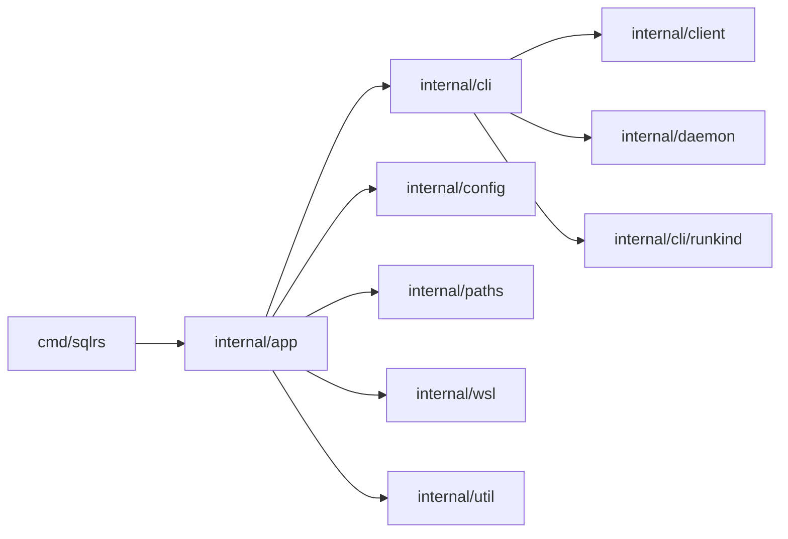

# CLI Component Structure

This document defines the current internal layout of the `sqlrs` CLI.

## 1. Goals

- Keep command parsing, orchestration, transport, and rendering separated.
- Reuse one transport layer for local and remote profiles.
- Keep command-specific argument normalization in one place.

## 2. Packages and responsibilities

- `cmd/sqlrs`
  - Entrypoint; invokes `app.Run` and maps errors to exit codes.
- `internal/app`
  - Loads workspace/global config and resolves profile/mode.
  - Dispatches command graph (`prepare:*`, `plan:*`, `run:*`, `ls`, `rm`, `status`, `config`, `init`).
  - Normalizes file/path arguments before transport calls.
- `internal/cli`
  - Client-side command executors (`RunLs`, `RunPrepare`, `RunPlan`, `RunRun`, `RunStatus`, `RunConfig`, `RunRm`).
  - Human-readable rendering for table/plan/status outputs.
- `internal/cli/runkind`
  - Registry of supported run kinds (`psql`, `pgbench`).
- `internal/client`
  - HTTP API client for `/v1/*` endpoints.
  - NDJSON streaming for prepare events and run output.
- `internal/daemon`
  - Local engine autostart/discovery (`engine.json`, lock/state orchestration).
- `internal/config`
  - CLI config loading, merge, and typed lookups (`dbms.image`, Liquibase settings, timeouts).
- `internal/paths`
  - OS-aware config/cache/state directory resolution.
- `internal/wsl`
  - WSL detection and distro resolution used by `init local` and Windows local mode.
- `internal/util`
  - Shared helpers (NDJSON reader, atomic IO helpers, error helpers).

## 3. Key types and interfaces

- `cli.GlobalOptions`, `cli.Command`
  - Parsed top-level CLI options and command segments.
- `cli.LsOptions`, `cli.LsResult`
  - List selectors and aggregated names/instances/states/jobs/tasks payload.
- `cli.PrepareOptions`, `cli.PlanResult`
  - Shared prepare/plan options and plan rendering model.
- `cli.RunOptions`, `cli.RunStep`, `cli.RunResult`
  - Run invocation options (kind, args, stdin/steps) and terminal run result.
- `client.PrepareJobRequest`, `client.PrepareJobStatus`, `client.PrepareJobEvent`
  - Prepare API payloads, including `plan_only` and planned tasks.
- `client.RunRequest`, `client.RunEvent`
  - Run API payload and streamed events (`stdout`, `stderr`, `exit`, `error`, `log`).
- `cli.ConfigOptions`, `client.ConfigValue`
  - Config command options and API value payloads.

## 4. Data ownership

- CLI config is file-based (workspace + global); loaded into memory per invocation.
- Engine discovery state (`engine.json`, daemon lock/process metadata) is managed via `internal/daemon`.
- Server config is owned by engine-side storage and accessed via HTTP (`/v1/config*`), not cached by CLI.

## 5. Dependency diagram

