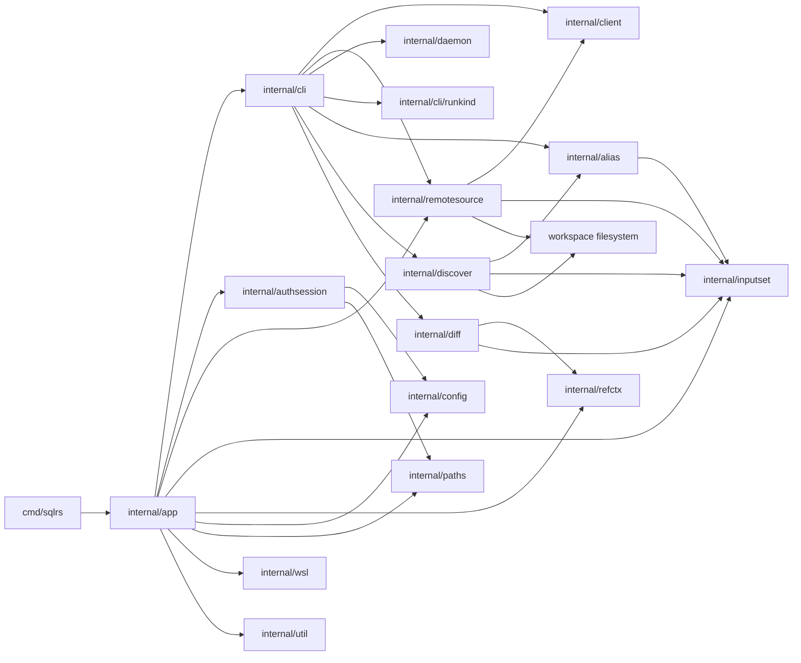

# CLI Component Structure

This document defines the approved internal layout of the `sqlrs` CLI after the
addition of a shared `inputset` layer for file-bearing command semantics.

## 1. Goals

- Keep command parsing, orchestration, shared input semantics, transport, and
  rendering separated.
- Keep one CLI-side source of truth for file-bearing arguments and closure rules
  for each supported tool kind.
- Reuse the same kind components across execution, `diff`, `alias check`,
  `alias create`, and `discover`.
- Reuse one transport layer for local and remote profiles.

## 2. Packages and responsibilities

- `cmd/sqlrs`
  - Entrypoint; invokes `app.Run` and maps errors to exit codes.
- `internal/app`
  - Loads workspace/global config and resolves profile/mode.
  - Dispatches the command graph (`prepare:*`, `plan:*`, `run:*`, `ls`, `rm`,
    `status`, `cache`, `config`, `init`, `auth`, `alias`, `discover`, `diff`,
    `user`, `org`).
  - Builds command context and chooses path resolvers and runtime projections
    from `internal/inputset`.
  - Builds remote source-sync options for remote `plan`, `prepare`, and
    `cache explain` stages, including ref-backed filesystem selection.
  - Rejects remote-only user and organization commands in local mode before
    local engine discovery or autostart.
  - Owns package-local ref-aware run-binding helpers for standalone
    `run --ref` so raw and alias-backed run flows reuse shared `refctx`,
    `alias`, and `inputset` boundaries without entering the prepare-oriented
    stage pipeline.
  - Owns package-local prepare-trace helpers used by `--provenance-path` and
    `cache explain` so diagnostics reuse the same bound single-stage prepare
    path as real execution.
  - Owns package-local WSL/init orchestration helpers for Windows local mode,
    including bootstrap/storage splitting, path translation reuse, and terminal
    cleanup/progress helpers.
- `internal/discover`
  - Advisory workspace-analysis pipeline for `sqlrs discover`.
  - Owns candidate scoring, topology ranking, alias-coverage suppression,
    copy-paste `alias create` command synthesis, and report aggregation.
  - Reuses `internal/alias` and `internal/inputset` for the aliases analyzer.
- `internal/refctx`
  - Shared ref-backed filesystem context for `plan` / `prepare --ref`,
    standalone `run --ref`, and `diff` ref-mode.
  - Owns repo-root discovery, local ref resolution, projected-cwd mapping,
    detached-worktree lifecycle, and blob-backed filesystem setup.
- `internal/remotesource`
  - CLI-side remote source-input synchronization loop documented in
    `remote-source-input-sync-flow.md`.
  - Owns `source_manifest` expansion, bounded `source_inputs_missing` retry,
    safe workspace-relative path resolution, requested source blob hashing and
    upload, and progress reporting to the stage stderr writer.
- `internal/inputset`
  - Shared CLI-side source of truth for file-bearing command semantics.
  - Owns staged parse/bind/collect/project abstractions and common helper types.
- `internal/inputset/psql`
  - `psql` file-bearing args and include-closure semantics reused by
    `prepare:psql`, `plan:psql`, `run:psql`, `diff`, `alias check`,
    `alias create`, and `discover`.
- `internal/inputset/liquibase`
  - Liquibase path-bearing args, search-path binding, and changelog-graph
    semantics reused by `prepare:lb`, `plan:lb`, `diff`, `alias check`,
    `alias create`, and `discover`.
- `internal/inputset/pgbench`
  - `pgbench` file-bearing args and runtime projection reused by `run:pgbench`
    and alias validation / alias creation.
- `internal/alias`
  - Alias discovery, scan-scope handling, single-alias resolution, YAML loading,
    alias file creation, and static validation orchestration.
  - Delegates kind-specific file semantics to `internal/inputset`.
- `internal/diff`
  - Diff-scope parsing, side-root resolution, comparison, and rendering.
  - Delegates wrapped-command file semantics to `internal/inputset`.
- `internal/cli`
  - Client-side command executors and human/JSON renderers, including
    auth command rendering, read-only cache-explain rendering, and remote-only
    user/organization management rendering.
- `internal/cli/runkind`
  - Registry of supported run kinds.
- `internal/authsession`
  - CLI-side OAuth/OIDC session management for `sqlrs auth` and protected
    remote API token resolution.
  - Owns PKCE/state/nonce generation, Google token endpoint calls, loopback
    callback validation, local credential-store access, cached ID-token refresh,
    and safe auth status metadata.
- `internal/client`
  - HTTP API client for `/v1/*` endpoints.
  - Read-only cache explanation requests for bound prepare stages.
  - Source blob upload requests and structured `source_inputs_missing` error
    parsing for remote source-input synchronization.
  - User and organization management requests for remote/shared deployments.
  - NDJSON streaming for prepare events and run output.
- `internal/daemon`
  - Local engine autostart/discovery (`engine.json`, lock/state orchestration).
- `internal/config`
  - CLI config loading, merge, and typed lookups (`dbms.image`, Liquibase
    settings, timeouts, and per-profile `sourceSync` policy).
  - Provides non-secret remote profile auth settings, but does not own OIDC
    refresh tokens or cached ID tokens.
- `internal/paths`
  - OS-aware config/cache/state directory resolution.
- `internal/wsl`
  - WSL detection and distro resolution primitives used by `internal/app` for
    `init local` and Windows local mode.
- `internal/util`
  - Shared helpers (NDJSON reader, atomic I/O helpers, error helpers).

## 3. Key types and interfaces

- `cli.GlobalOptions`, `cli.Command`
  - Parsed top-level CLI options and command segments.
- `cli.LsOptions`, `cli.LsResult`
  - List selectors and aggregated names/instances/states/jobs/tasks payload.
- `cli.PrepareOptions`, `cli.PlanResult`
  - Shared prepare/plan options and plan rendering model.
- `cli.RunOptions`, `cli.RunStep`, `cli.RunResult`
  - Run invocation options (kind, args, stdin/steps) and terminal run result.
- `alias.CreateOptions`, `alias.CreatePlan`, `alias.CreateResult`
  - Alias creation options, derived write plan, and terminal result.
- `inputset.PathResolver`, `inputset.CommandSpec`, `inputset.BoundSpec`
  - Shared staged interfaces for parsing, host-side binding, and collection of
    file-bearing inputs.
- `inputset.InputSet`, `inputset.InputEntry`
  - Deterministic collected view of declared and discovered files.
- `alias.Target`, `alias.CheckResult`
  - Single-alias resolution target and static validation result.
- `discover.Report`, `discover.Finding`, `discover.Candidate`
  - Advisory discovery output, one finding, and a scored workspace file
    candidate, including copy-paste create commands.
- `diff.Scope`, `diff.Context`, `diff.DiffResult`
  - `diff` comparison scope, resolved side roots, and rendered comparison model.
- `client.PrepareJobRequest`, `client.PrepareJobStatus`, `client.PrepareJobEvent`
  - Prepare API payloads, including `plan_only` and planned tasks.
- `client.CacheExplainPrepareRequest`, `client.CacheExplainPrepareResponse`
  - Read-only cache-explain API payloads for one bound single-stage prepare
    decision.
- `client.SourceManifest`, `client.SourceInputsMissingErrorResponse`,
  `client.SourceInputsMissingError`
  - Remote source-sync manifest payload and recoverable missing-input response.
- `remotesource.Options`, `remotesource.Uploader`
  - Remote source-sync execution options and source blob upload boundary.
- `client.RunRequest`, `client.RunEvent`
  - Run API payload and streamed events (`stdout`, `stderr`, `exit`, `error`,
    `log`).
- `cli.ConfigOptions`, `client.ConfigValue`
  - Config command options and API value payloads.
- `authsession.Manager`, `authsession.Session`, `authsession.CredentialStore`
  - CLI auth session manager, stored OIDC session model, and OS credential
    store abstraction.
- `cli.UserOptions`, `cli.OrganizationOptions`
  - Remote-only command options for `sqlrs user` and `sqlrs org`.
- `client.UserProfile`, `client.ExternalIdentity`, `client.Organization`,
  `client.OrganizationMembership`
  - User and organization API payloads. External identity uniqueness is owned
    by the server over `provider + issuer + subject`.

## 4. Data ownership

- CLI config is file-based (workspace + global); loaded into memory per
  invocation.
- OIDC refresh tokens are not CLI config data. They are local credentials owned
  by the auth session layer and stored in the OS credential store.
- Raw argv belongs to the command orchestrator until it is handed to the chosen
  `internal/inputset` kind component.
- Parsed specs, bound specs, and collected input sets are ephemeral and live
  only for one CLI invocation.
- Remote source manifests, missing-input retry state, and uploaded source blob
  bodies are ephemeral per invocation. The CLI may send source blobs only to the
  authenticated remote API; it does not persist them in CLI config.
- Engine discovery state (`engine.json`, daemon lock/process metadata) is
  managed via `internal/daemon`.
- Rendered alias-create commands are ephemeral and exist only in CLI output.
- Server config is owned by engine-side storage and accessed via HTTP
  (`/v1/config*`), not cached by the CLI.
- User profiles, external identities, organizations, and memberships are owned
  by the remote/shared control-plane store. The CLI does not cache them, and
  local engine discovery state is not involved in these commands.

## 5. Dependency diagram

```mermaid
flowchart LR
  CMD["cmd/sqlrs"]
  APP["internal/app"]
  CLI["internal/cli"]
  AUTH["internal/authsession"]
  REMOTESOURCE["internal/remotesource"]
  INPUTSET["internal/inputset"]
  ALIAS["internal/alias"]
  DISCOVER["internal/discover"]
  REFCTX["internal/refctx"]
  DIFF["internal/diff"]
  RUNKIND["internal/cli/runkind"]
  CLIENT["internal/client"]
  DAEMON["internal/daemon"]
  CONFIG["internal/config"]
  PATHS["internal/paths"]
  WSL["internal/wsl"]
  UTIL["internal/util"]
  FS["workspace filesystem"]

  CMD --> APP
  APP --> CLI
  APP --> AUTH
  APP --> REMOTESOURCE
  APP --> INPUTSET
  APP --> REFCTX
  APP --> CONFIG
  APP --> PATHS
  APP --> WSL
  APP --> UTIL
  AUTH --> CONFIG
  AUTH --> PATHS
  CLI --> CLIENT
  CLI --> REMOTESOURCE
  CLI --> DAEMON
  CLI --> RUNKIND
  CLI --> ALIAS
  CLI --> DISCOVER
  CLI --> DIFF
  REMOTESOURCE --> CLIENT
  REMOTESOURCE --> INPUTSET
  REMOTESOURCE --> FS
  DIFF --> REFCTX
  ALIAS --> INPUTSET
  DISCOVER --> ALIAS
  DISCOVER --> INPUTSET
  DISCOVER --> FS
  DIFF --> INPUTSET
```
