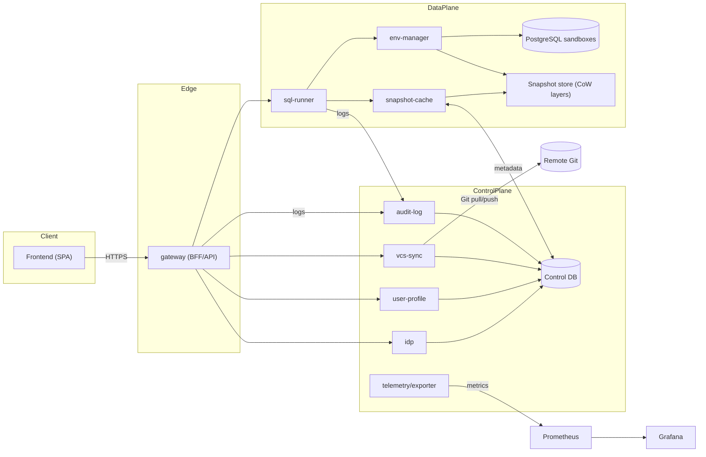
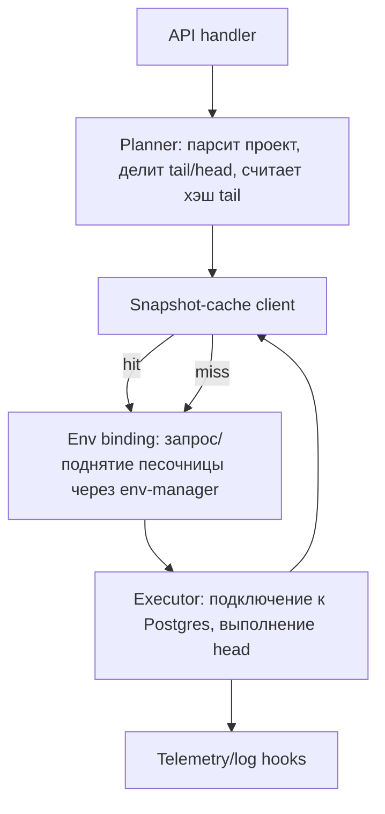
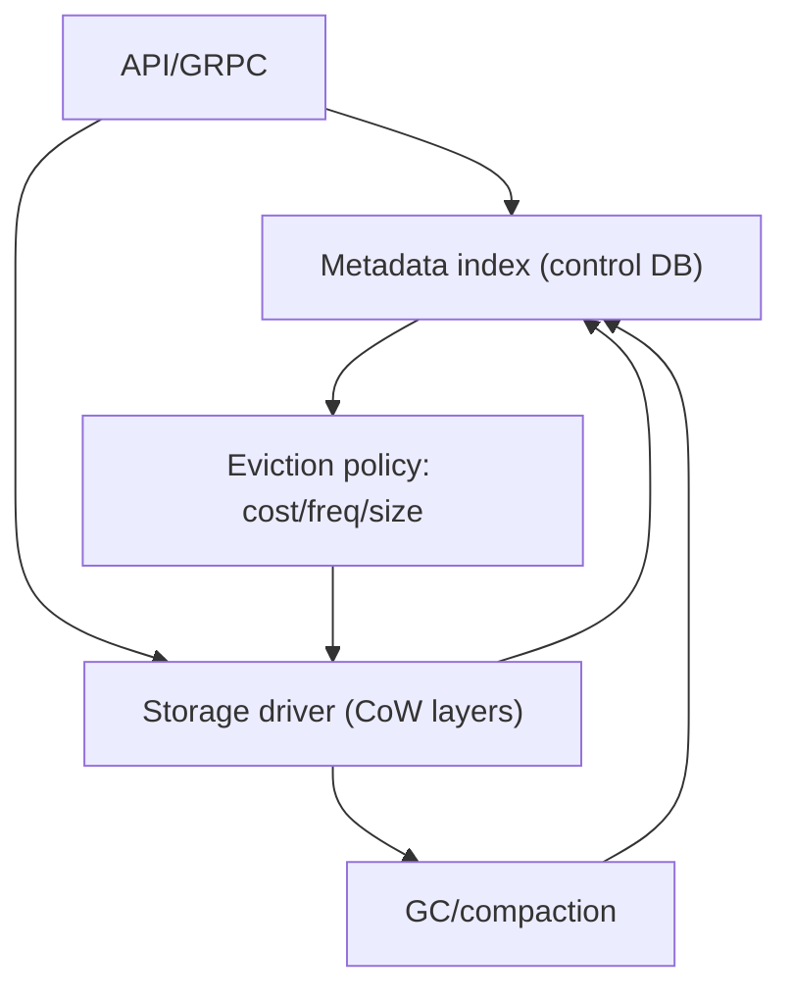
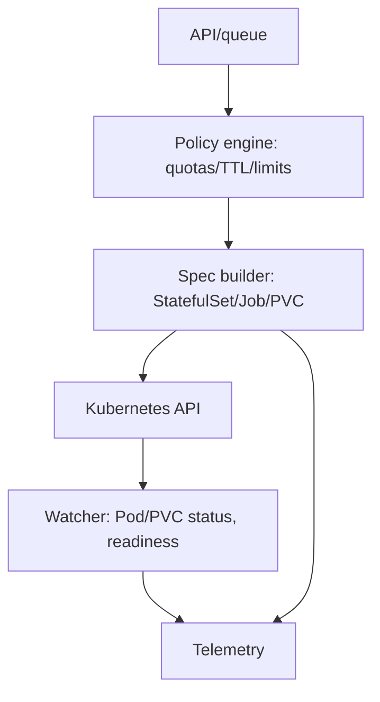
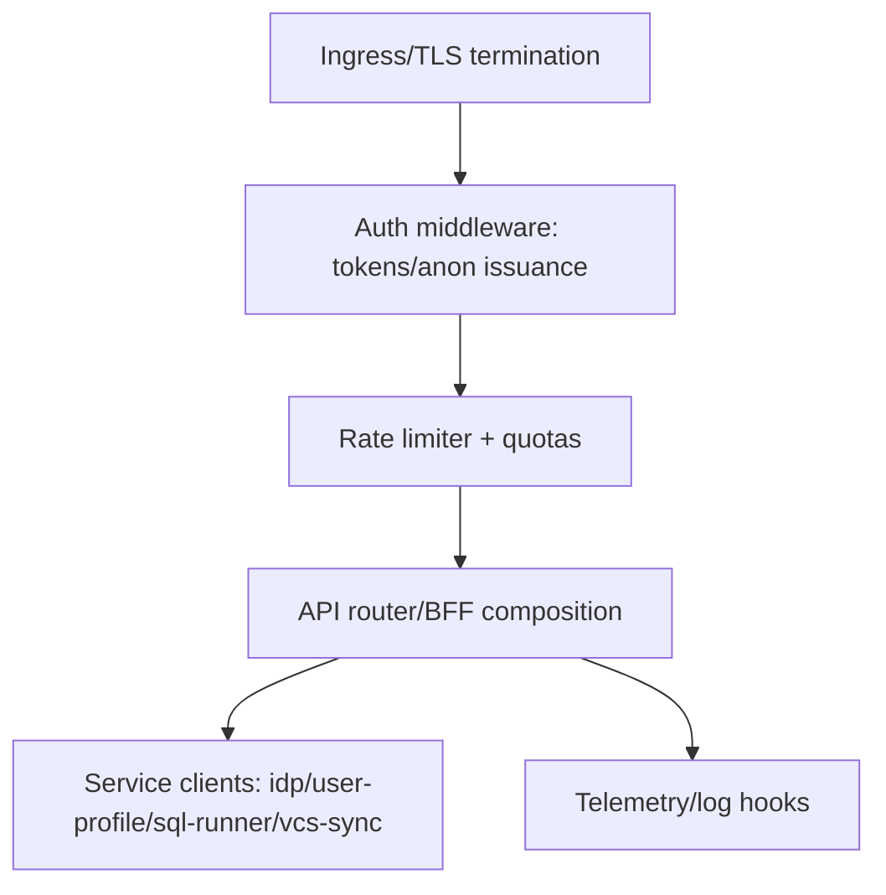

# Диаграммы архитектуры (MVP)

> Формат: mermaid. Открывать в Markdown с поддержкой mermaid или через онлайн-viewer.

## 1. Топология сервисов и коммуникаций (k8s)

## 2. Внутренняя архитектура ключевых сервисов

### 2.1 sql-runner

### 2.2 snapshot-cache

### 2.3 env-manager

### 2.4 gateway (BFF/API)

