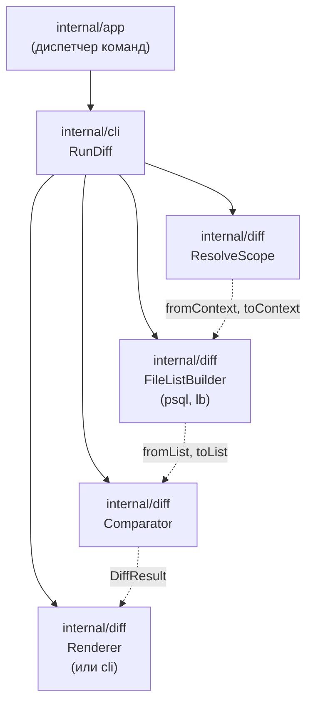

# sqlrs diff — структура компонентов

В этом документе описана **архитектурная проработка** команды `sqlrs diff` после
контракта CLI и user guide: какие компоненты есть, кто кого вызывает и где они
расположены. Это следующий шаг после дизайна в
[`docs/user-guides/sqlrs-diff.md`](../user-guides/sqlrs-diff.md) и
[`docs/architecture/cli-contract.md`](cli-contract.md).

## 1. Область и допущения

- **Статус**: первый срез **реализован** в `frontend/cli-go` (`internal/diff`,
  `internal/cli.RunDiff`, dispatch в `internal/app`). Ниже также зафиксирован
  дизайн следующих срезов.
- **Первый срез**: diff выполняется целиком в CLI; без engine. CLI разрешает две
  стороны (ref или path), строит closures для psql и Liquibase, сравнивает пути и
  хеши контента, рендерит вывод.
- **Поведение plan vs prepare** в коде пока одинаковое: те же построители
  списков файлов.
- **Режим ref**: в реализации только **`worktree`**; режим `blob` не сделан
  (явная ошибка при запросе).
- **Оборачиваемая команда**: один токен — `plan:psql`, `plan:lb`, `prepare:psql`,
  `prepare:lb`. Composite `prepare … run …` не парсится.
- **Единица развёртывания**: только CLI. Изменения в `backend/local-engine-go` не
  требуются.

## 2. Компоненты и ответственность

| Компонент | Ответственность | Кто вызывает |
|-----------|-----------------|--------------|
| **Обработчик команды diff** | `diff.ParseDiffScope` + один wrapped-токен; оркестрация `ResolveScope` → построение списков (обе стороны) → `Compare` → рендер; коды выхода. | `internal/app` → `internal/cli.RunDiff` |
| **Разрешитель области** | `internal/diff.ResolveScope`: два **контекста** — абсолютные корни `--from-path`/`--to-path` или **detached worktree** на каждый ref. | `RunDiff` |
| **Построитель списка файлов** | `BuildPsqlFileList` / `BuildLbFileList` для kind psql или lb и wrapped args. | `RunDiff` (для from и to) |
| **Компаратор diff** | `Compare(fromList, toList, options)` — Added / Modified / Removed; `--limit`, `--include-content`. | `RunDiff` |
| **Рендер diff** | `RenderHuman` / `RenderJSON`. | `RunDiff` |

## 3. Построитель списка файлов по kind

Построитель списка файлов — **ключевая абстракция**, разная для каждого kind. У
каждого kind одна точка входа и одно правило замыкания.

| Kind | Точка входа из аргументов | Правило замыкания | Реализация |
|------|---------------------------|-------------------|------------|
| **prepare:psql** / plan:psql | `-f <file>` (путь к файлу; не stdin `-f -`) | От каждого файла из `-f` рекурсивно добавлять все файлы, на которые ссылаются `\i`, `\ir`, `\include`, `\include_relative`. | `BuildPsqlFileList` в `internal/diff` |
| **prepare:lb** / plan:lb | `--changelog-file <path>` | От файла changelog добавлять все файлы, на которые ссылается граф changelog (include, includeAll и т.д.). Граф задаёт Liquibase. | `BuildLbFileList` в `internal/diff` |
| **run:psql** (будущее) | `-f <file>` (только файловые входы) | Как у psql: замыкание по `\i`/`\include` от `-f`. | Повторное использование psql-построителя |

`RunDiff` выбирает построитель по wrapped-токену (`plan:psql` и `prepare:psql` →
psql; `plan:lb` и `prepare:lb` → lb). Разбор alias и composite **пока не
подключён**. Аргументы вроде `-c`, `--image` на closure не влияют.

## 4. Поток вызовов

```text
1. app
   → глагол "diff"
   → глобальные флаги (ParseArgs), затем diff.ParseDiffScope: scope + один
     wrapped-токен + args (напр. plan:psql -- -f ./x.sql)
   → cli.RunDiff(stdout, parsed, cwd, outputFormat)

2. RunDiff
   → diff.ResolveScope(parsed.Scope, cwd)  →  fromCtx, toCtx, cleanup
   → BuildPsqlFileList или BuildLbFileList(fromCtx, wrappedArgs)  →  fromList
   → то же для toCtx  →  toList
   → diff.Compare(fromList, toList, options)
   → RenderHuman или RenderJSON
```

Разрешение области (как в коде):

- **ref**: `git rev-parse --show-toplevel` от cwd репозитория; `git worktree add
  --detach` во временные каталоги; только worktree; опционально
  `--ref-keep-worktree`.
- **path**: абсолютные каталоги из `--from-path` / `--to-path`.

## 5. Предлагаемое размещение пакетов (CLI)

Всё перечисленное относится к кодовой базе CLI (например, `frontend/cli-go`).

| Пакет | Содержимое |
|-------|------------|
| `internal/app` | dispatch `diff`; `runDiff` → `diff.ParseDiffScope`, затем `cli.RunDiff`. |
| `internal/cli` | `RunDiff`, оркестрация `internal/diff`. |
| `internal/diff` | `ParseDiffScope`, `ResolveScope`, `BuildPsqlFileList`, `BuildLbFileList`, `Compare`, `RenderHuman`, `RenderJSON`, типы (`Scope`, `Context`, `FileList`, …). |

## 6. Владение данными и жизненный цикл

- **Область (from/to ref или path)**: разбирается один раз за вызов; не
  персистится.
- **Контексты**: in-memory представление двух корней (например, путь worktree
  или аксессор к blob). Временный worktree при необходимости создаётся до
  построения списков файлов и удаляется после (если не задан `--ref-keep-worktree`).
- **Списки файлов**: in-memory на время выполнения команды; кэш не используется.
  Каждый список — упорядоченное множество (path, содержимое или хеш).
- **Результат diff**: in-memory; передаётся рендеру и затем отбрасывается.
  Постоянного состояния diff не вводит.

## 7. Схема зависимостей



## 8. Ссылки

- User guide: [`docs/user-guides/sqlrs-diff.md`](../user-guides/sqlrs-diff.md)
- Контракт CLI: [`docs/architecture/cli-contract.md`](cli-contract.md) (секция 3.9)
- Git-aware passive (сценарий P3): [`docs/architecture/git-aware-passive.RU.md`](git-aware-passive.RU.md)
- Структура компонентов CLI: [`cli-component-structure.RU.md`](cli-component-structure.RU.md)
