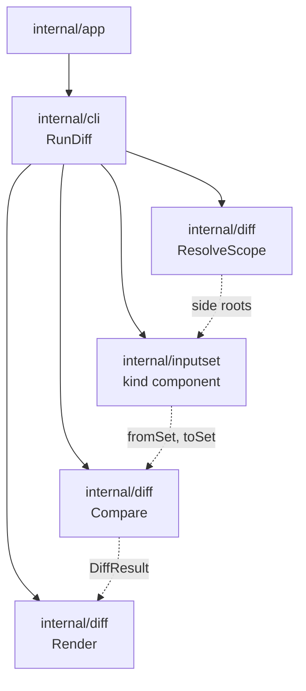

# sqlrs diff - структура компонентов

Документ описывает утвержденную компонентную структуру `sqlrs diff` после
CLI-контракта, user guide и решения о shared слое `inputset`.

## 1. Область и статус

- Первый user-visible срез реализован в `frontend/cli-go` и остается CLI-only.
- Сейчас команда сравнивает file-list closures и хеши контента; engine API не
  используется.
- Ref-mode сейчас использует detached `git worktree`; blob-mode не реализован.
- Wrapped command пока остается одним токеном из `plan:psql`, `plan:lb`,
  `prepare:psql` и `prepare:lb`.
- Утвержденная архитектура такова: `internal/diff` владеет только parsing diff
  scope, resolution контекстов сторон, сравнением и рендерингом. Kind-specific
  file semantics принадлежат общим компонентам `internal/inputset`.
- Существующие `BuildPsqlFileList` / `BuildLbFileList` в `internal/diff` -
  переходные реализации, а не долгосрочный источник истины.

## 2. Компоненты и ответственность

| Компонент | Ответственность | Кто вызывает |
|-----------|-----------------|--------------|
| **Обработчик команды diff** | Разобрать diff scope и wrapped command; оркестрировать resolution сторон, сбор input set для каждой стороны, сравнение и рендеринг. Сопоставлять ошибки с exit code. | `internal/app` -> `internal/cli.RunDiff` |
| **Разрешитель области** | По `--from-ref`/`--to-ref` или `--from-path`/`--to-path` построить два side context. Каждый context дает корень файловой системы для одной стороны сравнения. | `internal/diff.ResolveScope` |
| **Shared inputset kind component** | Для одной стороны и одного kind wrapped-команды разобрать file-bearing args, привязать их к корню этой стороны и собрать детерминированный input set. | `RunDiff` через `internal/inputset/*` |
| **Компаратор diff** | По двум собранным input set вычислить Added / Modified / Removed и применить опции вроде `--limit` и `--include-content`. | Обработчик diff |
| **Рендер diff** | Преобразовать результат сравнения в human-readable текст или JSON согласно глобальному `--output`. | Обработчик diff |

## 3. Shared inputset компоненты по kind

`sqlrs diff` не владеет per-kind file semantics. Он выбирает тот же shared
CLI-side компонент, который используют execution и alias inspection.

| Семейство wrapped-команд | Shared component | Примечание |
|--------------------------|------------------|------------|
| `plan:psql`, `prepare:psql`, будущий `run:psql` | `internal/inputset/psql` | Парсит file-bearing аргументы `psql` и собирает closure по `\i` / `\ir` / `\include`. |
| `plan:lb`, `prepare:lb` | `internal/inputset/liquibase` | Парсит changelog/defaults/search-path аргументы и собирает Liquibase changelog graph. |
| Будущий file-backed `run:pgbench` | `internal/inputset/pgbench` | Парсит file-bearing script args и отдает runtime и diff-facing projection-ы. |

Пока миграция не завершена, в `internal/diff` могут оставаться wrappers или
adapter-ы над прежними builders. Эти обертки переходные и должны схлопнуться в
`internal/inputset` как в единый источник истины.

## 4. Поток вызовов

```text
1. app (dispatch команды)
   -> определяет глагол "diff"
   -> парсит глобальные флаги и diff scope
   -> передает wrapped command token и args в cli.RunDiff

2. RunDiff
   -> diff.ResolveScope(parsed.Scope, cwd) -> fromCtx, toCtx, cleanup
   -> выбирает shared kind component по wrapped command
   -> для каждой стороны:
      Parse(wrappedArgs)
      -> Bind(side resolver, rooted at fromCtx/toCtx)
      -> Collect(side filesystem view)
   -> diff.Compare(fromSet, toSet, options)
   -> diff.RenderHuman или diff.RenderJSON
```

Когда последующие срезы добавят wrapped composite `prepare ... run`, `RunDiff`
должен вычислять каждую стадию отдельно, но все так же делегировать per-kind
file semantics одним и тем же компонентам `internal/inputset`.

## 5. Предлагаемое размещение пакетов (CLI)

Все перечисленное относится к кодовой базе CLI (например, `frontend/cli-go`).

| Пакет | Содержимое |
|-------|------------|
| `internal/app` | Dispatch `diff`, parsing diff scope, сбор side-root context. |
| `internal/cli` | Оркестрация `RunDiff` и top-level dispatch рендера. |
| `internal/diff` | `ParseDiffScope`, `ResolveScope`, `Compare`, `RenderHuman`, `RenderJSON` и общие типы результата diff. |
| `internal/inputset` | Общие parse/bind/collect/project абстракции и per-kind пакеты, которые использует `diff`. |

## 6. Владение данными и жизненный цикл

- **Scope (from/to ref или path)** разбирается один раз за invocation и не
  персистится.
- **Side contexts** - in-memory представление двух корней. Временные worktree,
  если используются, создаются до стадии collection и удаляются после команды,
  если пользователь явно не сохраняет их.
- **Parsed specs, bound specs и collected input sets** существуют только в
  памяти и только в рамках одной стороны одного вызова.
- **Результат diff** существует только в памяти и отбрасывается после
  рендеринга. Постоянный diff cache не вводится.

## 7. Схема зависимостей



## 8. Ссылки

- User guide: [`docs/user-guides/sqlrs-diff.md`](../user-guides/sqlrs-diff.md)
- Контракт CLI: [`docs/architecture/cli-contract.RU.md`](cli-contract.RU.md) (секция 3.9)
- Shared inputset layer: [`inputset-component-structure.RU.md`](inputset-component-structure.RU.md)
- Git-aware passive (сценарий P3): [`docs/architecture/git-aware-passive.RU.md`](git-aware-passive.RU.md)
- Структура компонентов CLI: [`cli-component-structure.RU.md`](cli-component-structure.RU.md)
