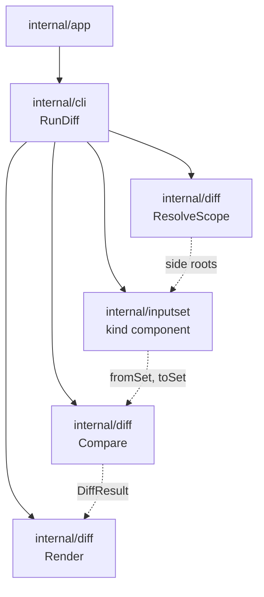

# sqlrs diff - Component Structure

This document describes the approved component structure for `sqlrs diff` after
the CLI contract, user guide, and the shared `inputset` decision.

## 1. Scope and status

- The first user-visible slice is implemented in `frontend/cli-go` and remains
  CLI-only.
- Today the command compares file-list closures and content hashes; no engine
  API is involved.
- Ref mode defaults to **blob** reads via `internal/inputset.GitRevFileSystem`
  (`git show` / `git ls-tree`); optional **`worktree`** still uses detached
  checkouts.
- The wrapped command currently remains one token among `plan:psql`, `plan:lb`,
  `prepare:psql`, and `prepare:lb`.
- The approved architecture is that `internal/diff` owns scope parsing,
  context resolution, comparison, and rendering only. Kind-specific file
  semantics belong to shared `internal/inputset` components.
- Existing `BuildPsqlFileList` / `BuildLbFileList` helpers in `internal/diff`
  are transitional implementation artifacts, not the long-term source of truth.

## 2. Components and responsibilities

| Component | Responsibility | Caller |
|-----------|----------------|--------|
| **Diff command handler** | Parse the diff scope and wrapped command; orchestrate side resolution, per-side input-set collection, comparison, and rendering. Map errors to exit codes. | `internal/app` -> `internal/cli.RunDiff` |
| **Scope resolver** | Given `--from-ref`/`--to-ref` or `--from-path`/`--to-path`, produce two side contexts. Each context exposes a filesystem root for one side of the comparison. | `internal/diff.ResolveScope` |
| **Shared inputset kind component** | For one side and one wrapped command kind, parse file-bearing args, bind them against that side's root, and collect a deterministic input set. | `RunDiff` via `internal/inputset/*` |
| **Diff comparator** | Given two collected input sets, compute Added / Modified / Removed and apply options such as `--limit` and `--include-content`. | Diff command handler |
| **Diff renderer** | Turn the comparison result into human-readable text or JSON according to global `--output`. | Diff command handler |

## 3. Shared inputset components by kind

`sqlrs diff` does not own per-kind file semantics. It selects the same shared
CLI-side component that execution and alias inspection use.

| Wrapped command family | Shared component | Notes |
|------------------------|------------------|-------|
| `plan:psql`, `prepare:psql`, future `run:psql` | `internal/inputset/psql` | Parses `psql` file-bearing args and collects `\i` / `\ir` / `\include` closure. |
| `plan:lb`, `prepare:lb` | `internal/inputset/liquibase` | Parses changelog/defaults/search-path args and collects the Liquibase changelog graph. |
| Future file-backed `run:pgbench` | `internal/inputset/pgbench` | Parses file-bearing script args and exposes runtime and diff-facing projections. |

Until the migration is complete, `internal/diff` may still contain wrappers or
adapters around older builders. Those wrappers remain transitional and must
collapse onto `internal/inputset` as the single source of truth.

## 4. Call flow

```text
1. app (command dispatch)
   -> detects verb "diff"
   -> parses global flags and diff scope
   -> passes the wrapped command token and args to cli.RunDiff

2. RunDiff
   -> diff.ResolveScope(parsed.Scope, cwd) -> fromCtx, toCtx, cleanup
   -> choose the shared kind component from the wrapped command
   -> for each side:
      Parse(wrappedArgs)
      -> Bind(side resolver rooted at fromCtx/toCtx)
      -> Collect(side filesystem view)
   -> diff.Compare(fromSet, toSet, options)
   -> diff.RenderHuman or diff.RenderJSON
```

When later slices add wrapped `prepare ... run` composites, `RunDiff` should
evaluate each stage separately while still delegating per-kind file semantics to
the same `internal/inputset` components.

## 5. Suggested package layout (CLI)

All of the following live in the CLI codebase (for example `frontend/cli-go`).

| Package | Contents |
|---------|----------|
| `internal/app` | Dispatches `diff`; parses diff scope; builds side root context. |
| `internal/cli` | `RunDiff` orchestration and top-level render dispatch. |
| `internal/diff` | `ParseDiffScope`, `ResolveScope`, `Compare`, `RenderHuman`, `RenderJSON`, and shared diff result types. |
| `internal/inputset` | Shared parse/bind/collect/project abstractions and the per-kind packages used by `diff`. |

## 6. Data ownership and lifecycle

- **Scope (from/to ref or path)** is parsed once per invocation and is not
  persisted.
- **Side contexts** are in-memory representations of the two roots. Temporary
  worktrees, if used, are created before collection and removed after the
  command unless the user keeps them explicitly.
- **Parsed specs, bound specs, and collected input sets** are in-memory only and
  live for one side of one invocation.
- **Diff results** are in-memory only and discarded after rendering. The command
  introduces no persistent diff cache.

## 7. Dependency diagram



## 8. References

- User guide: [`docs/user-guides/sqlrs-diff.md`](../user-guides/sqlrs-diff.md)
- CLI contract: [`docs/architecture/cli-contract.md`](cli-contract.md) (section 3.9)
- Shared inputset layer: [`inputset-component-structure.md`](inputset-component-structure.md)
- Git-aware passive (scenario P3): [`docs/architecture/git-aware-passive.md`](git-aware-passive.md)
- CLI component structure: [`cli-component-structure.md`](cli-component-structure.md)
