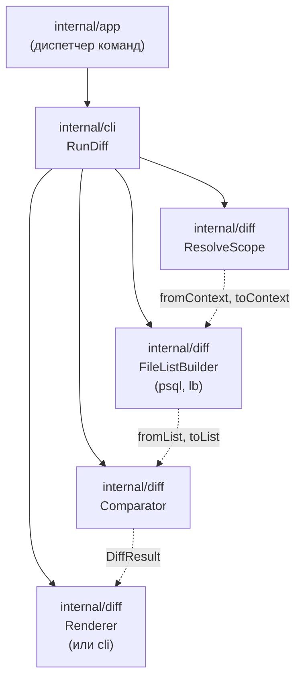

# sqlrs diff — Component Structure

This document describes the **architectural elaboration** for `sqlrs diff` after
the CLI contract and user guide: which components exist, who calls whom, and
where they live. It is the next step after the design in
[`docs/user-guides/sqlrs-diff.md`](../user-guides/sqlrs-diff.md) and
[`docs/architecture/cli-contract.md`](cli-contract.md).

## 1. Scope and assumptions

- **Status**: first slice **implemented** in `frontend/cli-go` (`internal/diff`,
  `internal/cli.RunDiff`, `internal/app` dispatch). This document also records
  design for later slices.
- **First slice**: diff runs entirely in the CLI; no engine API. The CLI resolves
  the two sides (ref or path), builds file lists locally using closure rules for
  psql and Liquibase, compares paths + content hashes, and renders output.
- **No engine call**: plan vs prepare do not change behaviour yet—both use the
  same file-list builders.
- **Ref mode**: **`worktree` only** in code; `blob` mode is not implemented
  (explicit error if requested).
- **Wrapped command**: single token only—`plan:psql`, `plan:lb`, `prepare:psql`,
  `prepare:lb`. No `prepare … run …` composite parsing yet.
- **Deployment unit**: CLI only. No `backend/local-engine-go` changes required.

## 2. Components and responsibilities

| Component | Responsibility | Caller |
|-----------|----------------|--------|
| **Diff command handler** | Parse diff scope (`diff.ParseDiffScope`) and single wrapped command; orchestrate `ResolveScope` → file list build (both sides) → `Compare` → render. Map errors to exit codes. | `internal/app` (command dispatch) → `internal/cli.RunDiff` |
| **Scope resolver** | Given `--from-ref`/`--to-ref` or `--from-path`/`--to-path`, produce two **contexts**. Each context is a filesystem root: **detached worktree** at repo root per ref, or an absolute **`--from-path` / `--to-path`**. | `internal/diff.ResolveScope` |
| **File list builder** | For one context and kind **psql** or **lb** plus wrapped args, build the **closure**: `BuildPsqlFileList`, `BuildLbFileList` → ordered `(path, hash[, content])`. | `RunDiff` (twice per side) |
| **Diff comparator** | Given two file lists (from, to), compute Added / Modified / Removed (by path and optional content hash). Optionally apply `--limit` and `--include-content`. | Diff command handler |
| **Diff renderer** | Turn a diff result into human-readable text or JSON according to global `--output`. | Diff command handler |

## 3. File list builder per kind

The file list builder is the **core abstraction** that differs by kind. Each kind
has a single entry point and a closure rule.

| Kind | Entry point from args | Closure rule | Implementer |
|------|------------------------|--------------|-------------|
| **prepare:psql** / plan:psql | `-f <file>` (file path; not stdin `-f -`) | From each `-f` file, recursively add every file referenced by `\i`, `\ir`, `\include`, `\include_relative`. | `BuildPsqlFileList` in `internal/diff` |
| **prepare:lb** / plan:lb | `--changelog-file <path>` | From changelog file, add every file referenced by the changelog graph (include, includeAll, etc.). Liquibase defines the graph. | `BuildLbFileList` in `internal/diff` |
| **run:psql** (future) | `-f <file>` (file-backed only) | Same as psql: closure over `\i`/`\include` from `-f`. | Reuse psql closure builder |

`RunDiff` selects the builder from the wrapped **token** (`plan:psql` and
`prepare:psql` → psql; `plan:lb` and `prepare:lb` → lb). Alias expansion and
composite phases are **not** wired yet. Non-file args (e.g. `-c`, `--image`) are
ignored for closure purposes.

## 4. Call flow

```text
1. app (command dispatch)
   → detects verb "diff"
   → global flags (existing ParseArgs), then diff.ParseDiffScope on command args:
     scope + single wrapped token + args (e.g. plan:psql -- -f ./x.sql)
   → cli.RunDiff(stdout, parsed, cwd, outputFormat)

2. RunDiff
   → diff.ResolveScope(parsed.Scope, cwd)  →  fromCtx, toCtx, cleanup (ref worktrees)
   → BuildPsqlFileList or BuildLbFileList(fromCtx, wrappedArgs)  →  fromList
   → same for toCtx  →  toList
   → diff.Compare(fromList, toList, options)  →  result
   → diff.RenderHuman or diff.RenderJSON  →  stdout
```

Scope resolver behaviour (implemented):

- **Ref mode**: `git -C <cwd> rev-parse --show-toplevel`; `git worktree add --detach`
  into temp dirs; context root = worktree path (full tree at that ref). Only
  `worktree`; `blob` not implemented. Optional `--ref-keep-worktree` skips removal.
- **Path mode**: each `--from-path` / `--to-path` resolved to an absolute
  directory; that directory is the context root.

File lists are deterministic; comparison is by relative path and content hash.

## 5. Suggested package layout (CLI)

All of the following live in the CLI codebase (e.g. `frontend/cli-go`).

| Package | Contents |
|---------|----------|
| `internal/app` | Dispatches `diff`; `runDiff` → `diff.ParseDiffScope`, then `cli.RunDiff`. |
| `internal/cli` | `RunDiff` orchestrates `internal/diff`. |
| `internal/diff` | `ParseDiffScope`, `ResolveScope`, `BuildPsqlFileList`, `BuildLbFileList`, `Compare`, `RenderHuman`, `RenderJSON`, types (`Scope`, `Context`, `FileList`, `DiffResult`, …). |

## 6. Data ownership and lifecycle

- **Scope (from/to ref or path)**: parsed once per invocation; not persisted.
- **Contexts**: in-memory representation of the two roots (e.g. worktree path,
  or blob accessor). Temporary worktree, if used, is created before building file
  lists and removed after (unless `--ref-keep-worktree`).
- **File lists**: in-memory for the duration of the command; no cache. Each list
  is an ordered set of (path, content or hash).
- **Diff result**: in-memory; passed to renderer then discarded. No persistent
  state introduced by diff.

## 7. Dependency diagram



## 8. References

- User guide: [`docs/user-guides/sqlrs-diff.md`](../user-guides/sqlrs-diff.md)
- CLI contract: [`docs/architecture/cli-contract.md`](cli-contract.md) (section 3.9)
- Git-aware passive (scenario P3): [`docs/architecture/git-aware-passive.md`](git-aware-passive.md)
- CLI component structure (existing): [`cli-component-structure.md`](cli-component-structure.md)
