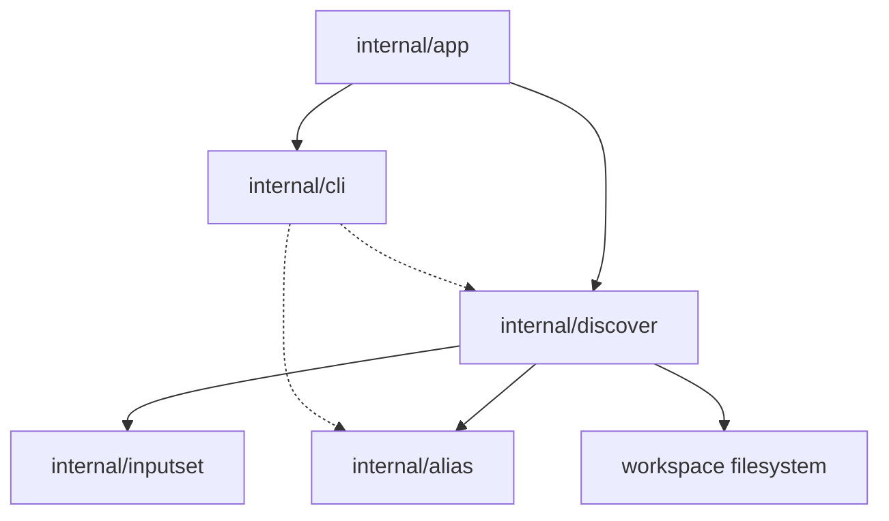

# Структура компонента Discover

Этот документ определяет согласованную внутреннюю структуру для slice
`sqlrs discover` после выбора aliases-анализатора как первого advisory
workflow.

Фокус документа: как разделены workspace scanning, kind-specific validation,
topology-анализ, suggestion rendering и suppression уже существующего alias
coverage.

## 1. Область и допущения

- Slice **только CLI**. Новый engine API, background service или remote workflow
  не вводятся.
- `sqlrs discover` является advisory и read-only.
- `sqlrs alias create` - mutating follow-up; discover только печатает
  copy-paste команды для него.
- Текущий slice по умолчанию запускает aliases-анализатор, если flags analyzer
  не переданы.
- Aliases-анализатор - это pipeline, а не простое перечисление файлов:
  - cheap path/content prefilter;
  - более глубокая kind-specific validation и closure collection;
  - topology/root ranking;
  - suppression результатов, которые уже покрыты существующими aliases.
- Анализатор может рендерить ready-to-run `sqlrs alias create` commands для
  surviving findings, но сам файлы не пишет.
- Анализатор может переиспользовать alias inventory, чтобы не дублировать
  существующие подсказки.
- Финальный human output рендерится как numbered multi-line blocks, а не как
  таблица.
- Progress выводится отдельно в `stderr` и остаётся на granularity
  stage/candidate.

## 2. CLI-модули и ответственность

| Модуль | Ответственность | Примечания |
| --- | --- | --- |
| `internal/app` | Добавить dispatch для `discover`; парсить analyzer flags; определять workspace root, cwd и output mode; вызывать discovery orchestrator. | Владеет command-shape rules и mapping exit-кодов. |
| `internal/discover` | Registry analyzers, candidate scoring, orchestration closure collection, topology graph construction, root selection, alias-coverage suppression, copy-paste create-command synthesis, aggregation report и emission progress events. | Владеет discovery semantics, а не execution semantics. |
| `internal/alias` | Existing alias inventory и ref-resolution primitives, которые переиспользуются для suppression duplicate suggestions или для привязки discoveries к уже известному alias coverage. | Остаётся source of truth для repo-tracked alias files. |
| `internal/inputset` | Общий CLI-side source of truth для file-bearing semantics `psql`, Liquibase и `pgbench`. | Discovery сначала переиспользует `psql` и Liquibase collectors. |
| `internal/cli` | Рендер human block и JSON discovery findings; печать copy-paste `alias create` commands; печать discover usage/help. | Отделяет форматирование от filesystem logic. |

## 3. Почему `internal/discover` выделен отдельно

`discover` шире, чем alias inspection.

- `internal/alias` владеет alias-file mechanics: suffix detection, scan-scope
  handling и single-alias resolution.
- `internal/discover` владеет advisory analysis, включая candidate scoring,
  построение closure graph, ranking вероятных alias roots и suggestion
  rendering.
- `internal/inputset` владеет kind-specific file-bearing semantics и closure
  collection.
- `internal/alias` владеет write path для `sqlrs alias create`.
- `internal/discover` выдаёт progress milestones, а app решает, показать ли
  spinner или verbose lines в `stderr`.

Без такого разделения команда либо начнёт дублировать alias logic, либо
разрастётся heuristics прямо внутри `internal/app`.

Согласованный поток такой:

```text
workspace scan
-> cheap candidate scoring
-> alias coverage lookup
-> kind-specific deep validation / closure collection
-> topology graph construction
-> root ranking and alias suggestion
-> report aggregation
```

## 4. Предлагаемый layout пакетов/файлов

### `frontend/cli-go/internal/app`

- `discover.go`
  - Парсить flags команды `discover`.
  - Выбирать analyzers, по умолчанию aliases в текущем slice.
  - Отвергать invalid analyzer combinations.
  - Передавать workspace context в discovery orchestrator.

### `frontend/cli-go/internal/discover`

- `types.go`
  - Общие report, finding, candidate и analyzer types.
- `run.go`
  - Точка входа для выбора и запуска analyzers.
- `aliases.go`
  - Текущая реализация aliases-анализатора.
- `scan.go`
  - Cheap path/content prefilter и candidate scoring.
- `graph.go`
  - Построение topology graph и ranking roots.
- `suggest.go`
  - Вывод suggested refs и copy-paste `sqlrs alias create` commands.
- `coverage.go`
  - Helpers для suppression alias coverage.
- `report.go`
  - Агрегация summary и стабильная форма output.

### `frontend/cli-go/internal/inputset`

- Общие per-kind collectors, используемые discovery:
  - `psql`
  - `liquibase`

### `frontend/cli-go/internal/alias`

- Переиспользуется как coverage index и source of truth по существующим alias.

### `frontend/cli-go/internal/cli`

- `commands_discover.go`
  - Discovery rendering helpers.
- `discover_usage.go`
  - Usage/help text для `sqlrs discover`.

## 5. Ключевые типы и интерфейсы

- `discover.Options`
  - Workspace root, cwd, selected analyzers и output mode.
- `discover.Progress`
  - Optional sink для stage/candidate milestones, используемый CLI progress
    renderer.
- `discover.Report`
  - Итоговый discovery output, включая summary counts и findings.
- `discover.Finding`
  - Одна advisory finding или candidate suggestion, включая suggested alias
    path и copy-paste create command.
- `discover.Candidate`
  - Один scored workspace file, прошедший cheap filtering.
- `discover.Graph`
  - Directed dependency graph, построенный из collected closures.
- `discover.Analyzer`
  - Analyzer interface для orchestrator.
- `discover.KindCollector`
  - Adapter поверх shared `inputset` collectors для topology validation.

## 6. Владение данными

- **Workspace root / cwd** принадлежит command context в `internal/app` и
  передаётся в `internal/discover` для bounded analysis.
- **Scored candidates** живут только в памяти одной CLI-инвокации.
- **Closures и graph nodes** ephemeral и создаются выбранным `inputset`
  collector'ом.
- **Existing alias coverage** читается из repository on demand и
  переиспользуется только для suppression duplicate suggestions.
- **Discovery findings** живут только в памяти и исчезают после render.
- **Suggested create commands** - ephemeral output only; discover их никуда не
  пишет.
- **Progress events** - ephemeral CLI events only и рендерятся в `stderr`.
- **Discovery cache** в этом slice не вводится.

## 7. Deployment units

### CLI (`frontend/cli-go`)

Весь behavior этого slice находится здесь:

- command parsing;
- workspace scanning;
- candidate scoring;
- closure и topology analysis;
- alias-coverage suppression;
- human/JSON rendering.

### Local engine (`backend/local-engine-go`)

В этом slice изменений нет.

Discovery не должен требовать:

- engine startup;
- HTTP API calls;
- queue/task persistence.

### Services / remote deployments

В этом slice изменений нет.

Команда остаётся purely local и repository-facing.

## 8. Dependency diagram



## 9. Ссылки

- User guide: [`../user-guides/sqlrs-aliases.md`](../user-guides/sqlrs-aliases.md)
- CLI contract: [`cli-contract.md`](cli-contract.md)
- Interaction flow: [`discover-flow.md`](discover-flow.md)
- Alias creation flow: [`alias-create-flow.RU.md`](alias-create-flow.RU.md)
- Alias creation component structure: [`alias-create-component-structure.RU.md`](alias-create-component-structure.RU.md)
- Shared inputset layer: [`inputset-component-structure.md`](inputset-component-structure.md)
- CLI component structure: [`cli-component-structure.md`](cli-component-structure.md)
