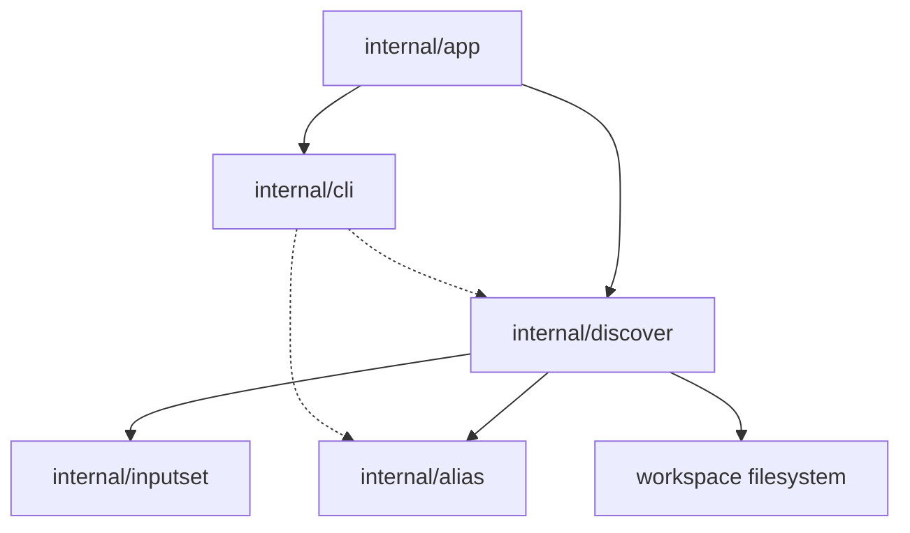

# Структура компонента Discover

Этот документ определяет согласованную внутреннюю структуру для slice
`sqlrs discover` в generic-analyzer slice после того, как команда выходит за
рамки первоначального aliases-only workflow.

Фокус документа: как разделены analyzer selection, workspace scanning,
kind-specific validation, repository-hygiene inspection, follow-up command
rendering и report aggregation.

## 1. Область и допущения

- Slice **только CLI**. Новый engine API, background service или remote workflow
  не вводятся.
- `sqlrs discover` является advisory и read-only.
- analyzer flags являются additive;
- если analyzer flags не переданы, `discover` запускает все stable analyzers в
  canonical order;
- первый stable analyzer set:
  - `--aliases`
  - `--gitignore`
  - `--vscode`
  - `--prepare-shaping`
- aliases-анализатор остаётся pipeline, а не простым перечислением файлов:
  - cheap path/content prefilter;
  - более глубокая kind-specific validation и closure collection;
  - topology/root ranking;
  - suppression результатов, которые уже покрыты существующими aliases.
- `discover` может рендерить ready-to-copy follow-up commands для части
  analyzers, но сам файлы не пишет.
- если важен shell syntax, follow-up commands рендерятся для текущей shell
  family:
  - PowerShell для Windows shells;
  - POSIX shell в остальных случаях.
- Финальный human output рендерится как numbered multi-line blocks, а не как
  таблица.
- Progress выводится отдельно в `stderr` и остаётся на granularity
  analyzer/stage/candidate.

## 2. CLI-модули и ответственность

| Модуль | Ответственность | Примечания |
| --- | --- | --- |
| `internal/app` | Добавить dispatch для `discover`; парсить analyzer flags; определять workspace root, cwd, shell family и output mode; вызывать discovery orchestrator. | Владеет command-shape rules и mapping exit-кодов. |
| `internal/discover` | Registry analyzers, orchestration их execution, candidate scoring, orchestration closure collection, repository-hygiene inspection, follow-up command synthesis, aggregation report и emission progress events. | Владеет discovery semantics, а не execution semantics. |
| `internal/alias` | Existing alias inventory и ref-resolution primitives, которые переиспользуются для suppression duplicate suggestions или для привязки discoveries к уже известному alias coverage. | Остаётся source of truth для repo-tracked alias files. |
| `internal/inputset` | Общий CLI-side source of truth для file-bearing semantics `psql`, Liquibase и `pgbench`. | Discovery переиспользует эти collectors для `--aliases` и `--prepare-shaping`. |
| `internal/cli` | Рендер human block и JSON discovery findings; печать follow-up commands; печать discover usage/help. | Отделяет форматирование от filesystem logic. |

## 3. Почему `internal/discover` выделен отдельно

`discover` шире, чем alias inspection.

- `internal/alias` владеет alias-file mechanics: suffix detection, scan-scope
  handling и single-alias resolution.
- `internal/discover` владеет advisory analysis, включая analyzer selection,
  candidate scoring, построение closure graph, repository-hygiene findings,
  ranking вероятных alias roots, shaping suggestions и synthesis follow-up
  commands.
- `internal/inputset` владеет kind-specific file-bearing semantics и closure
  collection.
- `internal/alias` владеет write path для `sqlrs alias create`, а
  `internal/discover` только ссылается на эту форму как на output.
- `internal/discover` выдаёт progress milestones, а app решает, показать ли
  spinner или verbose lines в `stderr`.

Без такого разделения команда либо начнёт дублировать alias logic, либо
разрастётся analyzer heuristics прямо внутри `internal/app`.

Согласованный поток такой:

```text
analyzer selection
-> per-analyzer analysis pipeline
-> follow-up command rendering when supported
-> report aggregation
```

## 4. Предлагаемый layout пакетов/файлов

### `frontend/cli-go/internal/app`

- `discover.go`
  - Парсить flags команды `discover`.
  - Выбирать analyzers, по умолчанию все stable analyzers в canonical order.
  - Отвергать invalid analyzer combinations.
  - Передавать workspace context в discovery orchestrator.

### `frontend/cli-go/internal/discover`

- `types.go`
  - Общие report, finding, suggestion, command, candidate и analyzer types.
- `run.go`
  - Точка входа для выбора и запуска analyzers.
- `registry.go`
  - Регистрация stable analyzers и canonical ordering.
- `aliases.go`
  - Реализация analyzer `--aliases`.
- `gitignore.go`
  - Реализация analyzer `--gitignore`.
- `vscode.go`
  - Реализация analyzer `--vscode`.
- `prepare_shaping.go`
  - Реализация analyzer `--prepare-shaping`.
- `scan.go`
  - Cheap workspace scanning и reusable path/content prefilter helpers.
- `graph.go`
  - Построение topology graph и ranking roots для workflow analyzers.
- `followup.go`
  - Рендер analyzer-specific follow-up commands.
- `coverage.go`
  - Helpers для suppression alias coverage.
- `jsonmerge.go`
  - Общие JSON merge helpers для follow-up payload'ов `.vscode/*.json`.
- `report.go`
  - Агрегация summary и стабильная форма output.

### `frontend/cli-go/internal/inputset`

- Общие per-kind collectors, используемые discovery:
  - `psql`
  - `liquibase`

### `frontend/cli-go/internal/alias`

- Переиспользуется как coverage index и source of truth по существующим alias.

### `frontend/cli-go/internal/cli`

- `commands_discover.go`
  - Discovery rendering helpers.
- `discover_usage.go`
  - Usage/help text для `sqlrs discover`.

## 5. Ключевые типы и интерфейсы

- `discover.Options`
  - Workspace root, cwd, selected analyzers, shell family и output mode.
- `discover.Progress`
  - Optional sink для analyzer/stage/candidate milestones, используемый CLI progress
    renderer.
- `discover.Report`
  - Итоговый discovery output, включая selected analyzers, per-analyzer summary
    counts и findings.
- `discover.Finding`
  - Один advisory finding, включая analyzer id, target path или workflow root,
    action text и optional follow-up command.
- `discover.FollowUpCommand`
  - Отрендеренный ready-to-copy follow-up command плюс shell-family metadata.
- `discover.Candidate`
  - Один scored workspace file, прошедший cheap filtering.
- `discover.Graph`
  - Directed dependency graph, построенный из collected closures.
- `discover.Analyzer`
  - Analyzer interface для orchestrator.
- `discover.KindCollector`
  - Adapter поверх shared `inputset` collectors для workflow-oriented analyzers.
- `discover.RepositoryFile`
  - Parsed workspace file payload, используемый hygiene analyzers.

## 6. Владение данными

- **Workspace root / cwd** принадлежит command context в `internal/app` и
  передаётся в `internal/discover` для bounded analysis.
- **Shell family** принадлежит command context в `internal/app` и передаётся в
  `internal/discover` только для rendering follow-up commands.
- **Scored candidates** живут только в памяти одной CLI-инвокации.
- **Closures и graph nodes** ephemeral и создаются workflow analyzers через
  выбранный `inputset` collector.
- **Existing alias coverage** читается из repository on demand и
  переиспользуется только для suppression duplicate suggestions.
- **Parsed `.gitignore` и `.vscode/*.json` state** ephemeral и существует
  только в течение одной invokation.
- **Discovery findings** живут только в памяти и исчезают после render.
- **Follow-up commands** - ephemeral output only; discover их никуда не пишет.
- **Progress events** - ephemeral CLI events only и рендерятся в `stderr`.
- **Discovery cache** в этом slice не вводится.

## 7. Deployment units

### CLI (`frontend/cli-go`)

Весь behavior этого slice находится здесь:

- command parsing;
- analyzer selection;
- workspace scanning;
- candidate scoring;
- closure и topology analysis;
- repository-hygiene inspection;
- alias-coverage suppression;
- follow-up command rendering;
- human/JSON rendering.

### Local engine (`backend/local-engine-go`)

В этом slice изменений нет.

Discovery не должен требовать:

- engine startup;
- HTTP API calls;
- queue/task persistence.

### Services / remote deployments

В этом slice изменений нет.

Команда остаётся purely local и repository-facing.

## 8. Dependency diagram



## 9. Ссылки

- User guides:
  - [`../user-guides/sqlrs-discover.md`](../user-guides/sqlrs-discover.md)
  - [`../user-guides/sqlrs-aliases.md`](../user-guides/sqlrs-aliases.md)
- CLI contract: [`cli-contract.RU.md`](cli-contract.RU.md)
- Interaction flow: [`discover-flow.RU.md`](discover-flow.RU.md)
- Alias creation flow: [`alias-create-flow.RU.md`](alias-create-flow.RU.md)
- Alias creation component structure: [`alias-create-component-structure.RU.md`](alias-create-component-structure.RU.md)
- Shared inputset layer: [`inputset-component-structure.RU.md`](inputset-component-structure.RU.md)
- CLI component structure: [`cli-component-structure.RU.md`](cli-component-structure.RU.md)
