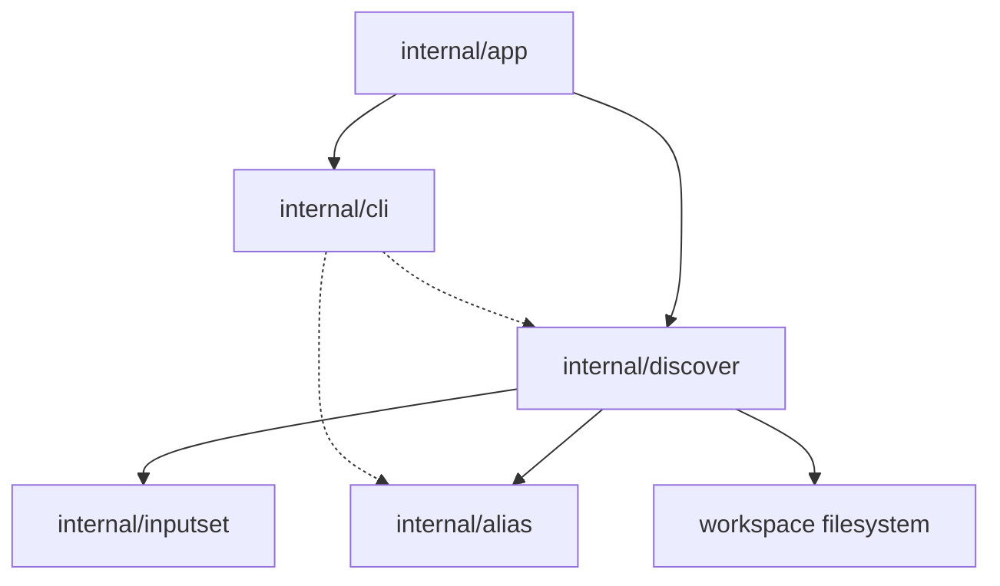

# Discover Component Structure

This document defines the approved internal component structure for the
`sqlrs discover` generic-analyzer slice after the command grows beyond the
initial aliases-only workflow.

The focus is on how analyzer selection, workspace scanning, kind-specific
validation, repository-hygiene inspection, follow-up command rendering, and
report aggregation are split across modules.

## 1. Scope and assumptions

- The slice is **CLI-only**. No new engine API, background service, or remote
  workflow is introduced.
- `sqlrs discover` is advisory and read-only.
- analyzer flags are additive;
- if no analyzer flags are supplied, `discover` runs all stable analyzers in
  canonical order;
- the first stable analyzer set is:
  - `--aliases`
  - `--gitignore`
  - `--vscode`
  - `--prepare-shaping`
- the aliases analyzer remains a pipeline, not a flat file listing:
  - cheap path/content prefilter;
  - deeper kind-specific validation and closure collection;
  - topology/root ranking;
  - suppression of results already covered by existing aliases.
- `discover` may render ready-to-copy follow-up commands for some analyzers,
  but it never writes files itself.
- when shell syntax matters, follow-up commands are rendered for the current
  shell family:
  - PowerShell on Windows shells;
  - POSIX shell otherwise.
- Final human output is rendered as numbered multi-line blocks, not a table.
- Progress is emitted separately on `stderr` and stays at analyzer/stage/
  candidate granularity.

## 2. CLI modules and responsibilities

| Module | Responsibility | Notes |
| --- | --- | --- |
| `internal/app` | Extend command dispatch with `discover`; parse analyzer flags; resolve workspace root, cwd, shell family, and output mode; call the discovery orchestrator. | Owns command-shape rules and exit-code mapping. |
| `internal/discover` | Analyzer registry, analyzer execution orchestration, candidate scoring, closure collection orchestration, repository-hygiene inspection, follow-up command synthesis, report aggregation, and progress event emission. | Owns discovery semantics, not execution semantics. |
| `internal/alias` | Existing alias inventory and ref-resolution primitives reused to suppress duplicate suggestions or anchor discoveries against known alias coverage. | Remains the source of truth for repo-tracked alias files. |
| `internal/inputset` | Shared CLI-side source of truth for `psql`, Liquibase, and `pgbench` file-bearing semantics. | Discovery reuses these collectors for `--aliases` and `--prepare-shaping`. |
| `internal/cli` | Render human block and JSON discovery findings; print follow-up commands; print discover usage/help. | Keeps formatting separate from filesystem logic. |

## 3. Why `internal/discover` is separate

`discover` is broader than alias inspection.

- `internal/alias` owns alias-file mechanics such as suffix detection,
  scan-scope handling, and single-alias resolution.
- `internal/discover` owns advisory analysis, including analyzer selection,
  candidate scoring, closure graph construction, repository-hygiene findings,
  ranking of likely alias roots, shaping suggestions, and follow-up command
  synthesis.
- `internal/inputset` owns kind-specific file-bearing semantics and closure
  collection.
- `internal/alias` owns the write path for `sqlrs alias create`, while
  `internal/discover` only references that shape as output.
- `internal/discover` emits progress milestones for the app to render on
  `stderr`; it does not choose between spinner and verbose-line presentation.

Without this split, the command would either duplicate `alias` logic or grow
analyzer heuristics directly inside `internal/app`.

The approved flow is:

```text
analyzer selection
-> per-analyzer analysis pipeline
-> follow-up command rendering when supported
-> report aggregation
```

## 4. Suggested package/file layout

### `frontend/cli-go/internal/app`

- `discover.go`
  - Parse `discover` flags.
  - Select analyzers, defaulting to all stable analyzers in canonical order.
  - Reject invalid analyzer combinations.
  - Pass workspace context into the discovery orchestrator.

### `frontend/cli-go/internal/discover`

- `types.go`
  - Shared report, finding, suggestion, command, candidate, and analyzer types.
- `run.go`
  - Analyzer selection and execution entrypoint.
- `registry.go`
  - Stable analyzer registration and canonical ordering.
- `aliases.go`
  - `--aliases` analyzer implementation.
- `gitignore.go`
  - `--gitignore` analyzer implementation.
- `vscode.go`
  - `--vscode` analyzer implementation.
- `prepare_shaping.go`
  - `--prepare-shaping` analyzer implementation.
- `scan.go`
  - Cheap workspace scanning and reusable path/content prefilter helpers.
- `graph.go`
  - Topology graph construction and root ranking for workflow analyzers.
- `followup.go`
  - Render analyzer-specific follow-up commands.
- `coverage.go`
  - Alias-coverage suppression helpers.
- `jsonmerge.go`
  - Shared JSON merge helpers for `.vscode/*.json` follow-up payloads.
- `report.go`
  - Summary aggregation and stable output shaping.

### `frontend/cli-go/internal/inputset`

- Shared per-kind collectors used by discovery:
  - `psql`
  - `liquibase`

### `frontend/cli-go/internal/alias`

- Reused as a coverage index and alias existence source of truth.

### `frontend/cli-go/internal/cli`

- `commands_discover.go`
  - Discovery rendering helpers.
- `discover_usage.go`
  - Usage/help text for `sqlrs discover`.

## 5. Key types and interfaces

- `discover.Options`
  - Workspace root, cwd, selected analyzers, shell family, and output mode.
- `discover.Progress`
  - Optional sink for analyzer/stage/candidate milestones used by the CLI progress
    renderer.
- `discover.Report`
  - Overall discovery output, including selected analyzers, per-analyzer
    summary counts, and findings.
- `discover.Finding`
  - One advisory finding, including analyzer id, target path or workflow root,
    action text, and optional follow-up command.
- `discover.FollowUpCommand`
  - A rendered ready-to-copy follow-up command plus shell-family metadata.
- `discover.Candidate`
  - One scored workspace file that survived cheap filtering.
- `discover.Graph`
  - Directed dependency graph built from collected closures.
- `discover.Analyzer`
  - Analyzer interface used by the orchestrator.
- `discover.KindCollector`
  - Adapter around shared `inputset` collectors for workflow-oriented analyzers.
- `discover.RepositoryFile`
  - Parsed workspace file payload used by hygiene analyzers.

## 6. Data ownership

- **Workspace root / cwd** is owned by command context in `internal/app` and
  passed into `internal/discover` for bounded analysis.
- **Shell family** is owned by command context in `internal/app` and passed into
  `internal/discover` only for follow-up command rendering.
- **Scored candidates** live in memory only for one CLI invocation.
- **Closures and graph nodes** are ephemeral and produced by workflow analyzers
  through the selected `inputset` collector.
- **Existing alias coverage** is read from the repository on demand and reused
  only to suppress duplicate suggestions.
- **Parsed `.gitignore` and `.vscode/*.json` state** is ephemeral and exists
  only for one invocation.
- **Discovery findings** live in memory only and are discarded after rendering.
- **Follow-up commands** are ephemeral output only and are not written anywhere
  by discover.
- **Progress events** are ephemeral CLI events only and are rendered to
  `stderr`.
- **No discovery cache** is introduced in this slice.

## 7. Deployment units

### CLI (`frontend/cli-go`)

Owns all behavior in this slice:

- command parsing;
- analyzer selection;
- workspace scanning;
- candidate scoring;
- closure and topology analysis;
- repository-hygiene inspection;
- alias-coverage suppression;
- follow-up command rendering;
- human/JSON rendering.

### Local engine (`backend/local-engine-go`)

No changes in this slice.

Discovery must not require:

- engine startup;
- HTTP API calls;
- queue/task persistence.

### Services / remote deployments

No changes in this slice.

The command remains purely local and repository-facing.

## 8. Dependency diagram



## 9. References

- User guides:
  - [`../user-guides/sqlrs-discover.md`](../user-guides/sqlrs-discover.md)
  - [`../user-guides/sqlrs-aliases.md`](../user-guides/sqlrs-aliases.md)
- CLI contract: [`cli-contract.md`](cli-contract.md)
- Interaction flow: [`discover-flow.md`](discover-flow.md)
- Alias creation flow: [`alias-create-flow.md`](alias-create-flow.md)
- Alias creation component structure: [`alias-create-component-structure.md`](alias-create-component-structure.md)
- Shared inputset layer: [`inputset-component-structure.md`](inputset-component-structure.md)
- CLI component structure: [`cli-component-structure.md`](cli-component-structure.md)
