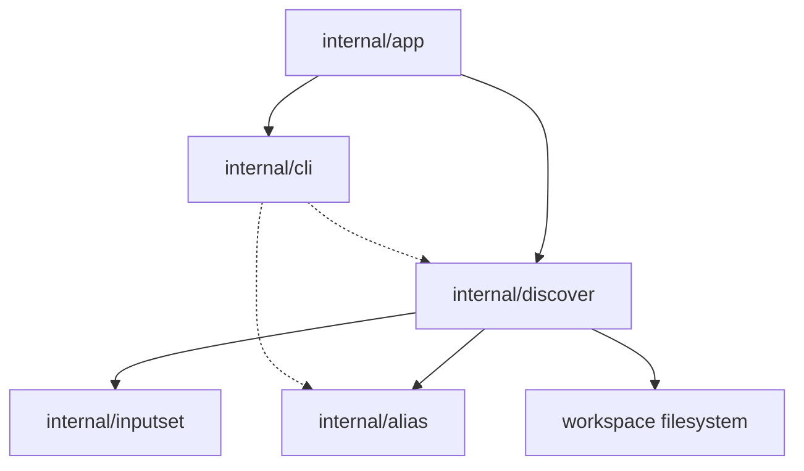

# Discover Component Structure

This document defines the approved internal component structure for the
`sqlrs discover` slice after selecting the aliases analyzer as the first
advisory workflow.

The focus is on how workspace scanning, kind-specific validation, topology
analysis, suggestion rendering, and alias-coverage suppression are split across
modules.

## 1. Scope and assumptions

- The slice is **CLI-only**. No new engine API, background service, or remote
  workflow is introduced.
- `sqlrs discover` is advisory and read-only.
- `sqlrs alias create` is the mutating follow-up; discover only emits
  copy-paste commands for it.
- The current slice defaults to the aliases analyzer when no analyzer flags are
  supplied.
- The aliases analyzer is a pipeline, not a flat file listing:
  - cheap path/content prefilter;
  - deeper kind-specific validation and closure collection;
  - topology/root ranking;
  - suppression of results already covered by existing aliases.
- The analyzer may render ready-to-run `sqlrs alias create` commands for
  surviving findings, but it never writes files.
- The analyzer is allowed to reuse alias inventory data to avoid duplicate
  suggestions.
- Final human output is rendered as numbered multi-line blocks, not a table.
- Progress is emitted separately on `stderr` and stays at stage/candidate
  granularity.

## 2. CLI modules and responsibilities

| Module | Responsibility | Notes |
| --- | --- | --- |
| `internal/app` | Extend command dispatch with `discover`; parse analyzer flags; resolve workspace root, cwd, and output mode; call the discovery orchestrator. | Owns command-shape rules and exit-code mapping. |
| `internal/discover` | Analyzer registry, candidate scoring, closure collection orchestration, topology graph construction, root selection, alias-coverage suppression, copy-paste create-command synthesis, report aggregation, and progress event emission. | Owns discovery semantics, not execution semantics. |
| `internal/alias` | Existing alias inventory and ref-resolution primitives reused to suppress duplicate suggestions or anchor discoveries against known alias coverage. | Remains the source of truth for repo-tracked alias files. |
| `internal/inputset` | Shared CLI-side source of truth for `psql`, Liquibase, and `pgbench` file-bearing semantics. | Discovery reuses the `psql` and Liquibase collectors first. |
| `internal/cli` | Render human block and JSON discovery findings; print copy-paste `alias create` commands; print discover usage/help. | Keeps formatting separate from filesystem logic. |

## 3. Why `internal/discover` is separate

`discover` is broader than alias inspection.

- `internal/alias` owns alias-file mechanics such as suffix detection,
  scan-scope handling, and single-alias resolution.
- `internal/discover` owns advisory analysis, including candidate scoring,
  closure graph construction, ranking of likely alias roots, and suggestion
  rendering.
- `internal/inputset` owns kind-specific file-bearing semantics and closure
  collection.
- `internal/alias` owns the write path for `sqlrs alias create`.
- `internal/discover` emits progress milestones for the app to render on
  `stderr`; it does not choose between spinner and verbose-line presentation.

Without this split, the command would either duplicate `alias` logic or grow
kind heuristics directly inside `internal/app`.

The approved flow is:

```text
workspace scan
-> cheap candidate scoring
-> alias coverage lookup
-> kind-specific deep validation / closure collection
-> topology graph construction
-> root ranking and alias suggestion
-> report aggregation
```

## 4. Suggested package/file layout

### `frontend/cli-go/internal/app`

- `discover.go`
  - Parse `discover` flags.
  - Select analyzers, defaulting to aliases in the current slice.
  - Reject invalid analyzer combinations.
  - Pass workspace context into the discovery orchestrator.

### `frontend/cli-go/internal/discover`

- `types.go`
  - Shared report, finding, candidate, and analyzer types.
- `run.go`
  - Analyzer selection and execution entrypoint.
- `aliases.go`
  - Current aliases analyzer implementation.
- `scan.go`
  - Cheap path/content prefilter and candidate scoring.
- `graph.go`
  - Topology graph construction and root ranking.
- `suggest.go`
  - Derive suggested refs and render copy-paste `sqlrs alias create` commands.
- `coverage.go`
  - Alias-coverage suppression helpers.
- `report.go`
  - Summary aggregation and stable output shaping.

### `frontend/cli-go/internal/inputset`

- Shared per-kind collectors used by discovery:
  - `psql`
  - `liquibase`

### `frontend/cli-go/internal/alias`

- Reused as a coverage index and alias existence source of truth.

### `frontend/cli-go/internal/cli`

- `commands_discover.go`
  - Discovery rendering helpers.
- `discover_usage.go`
  - Usage/help text for `sqlrs discover`.

## 5. Key types and interfaces

- `discover.Options`
  - Workspace root, cwd, selected analyzers, and output mode.
- `discover.Progress`
  - Optional sink for stage/candidate milestones used by the CLI progress
    renderer.
- `discover.Report`
  - Overall discovery output, including summary counts and findings.
- `discover.Finding`
  - One advisory finding or candidate suggestion, including the suggested alias
    path and copy-paste create command.
- `discover.Candidate`
  - One scored workspace file that survived cheap filtering.
- `discover.Graph`
  - Directed dependency graph built from collected closures.
- `discover.Analyzer`
  - Analyzer interface used by the orchestrator.
- `discover.KindCollector`
  - Adapter around shared `inputset` collectors for topology validation.

## 6. Data ownership

- **Workspace root / cwd** is owned by command context in `internal/app` and
  passed into `internal/discover` for bounded analysis.
- **Scored candidates** live in memory only for one CLI invocation.
- **Closures and graph nodes** are ephemeral and produced by the selected
  `inputset` collector.
- **Existing alias coverage** is read from the repository on demand and reused
  only to suppress duplicate suggestions.
- **Discovery findings** live in memory only and are discarded after rendering.
- **Suggested create commands** are ephemeral output only and are not written
  anywhere by discover.
- **Progress events** are ephemeral CLI events only and are rendered to
  `stderr`.
- **No discovery cache** is introduced in this slice.

## 7. Deployment units

### CLI (`frontend/cli-go`)

Owns all behavior in this slice:

- command parsing;
- workspace scanning;
- candidate scoring;
- closure and topology analysis;
- alias-coverage suppression;
- human/JSON rendering.

### Local engine (`backend/local-engine-go`)

No changes in this slice.

Discovery must not require:

- engine startup;
- HTTP API calls;
- queue/task persistence.

### Services / remote deployments

No changes in this slice.

The command remains purely local and repository-facing.

## 8. Dependency diagram



## 9. References

- User guide: [`../user-guides/sqlrs-aliases.md`](../user-guides/sqlrs-aliases.md)
- CLI contract: [`cli-contract.md`](cli-contract.md)
- Interaction flow: [`discover-flow.md`](discover-flow.md)
- Alias creation flow: [`alias-create-flow.md`](alias-create-flow.md)
- Alias creation component structure: [`alias-create-component-structure.md`](alias-create-component-structure.md)
- Shared inputset layer: [`inputset-component-structure.md`](inputset-component-structure.md)
- CLI component structure: [`cli-component-structure.md`](cli-component-structure.md)
