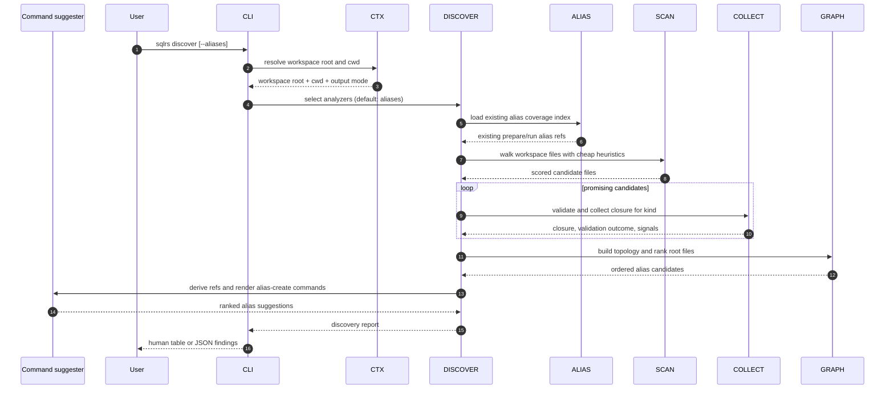

# Поток Discover

Этот документ описывает локальный поток взаимодействия для `sqlrs discover`
в текущем slice с aliases-анализатором и его copy-paste `alias create`
output.

Команда advisory и read-only. Она не обращается к engine, не запускает
контейнеры и не зависит от Git-ref resolution.

## 1. Участники

- **Пользователь** - запускает `sqlrs discover`.
- **CLI parser** - парсит флаги analyzer и help.
- **Command context** - определяет workspace root, cwd и output mode.
- **Discover orchestrator** - выбирает analyzers и агрегирует findings.
- **Alias coverage index** - переиспользует existing alias inventory, чтобы не
  дублировать уже существующие подсказки.
- **Candidate scanner** - делает cheap screening файлов workspace по path/content.
- **Kind collector** - выполняет более глубокую валидацию closure для
  поддерживаемых kinds.
- **Topology analyzer** - строит dependency graph и выбирает вероятные root
  files.
- **Command suggester** - выводит alias refs и рендерит copy-pasteable
  `sqlrs alias create` commands для surviving findings.
- **Renderer** - печатает human или JSON findings.

## 2. Поток: `sqlrs discover`

## 3. Разбиение на стадии

### 3.1 Дешёвый prefilter

Aliases-анализатор начинает с недорогого сканирования файлов workspace.

Он использует path и content signals, чтобы назначить кандидатам score, например:

- SQL-подобные расширения и SQL tokens;
- Liquibase-подобные XML, YAML, JSON, class или JAR references;
- типичные директории entrypoint'ов, например `db/`, `migrations/`, `sql/`
  или `queries/`;
- имена файлов, которые обычно сигнализируют root, например `master.xml`,
  `changelog.xml`, `init.sql` или `schema.sql`.

Эта стадия специально permissive: она сохраняет полезные потенциальные
кандидаты и дешево отбрасывает очевидно неподходящие файлы.

### 3.2 Глубокая валидация

Потенциальные кандидаты затем передаются в kind-specific collectors:

- `psql` кандидаты используют общий `psql` collector;
- Liquibase кандидаты используют общий Liquibase collector.

Стадия collector'а проверяет, что кандидат действительно парсится как
поддерживаемый workflow root, и вычисляет его reachable file closure.

Именно здесь становятся видны вложенные includes, changelog includes и
Liquibase references на classpath или JAR.

### 3.3 Топология и выбор root

Анализатор строит directed graph по собранным closures.

Затем он предпочитает файлы, которые:

- не имеют значимых inbound edges внутри графа кандидатов;
- обладают высоким path-score или content-score;
- ещё не покрыты существующим repo-tracked alias;
- лежат в привычных workflow-директориях или имеют привычные имена.

Именно эти roots становятся главными alias suggestions, которые выдаёт
`discover --aliases`.

### 3.4 Подавление дублей

Если в репозитории уже есть соответствующий alias file, анализатор подавляет
дублирующую подсказку или понижает её до informational note.

Так `discover` остаётся сфокусированным на недостающем alias coverage, а не на
перечислении того, что `sqlrs alias ls` уже умеет показать.

### 3.5 Copy-paste command synthesis

Каждый surviving root suggestion превращается в suggested alias ref, target
alias path и ready-to-copy `sqlrs alias create ...` command.

Этот command - только output artifact:

- `discover` сам файл не пишет;
- команду можно вставить в shell как есть или поправить перед запуском;
- mutation происходит только если пользователь запускает `sqlrs alias create`.

### 3.6 Каналы вывода и progress

`discover` оставляет `stdout` для финального результата и использует `stderr`
для progress.

- Human output рендерится как numbered multi-line blocks, а не как широкая
  таблица.
- JSON output остаётся стабильным и machine-friendly.
- В обычном интерактивном режиме progress показывается delayed spinner'ом в
  `stderr`.
- В verbose mode progress печатается line-based milestone'ами в `stderr`.
- Granularity progress'а строится по stage/candidate:
  - старт и summary workspace scan;
  - promotion candidate в глубокую валидацию;
  - success, suppression или invalidation candidate;
  - финальная сводка.
- Progress специально не трассирует каждую папку или каждый просмотренный
  файл.

## 4. Обработка ошибок

- Если workspace discovery не удаётся, команда завершается до анализа.
- Если candidate выходит за workspace boundary, он отклоняется.
- Если collector не может валидировать candidate, анализатор записывает
  failure как finding вместо падения команды.
- Ни одна стадия discover не меняет runtime state и не пишет файлы.
