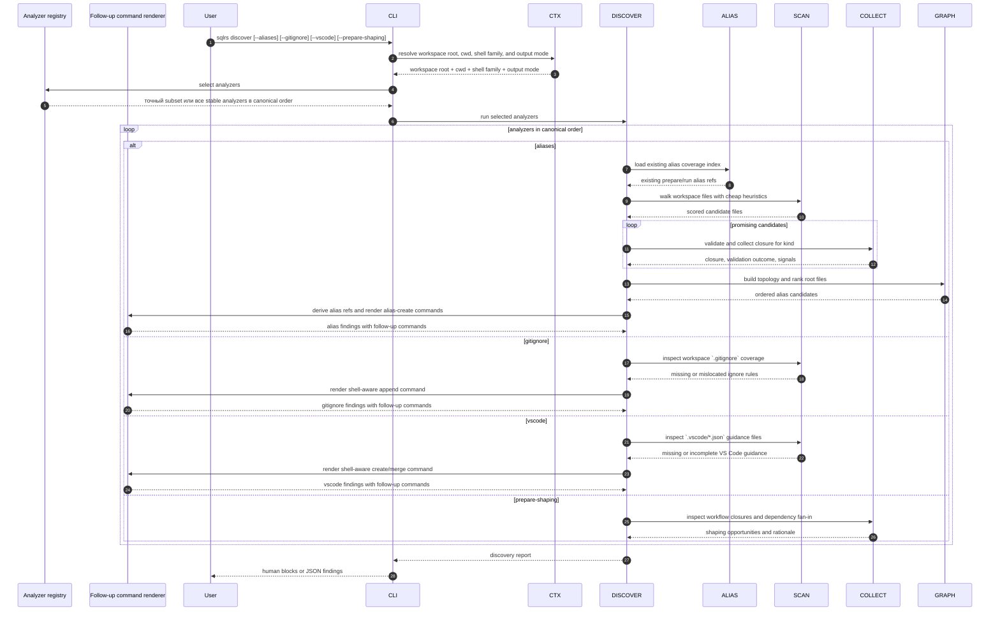

# Поток Discover

Этот документ описывает локальный поток взаимодействия для `sqlrs discover`
для generic analyzer slice после того, как команда выходит за рамки
первоначального aliases-only поведения.

Команда advisory и read-only. Она не обращается к engine, не запускает
контейнеры и не зависит от Git-ref resolution.

## 1. Участники

- **Пользователь** - запускает `sqlrs discover`.
- **CLI parser** - парсит флаги analyzer и help.
- **Command context** - определяет workspace root, cwd, shell family и output
  mode.
- **Discover orchestrator** - выбирает analyzers и агрегирует findings.
- **Analyzer registry** - определяет стабильные analyzers и их canonical
  execution order.
- **Alias coverage index** - переиспользует existing alias inventory, чтобы не
  дублировать уже существующие подсказки.
- **Candidate scanner** - делает cheap screening файлов workspace по path/content.
- **Kind collector** - выполняет более глубокую валидацию closure для
  поддерживаемых kinds.
- **Topology analyzer** - строит dependency graph и выбирает вероятные root
  files.
- **Repository hygiene advisor** - проверяет `.gitignore` и `.vscode/*` на
  отсутствие нужных правил для local workspace и editor guidance.
- **Follow-up command renderer** - рендерит shell-ready follow-up commands для
  analyzers, которые могут предложить безопасную следующую команду.
- **Renderer** - печатает human или JSON findings.
- **Progress reporter** - пишет discovery progress в `stderr`.

## 2. Поток: `sqlrs discover`

## 3. Разбиение на стадии

### 3.1 Выбор analyzers

Команда поддерживает additive analyzer flags.

- Если пользователь передаёт один или несколько analyzer flags, `discover`
  запускает ровно этот subset.
- Если пользователь не передаёт analyzer flags, `discover` запускает все stable
  analyzers в canonical order.
- Повторяющиеся analyzer flags игнорируются.
- Группировка output остаётся стабильной независимо от порядка флагов.

Так bare `discover` становится полезным как полный advisory pass после выхода
generic slice, но при этом сохраняются узкие scripted run'ы вроде
`discover --gitignore`.

### 3.2 Analyzer `--aliases`

Aliases-анализатор сохраняет текущий staged pipeline.

Он начинает с дешёвого сканирования файлов workspace и использует path/content
signals, чтобы назначить кандидатам score, например:

- SQL-подобные расширения и SQL tokens;
- Liquibase-подобные XML, YAML, JSON, class или JAR references;
- типичные директории entrypoint'ов, например `db/`, `migrations/`, `sql/`
  или `queries/`;
- имена файлов, которые обычно сигнализируют root, например `master.xml`,
  `changelog.xml`, `init.sql` или `schema.sql`.

Потенциальные кандидаты затем передаются в kind-specific collectors:

- `psql` кандидаты используют общий `psql` collector;
- Liquibase кандидаты используют общий Liquibase collector.

Стадия collector'а проверяет, что кандидат действительно парсится как
поддерживаемый workflow root, и вычисляет его reachable file closure.

Именно здесь становятся видны вложенные includes, changelog includes и
Liquibase references на classpath или JAR.

Затем анализатор строит directed graph по собранным closures и предпочитает
файлы, которые:

- не имеют значимых inbound edges внутри графа кандидатов;
- обладают высоким path-score или content-score;
- ещё не покрыты существующим repo-tracked alias;
- лежат в привычных workflow-директориях или имеют привычные имена.

Именно эти roots становятся главными alias suggestions, которые выдаёт
`discover --aliases`.

Если в репозитории уже есть соответствующий alias file, анализатор подавляет
дублирующую подсказку или понижает её до informational note.

Так `discover` остаётся сфокусированным на недостающем alias coverage, а не на
перечислении того, что `sqlrs alias ls` уже умеет показать.

Каждый surviving root suggestion превращается в suggested alias ref, target
alias path и ready-to-copy `sqlrs alias create ...` command.

Этот command - только output artifact:

- `discover` сам файл не пишет;
- команду можно вставить в shell как есть или поправить перед запуском;
- mutation происходит только если пользователь запускает `sqlrs alias create`.

### 3.3 Analyzer `--gitignore`

Analyzer `--gitignore` проверяет ignore coverage репозитория для local-only
workspace artifacts.

Его первый slice фокусируется на:

- отсутствии ignore rules для `.sqlrs/`;
- отсутствии ignore rules для других local-only sqlrs workspace artifacts;
- выборе места правила, когда вложенный `.gitignore` выражает scope яснее, чем
  более широкий root-level ignore.

Для каждого finding анализатор выдаёт:

- target `.gitignore` path;
- недостающие ignore entries;
- shell-aware follow-up command, который добавляет эти entries.

Follow-up command остаётся только output artifact. По возможности он должен
быть idempotent, чтобы повторный запуск не дублировал строки вслепую.

### 3.4 Analyzer `--vscode`

Analyzer `--vscode` проверяет `.vscode/*.json` guidance files, связанные с
sqlrs workspace conventions.

Его первый slice фокусируется на:

- отсутствующих или неполных `.vscode/settings.json` entries, связанных с
  `.sqlrs/config.yaml`;
- опциональном `.vscode/extensions.json` guidance там, где репозиторий не даёт
  явных editor recommendations для SQL/YAML-heavy workflows;
- согласованности existing VS Code settings с задокументированными sqlrs
  workspace conventions.

Для каждого finding анализатор выдаёт:

- target `.vscode/*.json` path;
- suggested JSON payload или fragment;
- shell-aware follow-up command, который создаёт файл или делает merge
  недостающих entries.

Если файл уже существует, suggested command должен сохранять unrelated user
settings и добавлять только недостающие sqlrs-relevant entries.

### 3.5 Analyzer `--prepare-shaping`

Analyzer `--prepare-shaping` сообщает о возможностях reshaping workflow,
которые должны улучшить prepare reuse и cache friendliness.

Его первый slice фокусируется на:

- больших prepare roots, смешивающих stable и volatile inputs;
- повторяющемся include/changelog fan-in, который подсказывает reusable shared
  base;
- alias-layout opportunities, где репозиторий выиграет от явного split prepare
  aliases.

В generic slice этот analyzer остаётся purely advisory. Он может предложить
split point или изменение выбора root, но пока не выдаёт mutating follow-up
command.

### 3.6 Синтез follow-up commands

Часть analyzers выдаёт copy-pasteable follow-up commands, но сама команда
`discover` остаётся read-only.

- `--aliases` выдаёт `sqlrs alias create ...`.
- `--gitignore` выдаёт shell-native append command.
- `--vscode` выдаёт shell-native create-or-merge command.
- `--prepare-shaping` в первом generic slice остаётся advisory-only.

Если важен shell syntax, follow-up commands рендерятся под текущую shell family:

- PowerShell для Windows shells;
- POSIX shell в остальных случаях.

### 3.7 Каналы вывода и progress

`discover` оставляет `stdout` для финального результата и использует `stderr`
для progress.

- Human output рендерится как numbered multi-line blocks, а не как широкая
  таблица.
- JSON output остаётся стабильным и machine-friendly.
- Findings группируются по analyzer в canonical analyzer order.
- В обычном интерактивном режиме progress показывается delayed spinner'ом в
  `stderr`.
- В verbose mode progress печатается line-based milestone'ами в `stderr`.
- Granularity progress'а строится по stage/candidate и при необходимости
  включает границы analyzers:
  - старт и завершение analyzer;
  - старт и summary workspace scan;
  - promotion candidate в глубокую валидацию;
  - success, suppression или invalidation candidate;
  - финальная сводка.
- Progress специально не трассирует каждую папку или каждый просмотренный
  файл.

## 4. Обработка ошибок

- Если workspace discovery не удаётся, команда завершается до анализа.
- Если candidate выходит за workspace boundary, он отклоняется.
- Если collector не может валидировать candidate, анализатор записывает
  failure как finding вместо падения команды.
- Если один analyzer сталкивается с analyzer-specific validation problem,
  остальные analyzers всё равно продолжают работу, а их findings остаются
  видимыми.
- Если рендеринг follow-up command не удался для одного finding, finding всё
  равно может быть показан с diagnostic payload, но без command string.
- Ни одна стадия discover не меняет runtime state и не пишет файлы.
