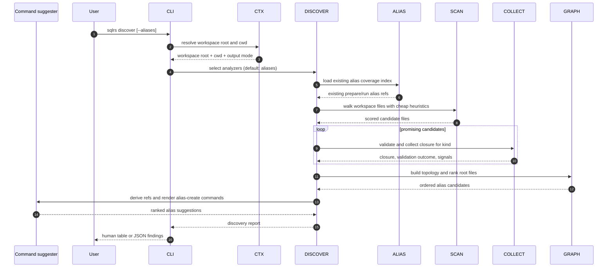

# Discover Flow

This document describes the local-only interaction flow for `sqlrs discover`
with the current aliases analyzer slice and its copy-paste `alias create`
output.

The command is advisory and read-only. It does not contact the engine, does not
start containers, and does not depend on Git-ref resolution.

## 1. Participants

- **User** - invokes `sqlrs discover`.
- **CLI parser** - parses analyzer flags and help.
- **Command context** - resolves workspace root, cwd, and output mode.
- **Discover orchestrator** - selects analyzers and aggregates their findings.
- **Alias coverage index** - reuses existing alias inventory to suppress
  duplicate suggestions.
- **Candidate scanner** - performs cheap path/content screening over workspace
  files.
- **Kind collector** - performs deeper closure validation for supported kinds.
- **Topology analyzer** - builds dependency graphs and chooses likely root
  files.
- **Command suggester** - derives alias refs and renders copy-pasteable
  `sqlrs alias create` commands for the surviving findings.
- **Renderer** - prints human or JSON findings.

## 2. Flow: `sqlrs discover`

## 3. Stage breakdown

### 3.1 Cheap prefilter

The aliases analyzer starts with a low-cost scan over workspace files.

It uses path and content signals to assign candidate scores, for example:

- SQL-like extensions and SQL tokens;
- Liquibase-like XML, YAML, JSON, class, or JAR references;
- common entrypoint locations such as `db/`, `migrations/`, `sql/`, or
  `queries/`;
- file names that commonly signal roots, such as `master.xml`, `changelog.xml`,
  `init.sql`, or `schema.sql`.

This stage is intentionally permissive so the analyzer can keep useful
promising files and cheaply reject obvious non-candidates.

### 3.2 Deep validation

Promising candidates are then passed to kind-specific collectors:

- `psql` candidates use the shared `psql` collector;
- Liquibase candidates use the shared Liquibase collector.

The collector stage verifies that the candidate parses as a supported workflow
root and computes its reachable file closure.

This is the stage where nested includes, changelog includes, and classpath or
JAR-backed Liquibase references become visible to the analyzer.

### 3.3 Topology and root selection

The analyzer builds a directed graph from the collected closures.

It then favors files that:

- have no meaningful inbound edges inside the candidate graph;
- have a high path-score or content-score;
- are not already covered by an existing repo-tracked alias;
- sit in conventional workflow directories or filenames.

Those roots become the main alias suggestions surfaced by `discover --aliases`.

### 3.4 Coverage suppression

If the repository already contains a matching alias file, the analyzer suppresses
the duplicate suggestion or downgrades it to an informational note.

This keeps `discover` focused on helping authors add missing alias coverage
rather than restating inventory that `sqlrs alias ls` already provides.

### 3.5 Copy-paste command synthesis

Each surviving root suggestion is turned into a suggested alias ref, target
alias path, and a ready-to-copy `sqlrs alias create ...` command.

That command is an output artifact only:

- `discover` never writes the file itself;
- the command can be pasted into the shell as-is or edited before execution;
- mutation happens only if the user runs `sqlrs alias create`.

## 4. Failure handling

- If workspace discovery fails, the command terminates before analysis.
- If a candidate violates workspace boundaries, it is rejected.
- If a collector cannot validate a candidate, the analyzer records the failure
  as a finding instead of crashing the command.
- No discovery stage mutates runtime state or writes files.
