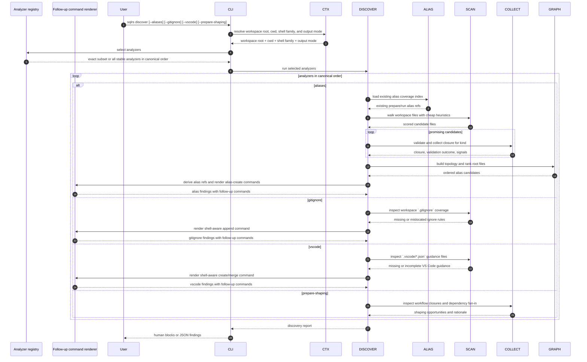

# Discover Flow

This document describes the local-only interaction flow for `sqlrs discover`
for the generic analyzer slice after `discover` grows beyond the initial
aliases-only behavior.

The command is advisory and read-only. It does not contact the engine, does not
start containers, and does not depend on Git-ref resolution.

## 1. Participants

- **User** - invokes `sqlrs discover`.
- **CLI parser** - parses analyzer flags and help.
- **Command context** - resolves workspace root, cwd, shell family, and output
  mode.
- **Discover orchestrator** - selects analyzers and aggregates their findings.
- **Analyzer registry** - defines the stable analyzers and their canonical
  execution order.
- **Alias coverage index** - reuses existing alias inventory to suppress
  duplicate suggestions.
- **Candidate scanner** - performs cheap path/content screening over workspace
  files.
- **Kind collector** - performs deeper closure validation for supported kinds.
- **Topology analyzer** - builds dependency graphs and chooses likely root
  files.
- **Repository hygiene advisor** - inspects `.gitignore` and `.vscode/*` files
  for missing local-workspace and editor guidance.
- **Follow-up command renderer** - renders shell-ready follow-up commands for
  analyzers that can suggest a safe next command.
- **Renderer** - prints human block output or JSON findings.
- **Progress reporter** - writes discovery progress to `stderr`.

## 2. Flow: `sqlrs discover`

## 3. Stage breakdown

### 3.1 Analyzer selection

The command supports additive analyzer flags.

- If the user passes one or more analyzer flags, `discover` runs exactly that
  subset.
- If the user passes no analyzer flags, `discover` runs all stable analyzers in
  canonical order.
- Duplicate analyzer flags are ignored.
- Output grouping remains stable regardless of flag order.

This keeps bare `discover` useful as a full advisory pass once the generic
slice ships, while still allowing narrow scripted runs such as
`discover --gitignore`.

### 3.2 Aliases analyzer

The aliases analyzer keeps the current staged pipeline.

It starts with a low-cost scan over workspace files and uses path/content
signals to assign candidate scores, for example:

- SQL-like extensions and SQL tokens;
- Liquibase-like XML, YAML, JSON, class, or JAR references;
- common entrypoint locations such as `db/`, `migrations/`, `sql/`, or
  `queries/`;
- file names that commonly signal roots, such as `master.xml`, `changelog.xml`,
  `init.sql`, or `schema.sql`.

Promising candidates are then passed to kind-specific collectors:

- `psql` candidates use the shared `psql` collector;
- Liquibase candidates use the shared Liquibase collector.

The collector stage verifies that the candidate parses as a supported workflow
root and computes its reachable file closure.

This is the stage where nested includes, changelog includes, and classpath or
JAR-backed Liquibase references become visible to the analyzer.

The analyzer then builds a directed graph from the collected closures and favors
files that:

- have no meaningful inbound edges inside the candidate graph;
- have a high path-score or content-score;
- are not already covered by an existing repo-tracked alias;
- sit in conventional workflow directories or filenames.

Those roots become the main alias suggestions surfaced by `discover --aliases`.

If the repository already contains a matching alias file, the analyzer suppresses
the duplicate suggestion or downgrades it to an informational note.

This keeps `discover` focused on helping authors add missing alias coverage
rather than restating inventory that `sqlrs alias ls` already provides.

Each surviving root suggestion is turned into a suggested alias ref, target
alias path, and a ready-to-copy `sqlrs alias create ...` command.

That command is an output artifact only:

- `discover` never writes the file itself;
- the command can be pasted into the shell as-is or edited before execution;
- mutation happens only if the user runs `sqlrs alias create`.

### 3.3 `--gitignore` analyzer

The `--gitignore` analyzer inspects repository ignore coverage for local-only
workspace artifacts.

Its first slice focuses on:

- missing ignore rules for `.sqlrs/`;
- missing ignore rules for other local-only sqlrs workspace artifacts;
- rule placement where a nested `.gitignore` would communicate scope more
  clearly than a broader root-level ignore.

For each finding, the analyzer produces:

- the target `.gitignore` path;
- the missing ignore entries;
- a shell-aware follow-up command that appends the entries.

The follow-up command is an output artifact only. It should be idempotent where
practical so that rerunning it does not blindly duplicate ignore lines.

### 3.4 `--vscode` analyzer

The `--vscode` analyzer inspects `.vscode/*.json` guidance files used for sqlrs
workspace conventions.

Its first slice focuses on:

- missing or incomplete `.vscode/settings.json` entries related to
  `.sqlrs/config.yaml`;
- optional `.vscode/extensions.json` guidance where the repository lacks clear
  editor recommendations for SQL/YAML-heavy workflows;
- settings consistency with documented sqlrs workspace conventions.

For each finding, the analyzer produces:

- the target `.vscode/*.json` path;
- the suggested JSON payload or fragment;
- a shell-aware follow-up command that creates or merges the missing entries.

When the file already exists, the suggested command must preserve unrelated user
settings and only merge the missing sqlrs-relevant entries.

### 3.5 `--prepare-shaping` analyzer

The `--prepare-shaping` analyzer reports workflow-shaping opportunities intended
to improve prepare reuse and cache friendliness.

Its first slice focuses on:

- large prepare roots that combine stable and volatile inputs;
- repeated include/changelog fan-in that suggests a reusable shared base;
- alias-layout opportunities where a repository would benefit from explicit
  split prepare aliases.

This analyzer remains purely advisory in the generic slice. It may recommend a
split point or a root-selection change, but it does not emit a mutating
follow-up command yet.

### 3.6 Follow-up command synthesis

Some analyzers emit copy-pasteable follow-up commands, but `discover` itself
remains read-only.

- `--aliases` emits `sqlrs alias create ...`.
- `--gitignore` emits a shell-native append command.
- `--vscode` emits a shell-native create-or-merge command.
- `--prepare-shaping` stays advisory-only in the first generic slice.

When shell syntax matters, follow-up commands are rendered for the current shell
family:

- PowerShell on Windows shells;
- POSIX shell otherwise.

### 3.7 Output channels and progress

`discover` keeps `stdout` reserved for the final result and uses `stderr` for
progress.

- Human output is rendered as numbered multi-line blocks, not a wide table.
- JSON output remains stable and machine-friendly.
- Findings are grouped by analyzer in canonical analyzer order.
- In normal interactive mode, progress is shown with a delayed spinner on
  `stderr`.
- In verbose mode, progress is written as line-based milestones on `stderr`.
- Progress granularity is stage/candidate based and may also include analyzer
  boundaries:
  - analyzer start and completion;
  - workspace scan start and summary;
  - candidate promotion into deeper validation;
  - candidate validation success, suppression, or invalidation;
  - final summary.
- Progress intentionally does not trace every folder or every scanned file.

## 4. Failure handling

- If workspace discovery fails, the command terminates before analysis.
- If a candidate violates workspace boundaries, it is rejected.
- If a collector cannot validate a candidate, the analyzer records the failure
  as a finding instead of crashing the command.
- If one analyzer encounters analyzer-specific validation problems, unrelated
  analyzers still run and their findings remain visible.
- If follow-up command rendering fails for one finding, the finding may still be
  reported with its diagnostic payload and without a command string.
- No discovery stage mutates runtime state or writes files.
