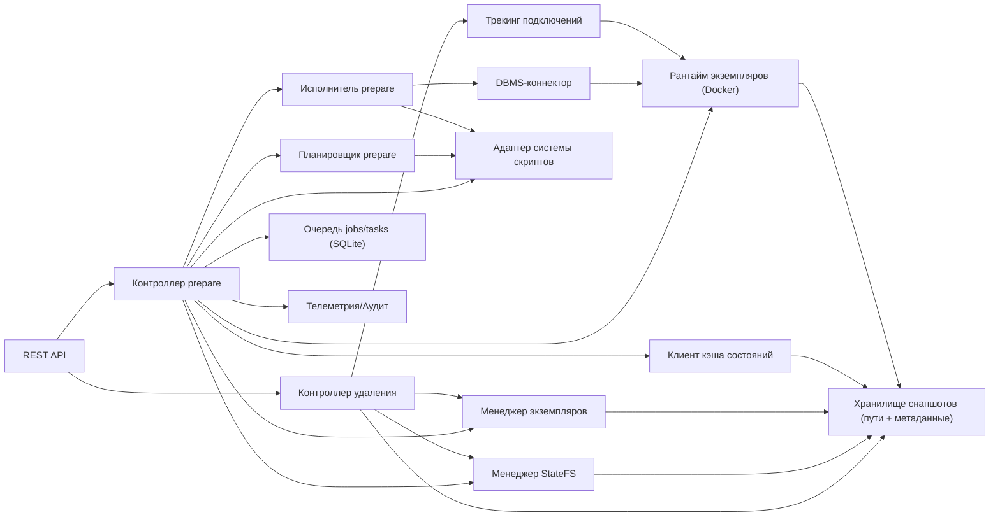
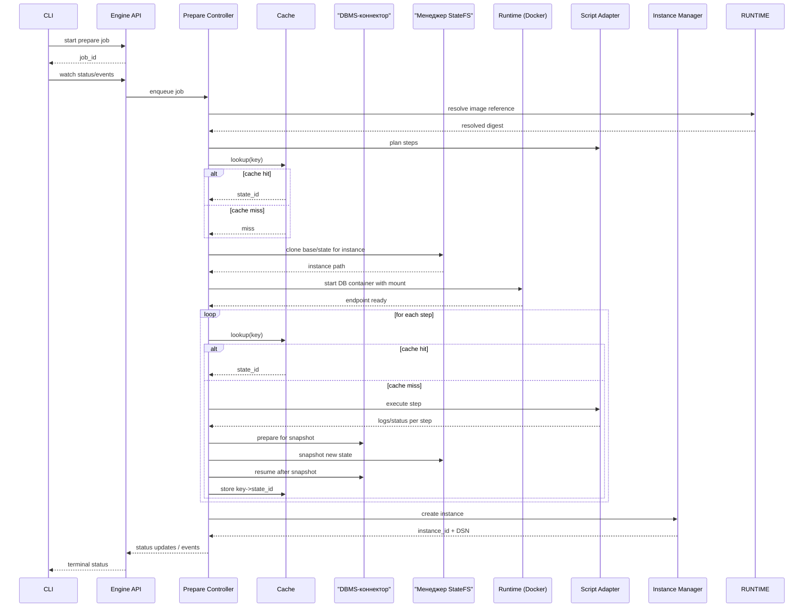
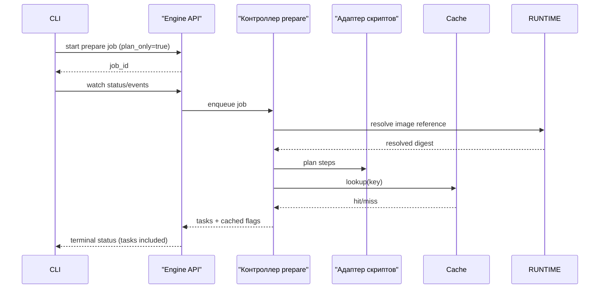
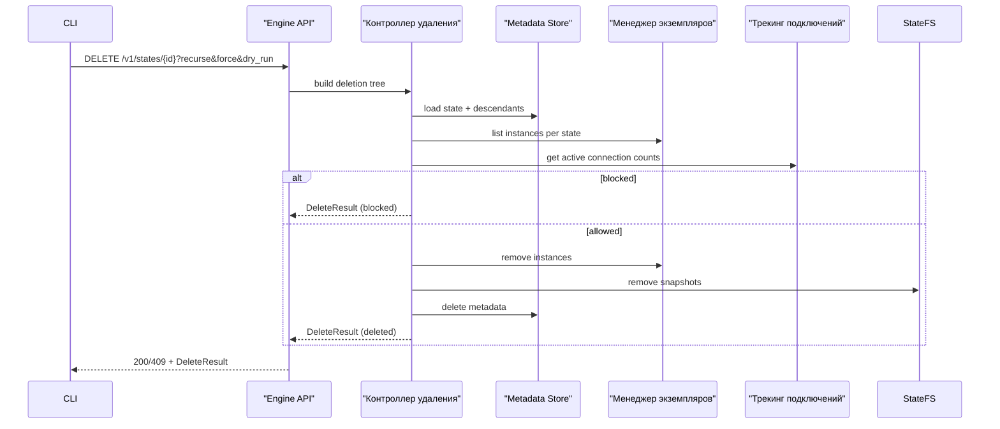
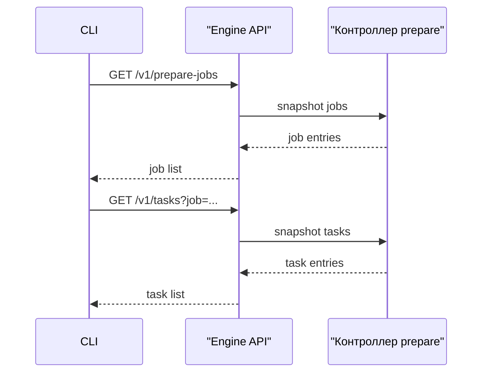
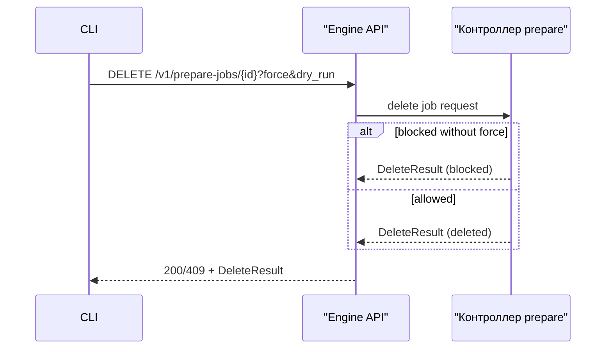

# Внутреннее устройство sqlrs Engine (локальный профиль)

Область: внутренняя структура процесса `sqlrs` для локального деплоймента (MVP). Фокус на том, как обрабатываются запросы от CLI, как устроены snapshot/cache, и как оркестрируются Docker и psql.

## 1. Модель компонентов

### 1.1 API-слой

- REST по loopback (HTTP/UDS); expose prepare jobs, операции с экземплярами, snapshots, cache и shutdown endpoints.
- expose endpoints удаления экземпляров и состояний с опциями recurse/force/dry-run.
- expose list endpoints для prepare jobs и tasks, а также удаление job.
- Prepare выполняется как async job; CLI следит за статусом/событиями и ждет завершения.
  `POST /v1/prepare-jobs` сохраняет запись job перед ответом `201 Created`.
  `plan_only`-запросы возвращают список задач в статусе job.
- Стримит события job (включая изменения статуса задач) всем подключенным NDJSON-клиентам.
- Пишет log-события для шагов runtime/DBMS (старт контейнера, запуск `psql`,
  prepare/resume snapshot) и повторяет последнее task-событие примерно раз в
  500 мс, если во время выполнения задачи нет новых событий.
- Стримит run-вывод/события через NDJSON; шаги восстановления пишутся при
  пересоздании отсутствующего контейнера инстанса.

### 1.2 Prepare Controller

- Координирует prepare job: plan steps, cache lookup, execute steps, snapshot states, создание экземпляра, persist metadata.
- Навязывает дедлайны и отмену; управляет дочерними процессами/контейнерами.
- Эмитит статусы и структурированные события (включая статус задач) для стрима в CLI.
- Отдает снимки jobs/tasks для list endpoints, хранит состояния jobs/tasks и обрабатывает удаление job.
- Разрешает образы без дайджеста в канонический дайджест перед планированием; добавляет задачу `resolve_image`, если резолв нужен.
- Отдает server config (`/v1/config`) и валидирует изменения по встроенной схеме.

### 1.3 Очередь jobs/tasks

- Хранит статусы jobs/tasks и историю событий в SQLite.
- Поддерживает восстановление после рестарта по queued/running записям.
- Удаляет завершенные prepare jobs сверх лимита на сигнатуру из конфига (`orchestrator.jobs.maxIdentical`).
- При удалении job очищает `state-store/jobs/<job_id>`, чтобы не оставались orphaned папки.

### 1.4 Планировщик prepare

- Строит упорядоченный список шагов prepare из `psql` скриптов.
- Каждый шаг хешируется (специфично для системы скриптов) для cache key: `engine/version/base/step_hash/params`.
- На выходе цепочка шагов, а не head/tail; промежуточные состояния могут материализоваться для cache reuse.
- Вход prepare также дает стабильный fingerprint состояния. Для контентных
  планнеров (psql/lb) этот fingerprint строится из **нормализованного контента**
  и **родительского state id** (task input). Для первого шага родителем является
  id базового образа, для последующих — id предыдущего состояния:
  `state_id = hash(prepare_kind + parent_state_id + normalized_content + engine_version)`.
- Контентные планнеры захватывают **read-lock** на всех разрешенных входах
  на время каждого task планирования/выполнения. Если lock нельзя получить,
  task завершается ошибкой, чтобы избежать plan drift.

### 1.5 Исполнитель prepare

- Выполняет один prepare шаг в instance через выбранный адаптер системы скриптов.
- Собирает структурированные логи/метрики для observability и cache planning.
- Использует DBMS-коннектор для подготовки к снапшоту без остановки контейнера.

### 1.6 Cache Client

- Общается с локальным state-cache индексом (SQLite) для lookup/store `key -> state_id`.
- Знает текущий корень state store; никогда не отдает наружу raw filesystem paths.

### 1.7 Менеджер StateFS

- Выбирает backend StateFS по файловой системе `SQLRS_STATE_STORE`:
  - btrfs → btrfs backend
  - zfs dataset mount point (в будущем) → zfs backend
  - иначе → fallback copy/reflink
- Windows использует тот же StateFS при запуске engine внутри WSL2.
- Экспортирует `Validate`, `Clone`, `Snapshot`, `RemovePath` для states и instances.
- Использует path resolver из State Store, чтобы найти корни `PGDATA` и каталоги states.

### 1.8 DBMS-коннектор

- Инкапсулирует подготовку СУБД к снапшоту и пробуждение после него.
- Для Postgres делает fast shutdown (`pg_ctl -m fast stop`) и restart, не останавливая контейнер.
- `psql` запускается внутри контейнера; пути к скриптам монтируются read-only и
  переписываются перед выполнением.

### 1.9 Instance Runtime

- Управляет DB-контейнерами через Docker (один контейнер на instance).
- Применяет монтирования от StateFS, задает лимиты ресурсов, default statement timeout.
- В MVP использует Docker CLI; позже можно заменить на SDK.
- Устанавливает `PGDATA=/var/lib/postgresql/data` и `POSTGRES_HOST_AUTH_METHOD=trust`.
- Возвращает connection info контроллеру.

### 1.10 Адаптер системы скриптов

- Дает общий интерфейс для систем скриптов (сейчас только `psql`).
- Каждый адаптер реализует planning, execution и правила хеширования шагов.
- `psql` запускается внутри контейнера и использует смонтированные пути к скриптам.
- Liquibase планируется как внешний CLI (host binary или Docker runner); накладные расходы измеряются и оптимизируются при необходимости.

### 1.11 Менеджер экземпляров

- Ведет mutable экземпляры, производные от immutable states.
- Создает эфемерные экземпляры и возвращает DSN.
- Управляет жизненным циклом экземпляров (ephemeral) и метаданными TTL/GC.
- Контейнеры остаются запущенными после prepare; экземпляры считаются warm, пока
  оркестрация run не решит их остановить.
- Если run обнаруживает отсутствующий контейнер и `runtime_dir` существует,
  engine пересоздает контейнер на основе сохраненного runtime, обновляет
  `runtime_id` и пишет run-события восстановления. При отсутствии `runtime_dir`
  run завершается ошибкой (без пересборки state).
- При удалении экземпляра удаляется сохраненная runtime-директория, чтобы не
  копить per-job данные под state store.
- Создание state сериализуется через файловые lock-и, чтобы параллельные prepare
  job ждали завершения первого и переиспользовали готовый state.

### 1.12 Контроллер удаления

- Строит дерево удаления для экземпляров и состояний.
- Проверяет правила безопасности (активные подключения, потомки, флаги).
- Выполняет удаление при разрешении; ответы идемпотентны.

### 1.13 Трекинг подключений

- Отслеживает активные подключения на уровне экземпляров.
- Использует introspection в БД (например, `pg_stat_activity`) по расписанию.
- Используется для продления TTL и проверок удаления.

### 1.14 State Store (Paths + Metadata)

- Разрешает корень хранилища в `<StateDir>/state-store`, если не задан `SQLRS_STATE_STORE`.
- В WSL проверяет активность systemd-маунта `SQLRS_STATE_STORE` перед работой со store.
- Владеет metadata DB (SQLite WAL) и layout путей (`engines/<engine>/<version>/base|states/<uuid>`).
- Пишет `engine.json` в state directory (endpoint + PID + auth token + lock) для discovery со стороны CLI.
- Хранит `parent_state_id` для поддержки иерархии состояний и рекурсивного удаления.

### 1.15 Telemetry/Audit

- Эмитит метрики: cache hit/miss, planning latency, instance bind/exec durations, snapshot size/time.
- Пишет audit events для prepare jobs и cache mutations.
- Логгирует HTTP-запросы и ключевые этапы prepare (создание job, планирование, обновления статуса задач, завершение).

## 2. Потоки (local)

### 2.1 Prepare Flow

- Отмена: контроллер отменяет prepare job, прерывает активную работу с БД, завершает стрим со статусом `failed` и ошибкой `cancelled`.
- Таймауты: контроллер ограничивает wall-clock; `statement_timeout` задается на шаг.

### 2.2 Plan-only Flow

- Plan-only job не выполняет шаги и не создает экземпляр.
- Статус job содержит список задач, когда он доступен.

### 2.3 Delete Flow

### 2.4 List Jobs/Tasks Flow

### 2.5 Job Delete Flow

## 3. Конкурентность и процессная модель

- Один процесс engine; явного лимита на параллельность пока нет (настраиваем позже).
- Один активный экземпляр на job; несколько job могут выполняться параллельно при наличии ресурсов.
- Лок: per-store lock, чтобы два экземпляра engine не писали в один store.

## 4. Персистентность и discovery

- `engine.json` в state directory: `{ pid, endpoint, socket_path|port, startedAt, lockfile, instanceId, authToken, version }`.
- Cache metadata, реестр states и очередь jobs/tasks живут в SQLite под корнем state store.
- Восстановление очереди повторно ставит queued/running задачи, а задачи с готовым state помечает как succeeded.

## 5. Обработка ошибок

- Все долгие операции возвращают job id; ошибки фиксируются как terminal state с причиной и логами.
- Cache writes идемпотентны по `state_id`; частичные snapshots помечаются failed и не переиспользуются без явной ссылки.
- Если Docker недоступен или выполнение `psql` в контейнере падает, API возвращает
  понятные ошибки; CLI их показывает и завершает с ненулевым кодом.

## 6. Точки эволюции

- Заменить Runtime на k8s executor без изменения формы API.
- Усилить локальный auth для multi-user/shared host (не-MVP).
- Подключить remote/shared cache client за тем же интерфейсом.
