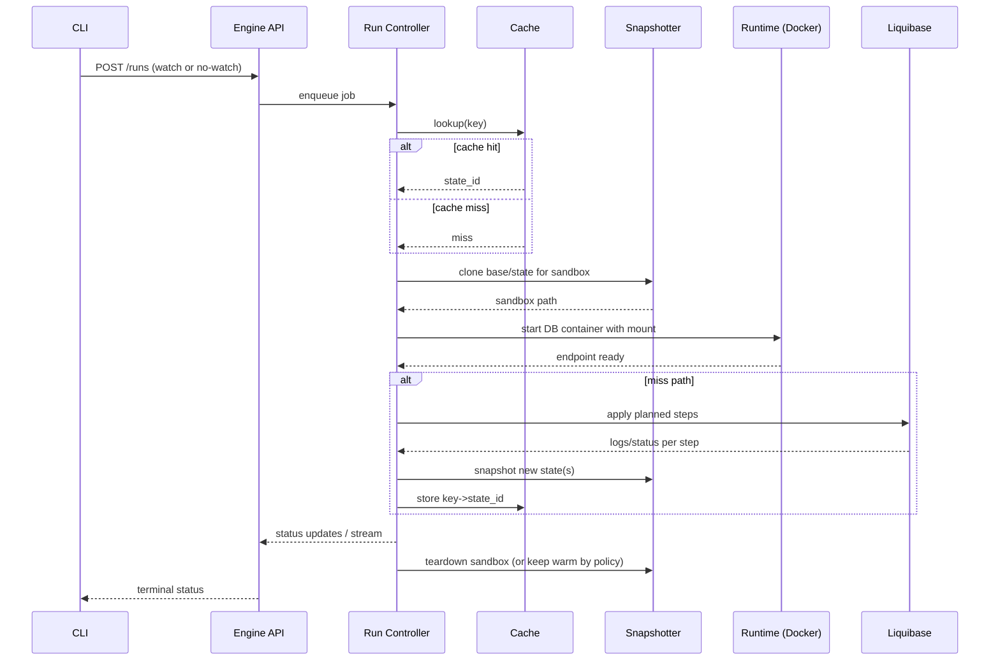

# Внутреннее устройство sqlrs Engine (локальный профиль)

Область: внутренняя структура процесса `sqlrs` для локального деплоймента (MVP). Фокус на том, как обрабатываются запросы от CLI, как устроены snapshot/cache, и как оркестрируются Docker и Liquibase.

## 1. Модель компонентов

```mermaid
flowchart LR
  API[REST API]
  CTRL[Run Controller]
  PLAN[Planner (head/tail)]
  CACHE[state-cache client]
  SNAP[Snapshotter]
  RUNTIME[Sandbox Runtime (Docker)]
  LB[Liquibase Provider]
  STORE[State Store (paths + metadata)]
  OBS[Telemetry/Audit]

  API --> CTRL
  CTRL --> PLAN
  CTRL --> CACHE
  CTRL --> SNAP
  CTRL --> RUNTIME
  CTRL --> LB
  CTRL --> OBS
  SNAP --> STORE
  CACHE --> STORE
  RUNTIME --> STORE
```

### 1.1 API-слой

- REST по loopback (HTTP/UDS); exposes `/runs`, `/snapshots`, `/cache/{key}`, `/engine/shutdown`.
- Все долгие операции выполняются асинхронно; sync-режим CLI только наблюдает статус/стрим.

### 1.2 Run Controller

- Координирует run как job: plan, cache lookup, sandbox bind, execute, snapshot, persist metadata.
- Навязывает дедлайны и отмену; управляет дочерними процессами/контейнерами.
- Эмитит статусы и структурированные события для стрима в CLI.

### 1.3 Planner

- Делит head/tail; вычисляет cache key (engine/version/base/block hash/params).
- Консультируется с Liquibase (если доступен) по pending changesets и checksums.

### 1.4 Cache Client

- Общается с локальным state-cache индексом (SQLite) для lookup/store `key -> state_id`.
- Знает текущий корень state store; никогда не отдает наружу raw filesystem paths.

### 1.5 Snapshotter

- Абстрагирует CoW/copy стратегии (btrfs, VHDX+link-dest, rsync).
- Экспортирует `Clone`, `Snapshot`, `Destroy` для states и sandboxes.
- Использует path resolver из State Store, чтобы найти корни `PGDATA`.

### 1.6 Sandbox Runtime

- Управляет DB-контейнерами через Docker (один контейнер на sandbox).
- Применяет монтирования от Snapshotter, задает лимиты ресурсов, default statement timeout.
- Возвращает connection info контроллеру.

### 1.7 Liquibase Provider

- Выбирает режим исполнения: host binary или Docker runner.
- Стримит структурированные логи в контроллер для observability и cache planning.

### 1.8 State Store (Paths + Metadata)

- Разрешает корень хранилища (`~/.cache/sqlrs/state-store` или override).
- Владеет metadata DB (SQLite WAL) и layout путей (`engines/<engine>/<version>/base|states/<uuid>`).
- Пишет `engine.json` (endpoint + PID + lock) для discovery со стороны CLI.

### 1.9 Telemetry/Audit

- Эмитит метрики: cache hit/miss, planning latency, sandbox bind/exec durations, snapshot size/time.
- Пишет audit events для runs и cache mutations.

## 2. Run Flow (local)



- Отмена: CLI вызывает `POST /runs/{id}/cancel`; контроллер делает `pg_cancel_backend`/останов контейнера и завершает стрим со статусом `cancelled`.
- Таймауты: контроллер ограничивает wall-clock; `statement_timeout` задается на run или на шаг.

## 3. Конкурентность и процессная модель

- Один процесс engine; очередь job с небольшим пулом воркеров (настраиваемо).
- Одна активная песочница на job; несколько job могут выполняться параллельно при наличии ресурсов.
- Лок: per-store lock, чтобы два экземпляра engine не писали в один store.

## 4. Персистентность и discovery

- `engine.json` в корне state store: `{ pid, endpoint, socket_path|port, started_at, lockfile }`.
- Cache metadata и реестр states живут в SQLite под корнем state store.
- Другой персистентности нет; engine в остальном disposable.

## 5. Обработка ошибок

- Все долгие операции возвращают `run_id`; ошибки фиксируются как terminal state с причиной и логами.
- Cache writes идемпотентны по `state_id`; частичные snapshots помечаются failed и не переиспользуются без явной ссылки.
- Если Docker/Liquibase недоступны, API возвращает понятные ошибки; CLI их показывает и завершает с ненулевым кодом.

## 6. Точки эволюции

- Заменить Runtime на k8s executor без изменения формы API.
- Добавить auth для IPC при multi-user (не-MVP).
- Подключить remote/shared cache client за тем же интерфейсом.
