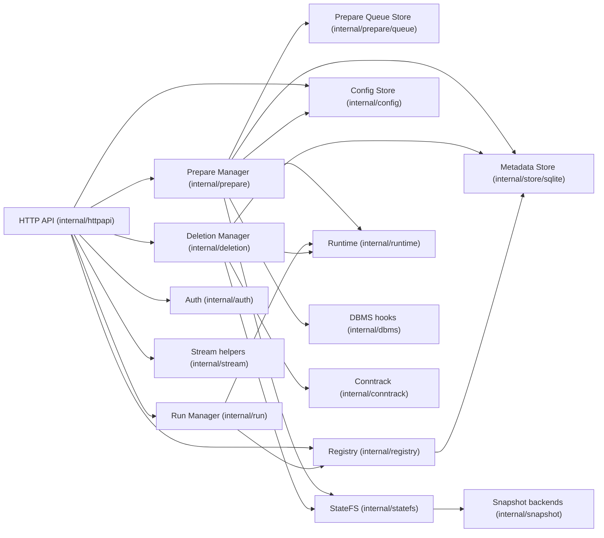
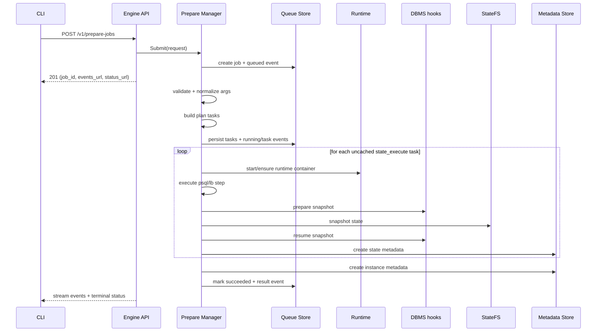
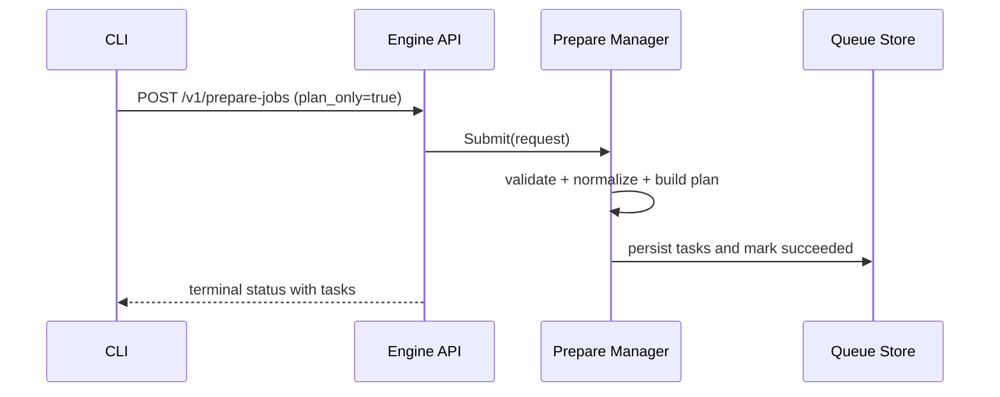

# Внутреннее устройство sqlrs Engine (локальный профиль)

Область: внутренняя архитектура процесса локального `sqlrs-engine`. Документ описывает текущую пакетную структуру и фактические request-flow из `backend/local-engine-go`.

## 1. Модель компонентов

### 1.1 API-слой

- Экспортирует endpoint-ы локального engine под `/v1/*`.
- Использует bearer auth для всех роутов, кроме `/v1/health`.
- Поддерживает:
  - схему и значения config (`/v1/config*`)
  - prepare jobs, events stream, tasks (`/v1/prepare-jobs*`, `/v1/tasks`)
  - run execution (`/v1/runs`)
  - list/get names/instances/states (`/v1/names*`, `/v1/instances*`, `/v1/states*`)
  - удаление instance/state/job.
- Стримит prepare- и run-события в формате NDJSON.

### 1.2 Prepare manager (planner + executor)

`internal/prepare` владеет полным жизненным циклом prepare:

- валидирует запрос (`prepare_kind`, args, image)
- нормализует входы `psql`/`lb`
- при необходимости резолвит image digest (`resolve_image` task)
- строит план задач (`plan`, `state_execute`, `prepare_instance`)
- выполняет задачи и делает snapshot состояний
- пишет job/task/events в queue store
- поддерживает `plan_only` (возврат tasks без создания instance)
- поддерживает удаление job (`force`, `dry_run`) и retention trimming.

Отдельного пакета `internal/executor` в текущей реализации нет.

### 1.3 Queue store

`internal/prepare/queue` хранит jobs, tasks и events в SQLite.

- recovery: queued/running jobs поднимаются после рестарта
- retention: completed jobs обрезаются по сигнатуре (`orchestrator.jobs.maxIdentical`)
- cleanup: при удалении job удаляется `<state-store-root>/jobs/<job_id>`.

### 1.4 Run manager

`internal/run` выполняет команды в контейнерах instance.

- валидирует run kind (`psql`, `pgbench`) и аргументы
- резолвит instance по id/name через registry
- исполняет команду через runtime
- при отсутствии контейнера пересоздает его из `runtime_dir` (если есть), обновляет `runtime_id` и пишет recovery log events.

### 1.5 StateFS и snapshot backends

`internal/statefs` дает файловую абстракцию и layout путей.

- делегирует snapshot операции в `internal/snapshot`
- выбор backend: `auto`, `overlay`, `btrfs`, `copy`
- layout состояний от image id:
  - `<state-store-root>/engines/<engine>/<version>/base`
  - `<state-store-root>/engines/<engine>/<version>/states/<state_id>`.

### 1.6 Runtime и DBMS hooks

- `internal/runtime` - Docker adapter (`docker` CLI): init base, start/stop container, exec, run one-shot container.
- `internal/dbms` - Postgres snapshot hooks (`PrepareSnapshot`, `ResumeSnapshot`) вокруг snapshot-операций.

### 1.7 Deletion и connection tracking

- `internal/deletion` строит и исполняет delete tree для instances/states.
- `internal/conntrack` подключаемый; в текущей local-wiring в `cmd/sqlrs-engine` используется `conntrack.Noop`.

### 1.8 Registry и metadata store

- `internal/registry` инкапсулирует name/id resolution и list/get операции.
- `internal/store` задает интерфейсы; `internal/store/sqlite` их реализует.
- metadata (names/instances/states) и prepare queue таблицы хранятся в `<state-store-root>/state.db`.

### 1.9 Config и discovery

- runtime config хранится в `<state-store-root>/config.json` и доступен через `/v1/config*`.
- discovery для CLI - файл `engine.json`, который пишет `cmd/sqlrs-engine` (endpoint, pid, auth token, version, instance id).

## 2. Потоки (local)

### 2.1 Prepare flow

### 2.2 Plan-only flow

### 2.3 Run flow

### 2.4 Deletion flow

## 3. Конкурентность и процессная модель

- Один процесс engine на локальный workspace profile.
- Prepare jobs выполняются асинхронно; несколько job могут идти параллельно.
- Создание state сериализуется per-target-state через lock-файлы в файловой системе.
- Queue recovery при старте возобновляет non-terminal jobs.

## 4. Персистентность и discovery

- Корень state store: `<state-dir>/state-store` по умолчанию, переопределяется `SQLRS_STATE_STORE`.
- SQLite БД: `<state-store-root>/state.db`.
- Config файл: `<state-store-root>/config.json`.
- Runtime-директории job: `<state-store-root>/jobs/<job_id>/runtime`.
- Discovery-файл CLI: `engine.json` (путь задается через `--write-engine-json`).

## 5. Обработка ошибок

- Долгие операции возвращают prepare job; terminal failures отдаются через status и event stream.
- Validation failures возвращают `400` со структурированной ошибкой.
- Ошибки runtime/docker availability отдаются как actionable API ошибки.
- Если кэшированное state помечено как dirty/incomplete, prepare инвалидирует его и пересобирает.

## 6. Точки эволюции

- Замена Docker runtime adapter без изменения API contract.
- Замена/расширение StateFS backend-ов при сохранении интерфейса `statefs.StateFS`.
- Замена `conntrack.Noop` на активный DB connection tracking для local/shared профилей.
