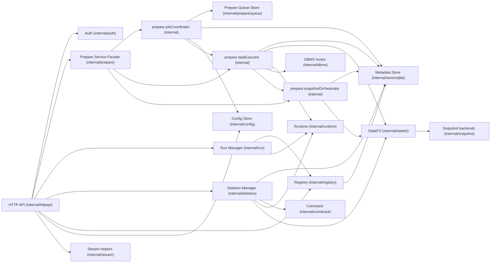
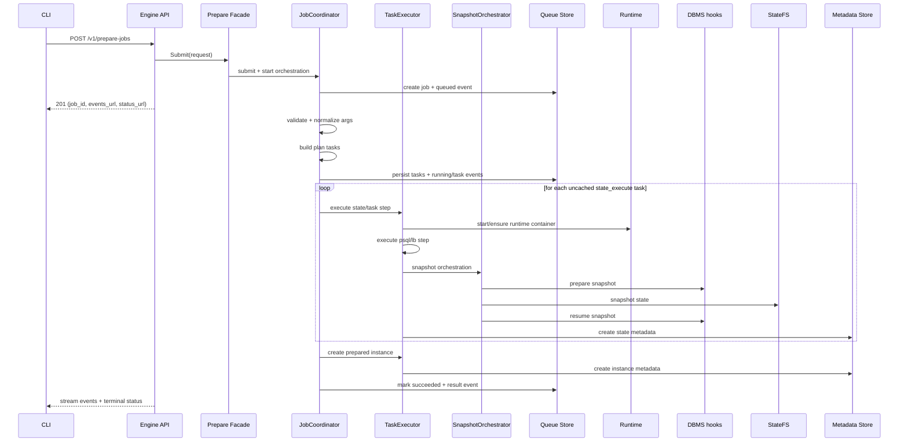
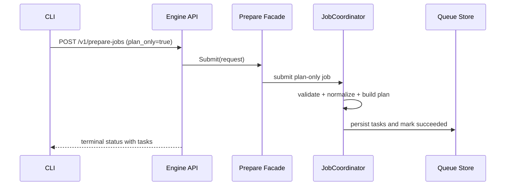
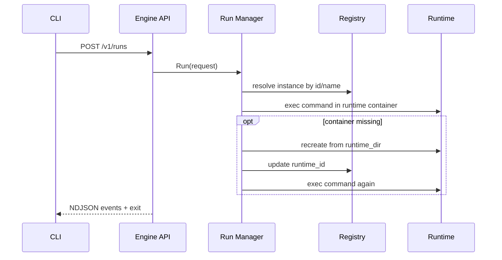
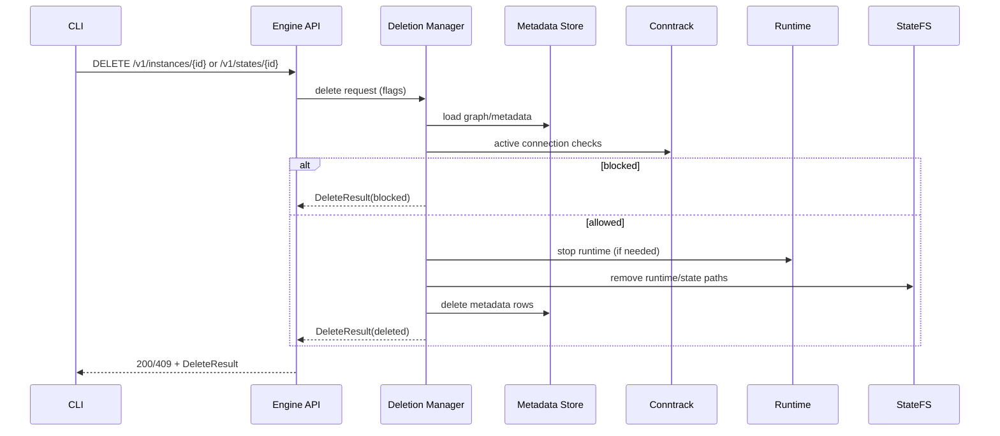

# sqlrs Engine Internals (Local Profile)

Scope: internal structure of the local `sqlrs-engine` process. This document
describes the current package-level design and request flows implemented in `backend/local-engine-go`.

## 1. Component Model

### 1.1 API layer

- Exposes local engine endpoints under `/v1/*`.
- Uses bearer auth for all routes except `/v1/health`.
- Supports:
  - config schema and value management (`/v1/config*`)
  - prepare jobs, events stream, tasks (`/v1/prepare-jobs*`, `/v1/tasks`)
  - run execution (`/v1/runs`)
  - names/instances/states listing and lookup (`/v1/names*`, `/v1/instances*`, `/v1/states*`)
  - instance/state/job deletion.
- Streams prepare events and run events as NDJSON.

### 1.2 Prepare Service Facade and internal components

`internal/prepare` still owns the full prepare lifecycle, but now has explicit
internal roles:

- `prepare.PrepareService` (facade)
  - public entrypoints for submit/status/events/delete used by `httpapi`.
- `jobCoordinator` (internal)
  - request normalization/validation, planning, queue/job/task/event transitions,
    retention logic.
- `taskExecutor` (internal)
  - runtime/task execution and instance creation.
- `snapshotOrchestrator` (internal)
  - base-state initialization guards, dirty cached-state invalidation,
    snapshot/cache hygiene helpers.
- Implementation note:
  - heavy method bodies now live on component methods directly; the transitional
    `Manager -> component -> Manager.*Impl` call chain was removed.

Package boundary is still `internal/prepare`; these are internal component roles,
not separate packages.

### 1.3 Queue store

`internal/prepare/queue` persists jobs, tasks, and events in SQLite.

- recovery: queued/running jobs are reloaded and resumed on startup
- retention: completed jobs are trimmed by signature (`orchestrator.jobs.maxIdentical`)
- cleanup: deleting a job also removes `<state-store-root>/jobs/<job_id>`.

### 1.4 Run manager

`internal/run` executes commands in instance containers.

- validates run kind (`psql`, `pgbench`) and arguments
- resolves instance by id/name via registry
- executes command via runtime
- on missing container, recreates it from `runtime_dir` (if present),
  updates `runtime_id`, and emits recovery log events.

### 1.5 StateFS and snapshot backends

`internal/statefs` provides filesystem abstraction and path layout.

- delegates snapshot operations to `internal/snapshot`
- backend selection: `auto`, `overlay`, `btrfs`, `copy`
- state layout is derived from image id under:
  - `<state-store-root>/engines/<engine>/<version>/base`
  - `<state-store-root>/engines/<engine>/<version>/states/<state_id>`.

### 1.6 Runtime and DBMS hooks

- `internal/runtime` is a container runtime adapter (Docker/Podman CLI): init
  base, start/stop containers, exec commands, run one-shot containers.
- `internal/dbms` provides Postgres snapshot hooks (`PrepareSnapshot`,
  `ResumeSnapshot`) around snapshot operations.

### 1.7 Deletion and connection tracking

- `internal/deletion` builds and executes delete trees for instances/states.
- `internal/conntrack` is pluggable; current local wiring in `cmd/sqlrs-engine`
  uses `conntrack.Noop`.

### 1.8 Registry and metadata store

- `internal/registry` encapsulates name/id resolution and list/get operations.
- `internal/store` defines interfaces; `internal/store/sqlite` implements them.
- metadata (names/instances/states) and prepare queue tables are stored in `<state-store-root>/state.db`.

### 1.9 Config and discovery

- runtime config is stored in `<state-store-root>/config.json` and exposed via `/v1/config*`.
- engine discovery for CLI uses `engine.json` written by `cmd/sqlrs-engine`
  (endpoint, pid, auth token, version, instance id).

## 2. Flows (Local)

### 2.1 Prepare flow

### 2.2 Plan-only flow

### 2.3 Run flow

### 2.4 Deletion flow

## 3. Concurrency and process model

- Single engine process per local workspace profile.
- Prepare jobs execute asynchronously; multiple jobs may run concurrently.
- State creation is serialized per target state via filesystem lock files.
- Queue recovery on startup resumes non-terminal jobs.

## 4. Persistence and discovery

- State store root: `<state-dir>/state-store` by default, overridable by `SQLRS_STATE_STORE`.
- SQLite DB: `<state-store-root>/state.db`.
- Config file: `<state-store-root>/config.json`.
- Job runtime dirs: `<state-store-root>/jobs/<job_id>/runtime`.
- CLI discovery file: `engine.json` (path passed by `--write-engine-json`).

## 5. Error handling

- Long operations return a prepare job; terminal failures are reported via job
  status and event stream.
- Validation failures return `400` with structured error payload.
- Runtime availability failures (Docker/Podman) are surfaced as actionable API errors.
- If cached state is detected as dirty/incomplete, prepare invalidates and
  rebuilds it.

## 6. Evolution hooks

- Keep runtime adapter replaceable (Docker/Podman and future OCI runtimes) without
  changing API contracts.
- Swap/extend StateFS backends while keeping `statefs.StateFS` stable.
- Replace `conntrack.Noop` with active DB connection tracking in local/shared profiles.

## 7. Helper Contracts (Normative)

Helper functions that affect orchestration, safety, path mapping, or API-visible
errors are treated as requirement-level behavior. They are not "optional internals".

### 7.1 Prepare helper contracts

- Lock helpers (`withInitLock`, `withStateBuildLock`) must provide exclusive build
  execution per target, wait on active lock owners, and honor cancellation via context.
- Marker helpers (`.init.ok`, `.build.ok`) must short-circuit waiting workers once
  a valid initialization/build result is observable.
- State hygiene helpers (`postmasterPIDPath`, `hasPGVersion`,
  `invalidateDirtyCachedState`) must classify dirty/incomplete cached states and
  remove both filesystem artifacts and metadata rows before reuse.
- Runtime directory safety helpers must reject runtime directories nested inside
  immutable state directories.

### 7.2 Liquibase helper contracts

- Argument filtering helpers must reject user-provided connection/runtime flags
  that break deterministic engine-controlled execution.
- Path helpers must normalize/map `--changelog-file`, `--defaults-file`,
  `--searchPath` according to the selected execution environment.
- Command transformation helpers must preserve planning/execution parity:
  planning uses `updateSQL`, execution uses one-step `update-count --count=1`.
- Host execution helpers must honor `exec_mode` (`native` vs `windows-bat`),
  preserve `work_dir`/environment semantics, and stream command logs line-by-line.

### 7.3 Runtime helper contracts

- Docker error classification helpers must convert daemon-unavailable failures into
  actionable user-facing diagnostics.
- Host auth helpers must ensure required `pg_hba.conf` entries idempotently.
- Port parsing helpers must fail closed on malformed `docker port` output.

### 7.4 Deletion and run helper contracts

- Deletion runtime-stop helpers must treat docker-daemon-unavailable as non-fatal
  during destructive cleanup.
- Runtime directory cleanup helpers must try StateFS removal first and fallback
  to filesystem removal.
- Run argument guards must reject conflicting connection flags in `run:psql` and
  `run:pgbench`.

### 7.5 HTTP stream helper contracts

- Prepare events stream helpers must provide ordered NDJSON delivery, wait for new
  events when the stream is not terminal, and stop once terminal status is reached.
