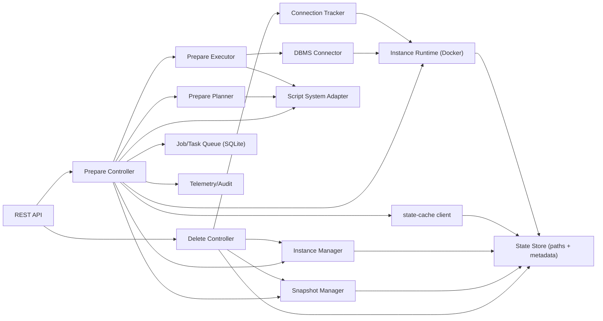
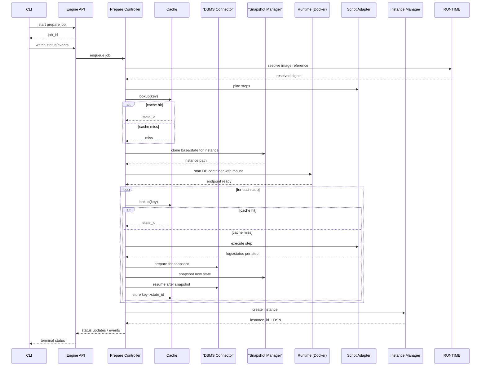
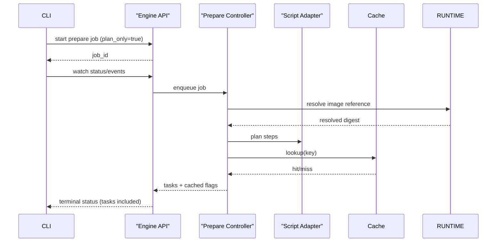
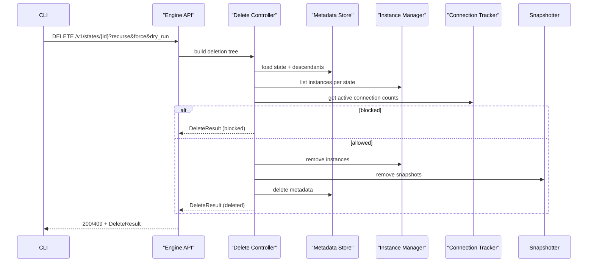
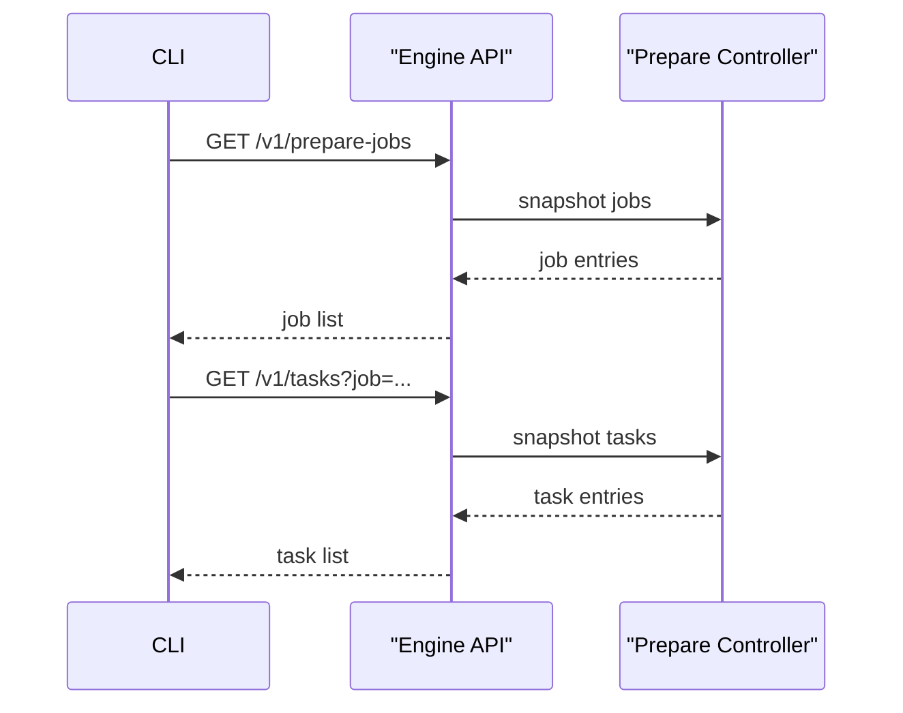
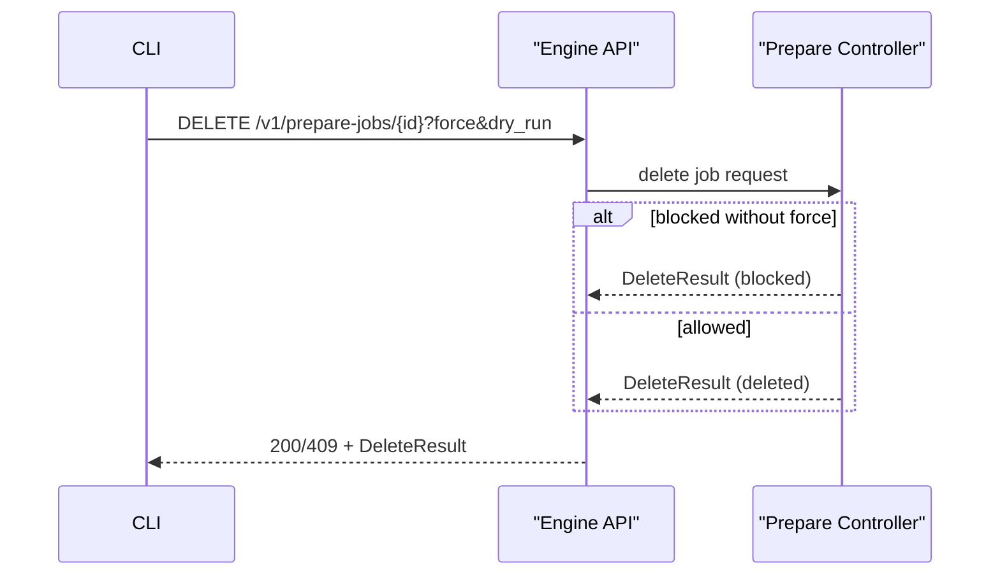

# sqlrs Engine Internals (Local Profile)

Scope: internal structure of the `sqlrs` engine process for local deployment (MVP). Focus on how requests from the CLI are handled, how snapshot/cache logic is wired, and how Docker/psql are orchestrated.

## 1. Component Model

### 1.1 API Layer

- REST over loopback (HTTP/UDS); exposes prepare jobs, instance lookup/binding, snapshots, cache, and shutdown endpoints.
- Exposes delete endpoints for instances and states with recurse/force/dry-run options.
- Exposes list/delete endpoints for prepare jobs and list endpoints for tasks.
- Prepare runs as async jobs; the CLI watches status/events and waits for completion.
  `POST /v1/prepare-jobs` persists the job record before returning `201 Created`.
  `plan_only` compute-only requests return task lists in job status.
- Streams job events (including task status changes) to all connected NDJSON clients.
- Emits log events for runtime/DBMS steps (container start, `psql` execution,
  snapshot prepare/resume) and repeats the last task event every ~500ms while a
  task is running and no new events are emitted.

### 1.2 Prepare Controller

- Coordinates a prepare job: plan steps, cache lookup, execute steps, snapshot states, create instance, persist metadata.
- Enforces deadlines and cancellation; supervises child processes/containers.
- Emits status transitions and structured events (including task status) for streaming to the CLI.
- Provides job/task snapshots for list endpoints, persists job/task state, and handles job deletion requests.
- Resolves non-digest image references to canonical digests before planning; records a `resolve_image` task when resolution is required.
- Serves server configuration (`/v1/config`) and validates updates against the built-in schema.

### 1.3 Job/Task Queue Store

- Stores job/task status and event history in SQLite.
- Supports recovery after restarts by reloading queued/running work.
- Trims completed prepare jobs beyond the per-signature retention limit from config (`orchestrator.jobs.maxIdentical`).
- Job deletion removes `state-store/jobs/<job_id>` to prevent orphaned folders.

### 1.4 Prepare Planner

- Builds an ordered list of prepare steps from `psql` scripts.
- Each step is hashed (script-system specific) to form cache keys: `engine/version/base/step_hash/params`.
- The output is a step chain, not head/tail; intermediate states may be materialized for cache reuse.
- The overall prepare input also produces a stable state fingerprint:
  `state_id = hash(prepare_kind + base_image_id_resolved + normalized_args + normalized_input_hashes + engine_version)`.

### 1.5 Prepare Executor

- Executes a single prepare step in an instance using the selected script system adapter.
- Captures structured logs/metrics for observability and cache planning.
- Uses a DBMS connector to prepare for snapshots without stopping the container.

### 1.6 Cache Client

- Talks to local state-cache index (SQLite) to lookup/store `key -> state_id`.
- Knows current state store root; never exposes raw filesystem paths to callers.

### 1.7 Snapshot Manager

- Prefers OverlayFS on Linux; falls back to copy-based snapshots.
- Windows/WSL snapshot backend is added later.
- Exposes `Clone`, `Snapshot`, `Destroy` for states and instances.
- Uses path resolver from State Store to locate `PGDATA` roots and state directories.

### 1.8 DBMS Connector

- Encapsulates DBMS-specific snapshot preparation and resume.
- For Postgres, performs fast shutdown (`pg_ctl -m fast stop`) and restart while the
  container stays up.
- `psql` execution runs inside the container; script paths are mounted read-only and
  rewritten before execution.

### 1.9 Instance Runtime

- Manages DB containers via Docker (single-container per instance).
- Uses Docker CLI in the MVP; replaceable with a Docker Engine SDK adapter.
- Applies mounts from Snapshot Manager, sets resource limits, statement timeout defaults.
- Sets `PGDATA=/var/lib/postgresql/data` and `POSTGRES_HOST_AUTH_METHOD=trust`.
- Provides connection info to the controller.

### 1.10 Script System Adapter

- Provides a common interface for script systems (currently `psql`).
- Each adapter implements step planning + step execution + hashing rules.
- `psql` execution runs inside the container and uses mounted script paths.
- Liquibase execution is planned via external CLI (host binary or Docker runner); overhead is tracked and optimized if needed.

### 1.11 Instance Manager

- Maintains mutable instances derived from immutable states.
- Creates ephemeral instances and returns DSNs.
- Handles instance lifecycle (ephemeral) and TTL/GC metadata.
- Containers stay running after prepare; instances are recorded as warm until
  run orchestration decides to stop them.
- Instance deletion removes the recorded runtime data directory to avoid
  leaking per-job runtime data under the state store.
- State creation is serialized with per-state filesystem locks so concurrent
  prepare jobs wait for the first builder to finish and then reuse the state.

### 1.12 Delete Controller

- Builds deletion trees for instances and states.
- Evaluates safety rules (active connections, descendants, flags).
- Executes deletions when allowed; responses are idempotent.

### 1.13 Connection Tracker

- Tracks active connections per instance.
- Uses DB introspection (e.g., `pg_stat_activity`) on a periodic schedule.
- Feeds TTL extension and deletion safety checks.

### 1.14 State Store (Paths + Metadata)

- Resolves storage root under `<StateDir>/state-store`.
- Owns metadata DB handle (SQLite WAL) and path layout (`engines/<engine>/<version>/base|states/<uuid>`).
- Writes `engine.json` in the CLI state directory (endpoint + PID + auth token + lock) for discovery.
- Stores `parent_state_id` to support state ancestry and recursive deletion.

### 1.15 Telemetry/Audit

- Emits metrics: cache hit/miss, planning latency, instance bind/exec durations, snapshot size/time.
- Writes audit events for prepare jobs and cache mutations.
- Logs HTTP requests and prepare lifecycle events (job creation, task planning, task status updates, completion).

## 2. Flows (Local)

### 2.1 Prepare Flow

- Cancellation: controller cancels the prepare job; active DB work is interrupted; stream ends with `failed` plus a `cancelled` error.
- Timeouts: controller enforces wall-clock deadline; DB statement_timeout is set per step.

### 2.2 Plan-only Flow

- Plan-only jobs skip execution and instance creation.
- The job status includes the planned task list when available.

### 2.3 Delete Flow

### 2.4 Job/Task Listing Flow

### 2.5 Job Deletion Flow

## 3. Concurrency and Process Model

- Single engine process; no explicit concurrency cap yet (configurable later).
- One active instance per job; multiple jobs may run in parallel if resources allow.
- Locking: per-store lock to prevent two engine instances from mutating the same store.

## 4. Persistence and Discovery

- `engine.json` in the state directory: `{ pid, endpoint, socket_path|port, startedAt, lockfile, instanceId, authToken, version }`.
- Cache metadata, state registry, and job/task queue state live in SQLite under the state store root.
- Queue recovery replays queued/running work; tasks with existing output states are marked succeeded.

## 5. Error Handling

- All long ops return a prepare job id; failures are terminal states with reason and logs.
- Cache writes are idempotent per `state_id`; partial snapshots are marked failed and not reused unless explicitly referenced.
- If Docker is unavailable or container `psql` execution fails, API returns actionable errors; CLI surfaces them and exits non-zero.

## 6. Evolution Hooks

- Swap Runtime to k8s executor without changing API shape.
- Harden local auth for multi-user or shared hosts (non-MVP).
- Plug remote/shared cache client behind the same cache interface.
