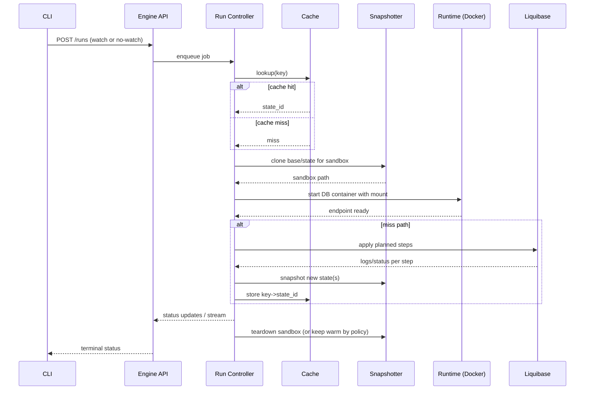

# sqlrs Engine Internals (Local Profile)

Scope: internal structure of the `sqlrs` engine process for local deployment (MVP). Focus on how requests from the CLI are handled, how snapshot/cache logic is wired, and how Docker/Liquibase are orchestrated.

## 1. Component Model

```mermaid
flowchart LR
  API[REST API]
  CTRL[Run Controller]
  PLAN[Planner (head/tail)]
  CACHE[state-cache client]
  SNAP[Snapshotter]
  RUNTIME[Sandbox Runtime (Docker)]
  LB[Liquibase Provider]
  STORE[State Store (paths + metadata)]
  OBS[Telemetry/Audit]

  API --> CTRL
  CTRL --> PLAN
  CTRL --> CACHE
  CTRL --> SNAP
  CTRL --> RUNTIME
  CTRL --> LB
  CTRL --> OBS
  SNAP --> STORE
  CACHE --> STORE
  RUNTIME --> STORE
```

### 1.1 API Layer

- REST over loopback (HTTP/UDS); exposes `/runs`, `/snapshots`, `/cache/{key}`, `/engine/shutdown`.
- All long operations run asynchronously; sync CLI mode just watches status/stream.

### 1.2 Run Controller

- Coordinates a run as a job: plan, cache lookup, sandbox bind, execute, snapshot, persist metadata.
- Enforces deadlines and cancellation; supervises child processes/containers.
- Emits status transitions and structured events for streaming to the CLI.

### 1.3 Planner

- Splits head/tail; computes cache key (engine/version/base/block hash/params).
- Consults Liquibase (when available) for pending changesets and checksums.

### 1.4 Cache Client

- Talks to local state-cache index (SQLite) to lookup/store `key -> state_id`.
- Knows current state store root; never exposes raw filesystem paths to callers.

### 1.5 Snapshotter

- Abstracts CoW/copy strategies (btrfs, VHDX+link-dest, rsync).
- Exposes `Clone`, `Snapshot`, `Destroy` for states and sandboxes.
- Uses path resolver from State Store to locate `PGDATA` roots.

### 1.6 Sandbox Runtime

- Manages DB containers via Docker (single-container per sandbox).
- Applies mounts from Snapshotter, sets resource limits, statement timeout defaults.
- Provides connection info to the controller.

### 1.7 Liquibase Provider

- Selects execution mode: host binary or Docker runner.
- Streams structured logs back to the controller for observability and cache planning.

### 1.8 State Store (Paths + Metadata)

- Resolves storage root (`~/.cache/sqlrs/state-store` or overridden).
- Owns metadata DB handle (SQLite WAL) and path layout (`engines/<engine>/<version>/base|states/<uuid>`).
- Writes `engine.json` (endpoint + PID + lock) for CLI discovery.

### 1.9 Telemetry/Audit

- Emits metrics: cache hit/miss, planning latency, sandbox bind/exec durations, snapshot size/time.
- Writes audit events for runs and cache mutations.

## 2. Run Flow (Local)



- Cancellation: CLI calls `POST /runs/{id}/cancel`; controller sends `pg_cancel_backend`/container stop and ends stream with `cancelled`.
- Timeouts: controller enforces wall-clock deadline; DB statement_timeout is set per run or per step.

## 3. Concurrency and Process Model

- Single engine process; job queue with a small worker pool (configurable).
- One active sandbox per job; multiple jobs may run in parallel if resources allow.
- Locking: per-store lock to prevent two engine instances from mutating the same store.

## 4. Persistence and Discovery

- `engine.json` in state store root: `{ pid, endpoint, socket_path|port, started_at, lockfile }`.
- Cache metadata and state registry live in SQLite under the state store root.
- No other persistent state outside the store; engine is otherwise disposable.

## 5. Error Handling

- All long ops return `run_id`; failures are terminal states with reason and logs.
- Cache writes are idempotent per `state_id`; partial snapshots are marked failed and not reused unless explicitly referenced.
- If Docker/Liquibase unavailable, API returns actionable errors; CLI surfaces them and exits non-zero.

## 6. Evolution Hooks

- Swap Runtime to k8s executor without changing API shape.
- Add auth for IPC if running multi-user (non-MVP).
- Plug remote/shared cache client behind the same cache interface.
