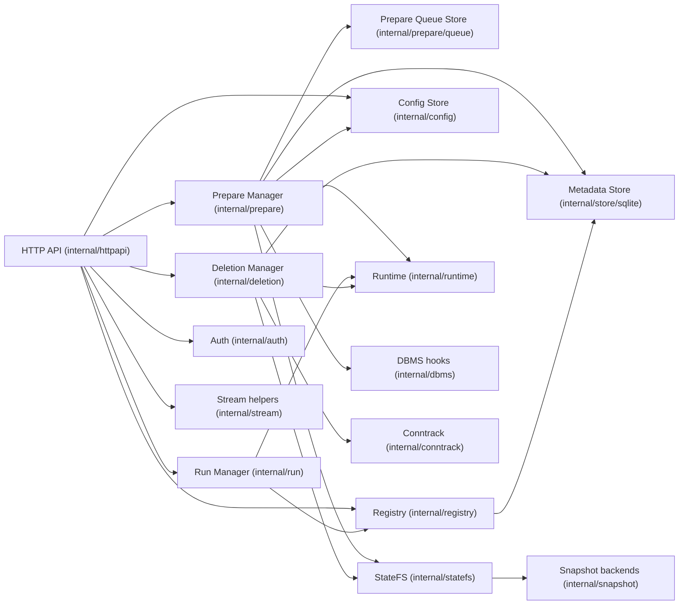
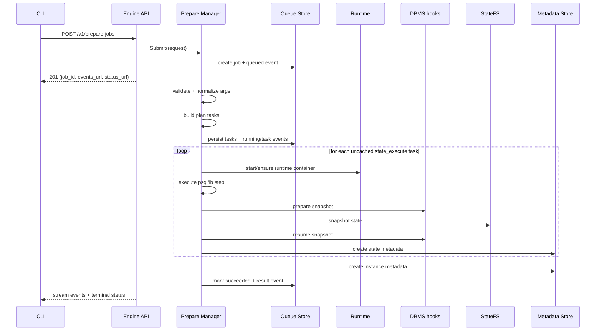
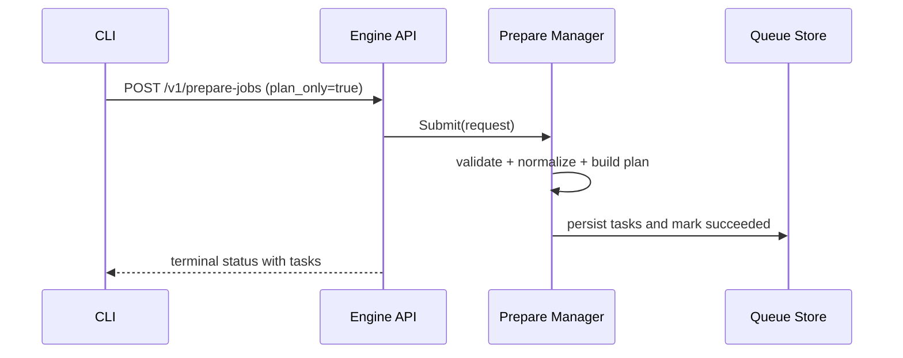
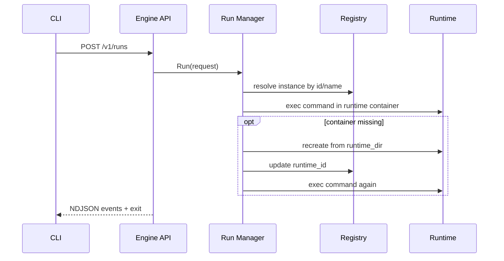
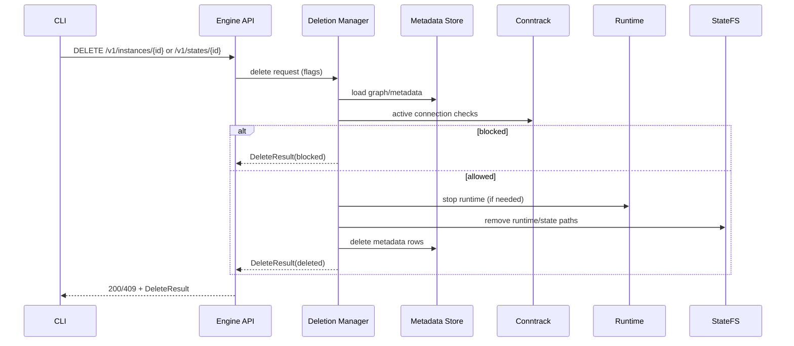

# sqlrs Engine Internals (Local Profile)

Scope: internal structure of the local `sqlrs-engine` process. This document
describes the current package-level design and request flows implemented in `backend/local-engine-go`.

## 1. Component Model

### 1.1 API layer

- Exposes local engine endpoints under `/v1/*`.
- Uses bearer auth for all routes except `/v1/health`.
- Supports:
  - config schema and value management (`/v1/config*`)
  - prepare jobs, events stream, tasks (`/v1/prepare-jobs*`, `/v1/tasks`)
  - run execution (`/v1/runs`)
  - names/instances/states listing and lookup (`/v1/names*`, `/v1/instances*`, `/v1/states*`)
  - instance/state/job deletion.
- Streams prepare events and run events as NDJSON.

### 1.2 Prepare manager (planner + executor)

`internal/prepare` owns the full prepare lifecycle:

- validates request (`prepare_kind`, args, image)
- normalizes `psql`/`lb` inputs
- resolves image digest when needed (`resolve_image` task)
- builds plan tasks (`plan`, `state_execute`, `prepare_instance`)
- executes tasks and snapshots resulting states
- writes job/task/events to the queue store
- supports `plan_only` jobs (returns tasks, does not create instance)
- supports job deletion (`force`, `dry_run`) and retention trimming.

There is no separate `internal/executor` package in the current implementation.

### 1.3 Queue store

`internal/prepare/queue` persists jobs, tasks, and events in SQLite.

- recovery: queued/running jobs are reloaded and resumed on startup
- retention: completed jobs are trimmed by signature (`orchestrator.jobs.maxIdentical`)
- cleanup: deleting a job also removes `<state-store-root>/jobs/<job_id>`.

### 1.4 Run manager

`internal/run` executes commands in instance containers.

- validates run kind (`psql`, `pgbench`) and arguments
- resolves instance by id/name via registry
- executes command via runtime
- on missing container, recreates it from `runtime_dir` (if present),
  updates `runtime_id`, and emits recovery log events.

### 1.5 StateFS and snapshot backends

`internal/statefs` provides filesystem abstraction and path layout.

- delegates snapshot operations to `internal/snapshot`
- backend selection: `auto`, `overlay`, `btrfs`, `copy`
- state layout is derived from image id under:
  - `<state-store-root>/engines/<engine>/<version>/base`
  - `<state-store-root>/engines/<engine>/<version>/states/<state_id>`.

### 1.6 Runtime and DBMS hooks

- `internal/runtime` is a container runtime adapter (Docker/Podman CLI): init
  base, start/stop containers, exec commands, run one-shot containers.
- `internal/dbms` provides Postgres snapshot hooks (`PrepareSnapshot`,
  `ResumeSnapshot`) around snapshot operations.

### 1.7 Deletion and connection tracking

- `internal/deletion` builds and executes delete trees for instances/states.
- `internal/conntrack` is pluggable; current local wiring in `cmd/sqlrs-engine`
  uses `conntrack.Noop`.

### 1.8 Registry and metadata store

- `internal/registry` encapsulates name/id resolution and list/get operations.
- `internal/store` defines interfaces; `internal/store/sqlite` implements them.
- metadata (names/instances/states) and prepare queue tables are stored in `<state-store-root>/state.db`.

### 1.9 Config and discovery

- runtime config is stored in `<state-store-root>/config.json` and exposed via `/v1/config*`.
- engine discovery for CLI uses `engine.json` written by `cmd/sqlrs-engine`
  (endpoint, pid, auth token, version, instance id).

## 2. Flows (Local)

### 2.1 Prepare flow

### 2.2 Plan-only flow

### 2.3 Run flow

### 2.4 Deletion flow

## 3. Concurrency and process model

- Single engine process per local workspace profile.
- Prepare jobs execute asynchronously; multiple jobs may run concurrently.
- State creation is serialized per target state via filesystem lock files.
- Queue recovery on startup resumes non-terminal jobs.

## 4. Persistence and discovery

- State store root: `<state-dir>/state-store` by default, overridable by `SQLRS_STATE_STORE`.
- SQLite DB: `<state-store-root>/state.db`.
- Config file: `<state-store-root>/config.json`.
- Job runtime dirs: `<state-store-root>/jobs/<job_id>/runtime`.
- CLI discovery file: `engine.json` (path passed by `--write-engine-json`).

## 5. Error handling

- Long operations return a prepare job; terminal failures are reported via job
  status and event stream.
- Validation failures return `400` with structured error payload.
- Runtime availability failures (Docker/Podman) are surfaced as actionable API errors.
- If cached state is detected as dirty/incomplete, prepare invalidates and
  rebuilds it.

## 6. Evolution hooks

- Keep runtime adapter replaceable (Docker/Podman and future OCI runtimes) without
  changing API contracts.
- Swap/extend StateFS backends while keeping `statefs.StateFS` stable.
- Replace `conntrack.Noop` with active DB connection tracking in local/shared profiles.
