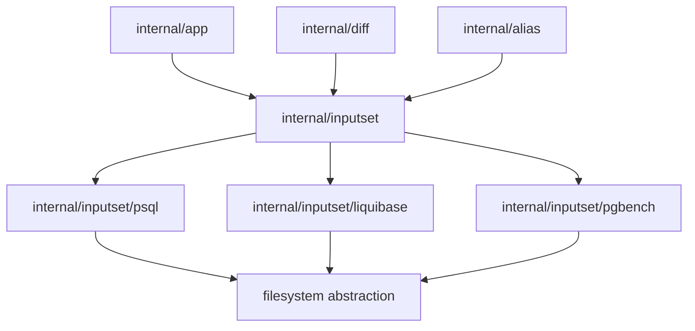

# Компонентная структура CLI InputSet

Этот документ определяет утвержденный общий CLI-side слой для
**семантики file-bearing команд** в `sqlrs`.

Цель слоя — дать `prepare`, `plan`, `run`, `diff` и `alias check` один source
of truth для:

- парсинга file-bearing аргументов каждого поддерживаемого tool kind;
- разрешения этих аргументов в host-side пути;
- построения resulting file set / closure;
- проекции одной и той же семантической модели в нужный формат для конкретного
  consumer.

## 1. Scope и цели

- Слой полностью **CLI-only**. Новый engine API не вводится.
- Слой организован по **tool kind**, а не по top-level глаголу CLI:
  - `psql`
  - `liquibase`
  - `pgbench`
- Слой сначала владеет **host-path semantics**. Runtime-specific переписывания,
  такие как WSL conversion, Liquibase `exec_mode`, `-f -` или `/dev/stdin`,
  происходят позже в consumer-specific projection.
- Слой должен обслуживать несколько consumer-ов без дублирования parser-ов:
  - `prepare:*`
  - `plan:*`
  - `run:*`
  - `sqlrs diff`
  - `sqlrs alias check`
  - позже `discover`, provenance и cache explanation

## 2. Правила дизайна

1. **Один source of truth на tool kind**

   Семантика файловых входов `psql` принадлежит одному общему `psql`
   component, семантика `liquibase` — одному общему `liquibase` component и т.д.
   `diff` не должен поддерживать собственный per-kind parser/builder.

2. **Отделять host-side semantics от runtime projection**

   Общий слой разрешает file-bearing inputs в host-path space и выдаёт
   reusable semantic model. Дальше consumers строят из неё:
   - runtime args для `prepare:*` / `plan:*`;
   - run steps/stdin materialization для `run:*`;
   - file lists + hashes для `diff`;
   - declared refs, closure checks и issues для `alias check`.

3. **Сначала parse, потом bind, потом collect**

   Общий pipeline такой:

   ```text
   raw args
   -> kind-specific parse
   -> host-path binding через resolver
   -> file-set collection через filesystem access
   -> consumer-specific projection
   ```

4. **Consumers должны оставаться тонкими**

   `internal/app`, `internal/diff` и `internal/alias` отвечают за orchestration,
   command-shape rules и rendering. Они не переопределяют per-kind path
   semantics.

## 3. Компоненты и ответственность

| Компонент                     | Ответственность                                                                                                                                                                                           | Основные consumers                                             |
| ----------------------------- | --------------------------------------------------------------------------------------------------------------------------------------------------------------------------------------------------------- | -------------------------------------------------------------- |
| `internal/inputset`           | Общие core-абстракции: path resolvers, filesystem abstraction, типы collected input set, shared hashing/ordering helpers.                                                                                 | `internal/app`, `internal/diff`, `internal/alias`              |
| `internal/inputset/psql`      | Парсить `psql` file-bearing args, bind-ить пути, строить include closure (`\i`, `\ir`, `\include`, `\include_relative`), проектировать в prepare/run/diff/alias-check представления.                      | `prepare:psql`, `plan:psql`, `run:psql`, `diff`, `alias check` |
| `internal/inputset/liquibase` | Парсить Liquibase path-bearing args (`--changelog-file`, `--defaults-file`, `--searchPath`), bind-ить search roots, строить changelog graph, проектировать в prepare/plan/diff/alias-check представления. | `prepare:lb`, `plan:lb`, `diff`, `alias check`                 |
| `internal/inputset/pgbench`   | Парсить `pgbench` file-bearing args, bind-ить пути, materialize-ить runtime stdin projection, отдавать declared file refs для alias validation.                                                           | `run:pgbench`, `alias check`                                   |
| `internal/app`                | Строить command context, выбирать kind component, передавать правильный path resolver, запрашивать runtime projection и вызывать transport executors.                                                     | Исполнение CLI-команд                                          |
| `internal/diff`               | Разрешать left/right scope roots, вызывать тот же kind component для обеих сторон, сравнивать collected input sets и рендерить human/JSON diff.                                                           | `sqlrs diff`                                                   |
| `internal/alias`              | Разрешать alias files и alias-relative base, затем вызывать тот же kind component для declared refs и optional closure checks.                                                                            | `sqlrs alias check`                                            |

## 4. Общий pipeline

### 4.1 Parse

Каждый kind package парсит только свой file-bearing syntax и производит
semantic command spec.

Примеры:

- `psql`: `-f`, `--file`, `-ffile`
- `liquibase`: `--changelog-file`, `--defaults-file`, `--searchPath`
- `pgbench`: `-f`, `--file`, weighted file args

На этом этапе не решается, как именно rebasing путей зависит от контекста.

### 4.2 Bind

Распарсенный spec bind-ится через consumer-provided resolver.

Resolvers кодируют context-dependent rules, например:

- raw CLI cwd/workspace-root resolution;
- alias-file-relative resolution;
- diff side root resolution (`--from-path` / `--to-path` или worktree root).

Результат binding — normalized host-side file refs и search roots без
привязки к runtime-specific path format.

### 4.3 Collect

Bound spec строит `InputSet` через filesystem abstraction:

- direct file refs;
- recursively discovered includes/changelog edges;
- deterministic ordering;
- stable identity metadata для hashing и diffing.

### 4.4 Project

Consumers получают свои представления из одного и того же bound spec или
collected set:

- `prepare:*` / `plan:*`: runtime args и work-dir/search-path projection;
- `run:*`: run steps, stdin bodies или command args;
- `diff`: relative file list + content hashes/snippets;
- `alias check`: issues по declared paths и, где включено, closure validation.

## 5. Предлагаемые core types

Иллюстративная форма:

```go
type PathResolver interface {
    ResolveFile(raw string) (ResolvedPath, error)
    ResolveSearchPath(raw string) ([]ResolvedPath, error)
}

type FileSystem interface {
    Stat(path string) (FileInfo, error)
    ReadFile(path string) ([]byte, error)
    ReadDir(path string) ([]DirEntry, error)
}

type KindComponent interface {
    Parse(args []string) (CommandSpec, error)
}

type CommandSpec interface {
    Bind(resolver PathResolver) (BoundSpec, error)
}

type BoundSpec interface {
    DeclaredRefs() []DeclaredRef
    Collect(fs FileSystem) (InputSet, error)
}

type InputSet struct {
    Entries []InputEntry
}

type InputEntry struct {
    RelativePath string
    AbsolutePath string
    Role         string
    Origin       string
}
```

Конкретные имена типов могут отличаться. Архитектурно важно само staged
разделение между parse, bind, collect и projection.

## 6. Предлагаемый layout пакетов

```text
frontend/cli-go/internal/inputset/
  types.go
  resolver.go
  filesystem.go
  hash.go
  psql/
    parse.go
    bind.go
    collect.go
    project_prepare.go
    project_run.go
  liquibase/
    parse.go
    bind.go
    collect.go
    project_prepare.go
  pgbench/
    parse.go
    bind.go
    project_run.go
```

Точные имена файлов можно подобрать иначе, но граница пакета должна явно
фиксировать source of truth по каждому kind.

## 7. Владение данными

- Raw argv принадлежит command orchestrator (`internal/app`, `internal/diff`
  или `internal/alias`) до передачи выбранному kind component.
- Parsed specs, bound specs и collected input sets **эфемерны** и живут только
  в рамках одного CLI invocation.
- Source of truth остаются файлы на диске; слой сам по себе не вводит
  persistent cache.
- Runtime-specific projections являются производными значениями и не должны
  становиться новым source of truth для path semantics.

## 8. Диаграмма зависимостей



## 9. Ссылки

- [`cli-component-structure.RU.md`](cli-component-structure.RU.md)
- [`diff-component-structure.RU.md`](diff-component-structure.RU.md)
- [`alias-inspection-component-structure.RU.md`](alias-inspection-component-structure.RU.md)
- [`git-aware-passive.RU.md`](git-aware-passive.RU.md)
- [`m2-local-developer-experience-plan.RU.md`](m2-local-developer-experience-plan.RU.md)
