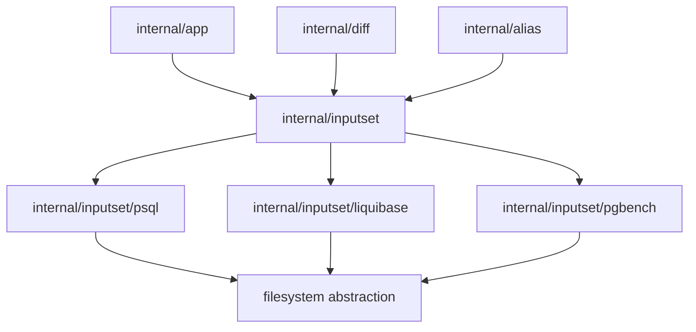

# CLI InputSet Component Structure

This document defines the approved shared CLI-side component layer for
**file-bearing command semantics** in `sqlrs`.

The goal is to give `prepare`, `plan`, `run`, `diff`, and `alias check` one
source of truth for:

- parsing file-bearing arguments for each supported tool kind;
- resolving those arguments into host-side paths;
- collecting the resulting file set / closure;
- projecting the same semantic model into consumer-specific outputs.

## 1. Scope and goals

- The layer is **CLI-only**. It does not introduce a new engine API.
- The layer is organized by **tool kind**, not by top-level CLI verb:
  - `psql`
  - `liquibase`
  - `pgbench`
- The layer owns **host-path semantics** first. Runtime-specific rewrites such as
  WSL conversion, Liquibase `exec_mode`, `-f -`, or `/dev/stdin` happen later in
  consumer-specific projections.
- The layer must support multiple consumers without duplicating parsers:
  - `prepare:*`
  - `plan:*`
  - `run:*`
  - `sqlrs diff`
  - `sqlrs alias check`
  - later `discover`, provenance, and cache explanation

## 2. Design rules

1. **One source of truth per tool kind**

   `psql` file semantics belong to one shared `psql` component, `liquibase`
   semantics belong to one shared `liquibase` component, and so on. `diff`
   must not keep its own per-kind parser/builder.

2. **Split host-side semantics from runtime projection**

   The shared layer resolves file-bearing inputs in host-path space and produces
   a reusable semantic model. Consumers then derive:
   - runtime args for `prepare:*` / `plan:*`;
   - run steps/stdin materialization for `run:*`;
   - file lists + hashes for `diff`;
   - declared refs, closure checks, and issues for `alias check`.

3. **Parse, then bind, then collect**

   The shared pipeline is:

   ```text
   raw args
   -> kind-specific parse
   -> host-path binding via resolver
   -> file-set collection via filesystem access
   -> consumer-specific projection
   ```

4. **Consumers stay thin**

   `internal/app`, `internal/diff`, and `internal/alias` provide orchestration,
   command-shape rules, and rendering. They do not reimplement per-kind path
   semantics.

## 3. Components and responsibilities

| Component                     | Responsibility                                                                                                                                                                         | Primary consumers                                              |
| ----------------------------- | -------------------------------------------------------------------------------------------------------------------------------------------------------------------------------------- | -------------------------------------------------------------- |
| `internal/inputset`           | Shared core abstractions: path resolvers, filesystem abstraction, collected input-set types, shared hashing/ordering helpers.                                                          | `internal/app`, `internal/diff`, `internal/alias`              |
| `internal/inputset/psql`      | Parse `psql` file-bearing args, bind paths, collect include closure (`\i`, `\ir`, `\include`, `\include_relative`), project to prepare/run/diff/alias-check views.                     | `prepare:psql`, `plan:psql`, `run:psql`, `diff`, `alias check` |
| `internal/inputset/liquibase` | Parse Liquibase path-bearing args (`--changelog-file`, `--defaults-file`, `--searchPath`), bind search roots, collect changelog graph, project to prepare/plan/diff/alias-check views. | `prepare:lb`, `plan:lb`, `diff`, `alias check`                 |
| `internal/inputset/pgbench`   | Parse `pgbench` file-bearing args, bind paths, materialize runtime stdin projection, expose declared file refs for alias validation.                                                   | `run:pgbench`, `alias check`                                   |
| `internal/app`                | Build command context, choose the kind component, provide the right path resolver, request runtime projections, and call transport executors.                                          | CLI execution                                                  |
| `internal/diff`               | Resolve left/right scope roots, call the same kind component on each side, compare collected input sets, render human/JSON diff.                                                       | `sqlrs diff`                                                   |
| `internal/alias`              | Resolve alias files and alias-relative bases, then call the same kind component for declared refs and optional closure checks.                                                         | `sqlrs alias check`                                            |

## 4. Shared pipeline

### 4.1 Parse

Each kind package parses only its own file-bearing syntax and produces a
semantic command spec.

Examples:

- `psql`: `-f`, `--file`, `-ffile`
- `liquibase`: `--changelog-file`, `--defaults-file`, `--searchPath`
- `pgbench`: `-f`, `--file`, weighted file args

This stage does not decide how paths are rebased.

### 4.2 Bind

The parsed spec is bound with a consumer-provided resolver.

Resolvers encode context-dependent rules such as:

- raw CLI cwd/workspace-root resolution;
- alias-file-relative resolution;
- diff side root resolution (`--from-path` / `--to-path` or a ref worktree plus mirrored cwd slice).

Binding produces normalized host-side file references and search roots without
committing to a runtime-specific path format.

### 4.3 Collect

The bound spec collects an `InputSet` through a filesystem abstraction:

- direct file refs;
- recursively discovered includes/changelog edges;
- deterministic ordering;
- stable identity metadata for hashing and diffing.

### 4.4 Project

Consumers derive their own outputs from the same bound spec or collected set:

- `prepare:*` / `plan:*`: runtime args and work-dir/search-path projection;
- `run:*`: run steps, stdin bodies, or command args;
- `diff`: relative file list + content hashes/snippets;
- `alias check`: declared-path issues and, where enabled, closure validation.

## 5. Suggested core types

Illustrative shape:

```go
type PathResolver interface {
    ResolveFile(raw string) (ResolvedPath, error)
    ResolveSearchPath(raw string) ([]ResolvedPath, error)
}

type FileSystem interface {
    Stat(path string) (FileInfo, error)
    ReadFile(path string) ([]byte, error)
    ReadDir(path string) ([]DirEntry, error)
}

type KindComponent interface {
    Parse(args []string) (CommandSpec, error)
}

type CommandSpec interface {
    Bind(resolver PathResolver) (BoundSpec, error)
}

type BoundSpec interface {
    DeclaredRefs() []DeclaredRef
    Collect(fs FileSystem) (InputSet, error)
}

type InputSet struct {
    Entries []InputEntry
}

type InputEntry struct {
    RelativePath string
    AbsolutePath string
    Role         string
    Origin       string
}
```

The exact type names can vary. The important architectural rule is the staged
split between parse, bind, collect, and projection.

## 6. Suggested package layout

```text
frontend/cli-go/internal/inputset/
  types.go
  resolver.go
  filesystem.go
  hash.go
  psql/
    parse.go
    bind.go
    collect.go
    project_prepare.go
    project_run.go
  liquibase/
    parse.go
    bind.go
    collect.go
    project_prepare.go
  pgbench/
    parse.go
    bind.go
    project_run.go
```

Exact file names are flexible, but the package boundary should make the
kind-specific source of truth explicit.

## 7. Data ownership

- Raw argv belongs to the command orchestrator (`internal/app`, `internal/diff`,
  or `internal/alias`) until handed to the selected kind component.
- Parsed specs, bound specs, and collected input sets are **ephemeral** and live
  only for one CLI invocation.
- Files on disk remain the source of truth; the layer introduces no persistent
  cache by itself.
- Runtime-specific projections are derived values and should not become the new
  source of truth for path semantics.

## 8. Dependency diagram



## 9. References

- [`cli-component-structure.md`](cli-component-structure.md)
- [`diff-component-structure.md`](diff-component-structure.md)
- [`alias-inspection-component-structure.md`](alias-inspection-component-structure.md)
- [`git-aware-passive.md`](git-aware-passive.md)
- [`m2-local-developer-experience-plan.md`](m2-local-developer-experience-plan.md)
