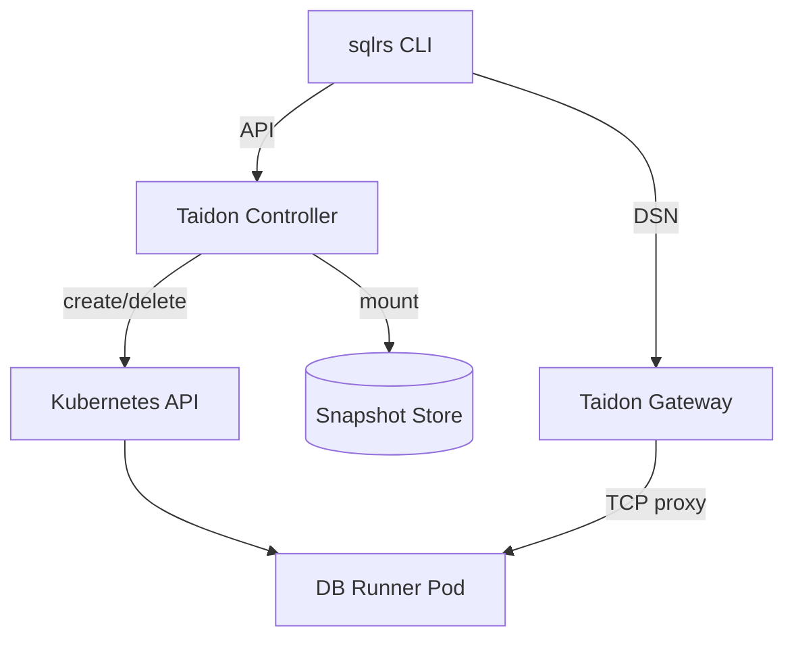
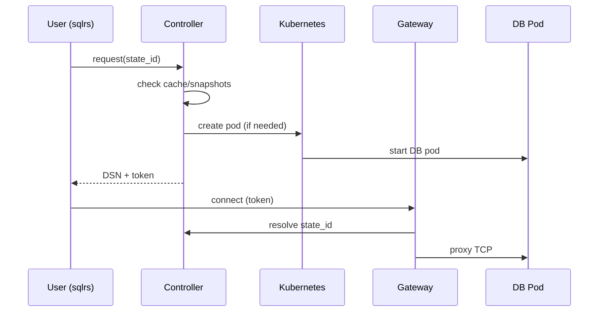
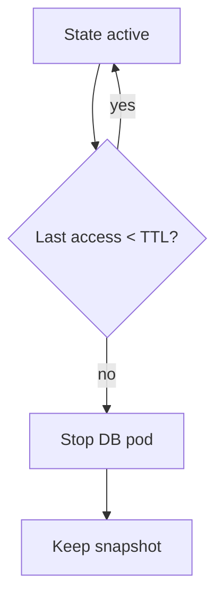
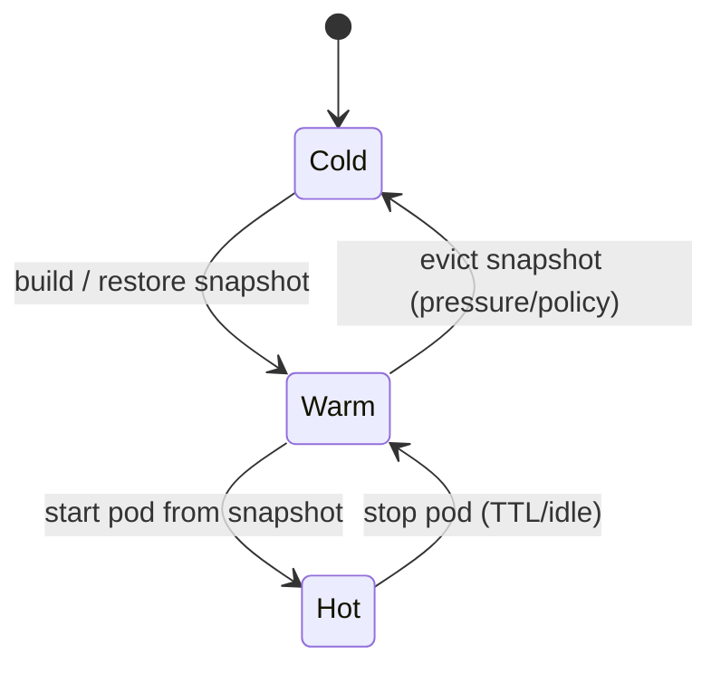
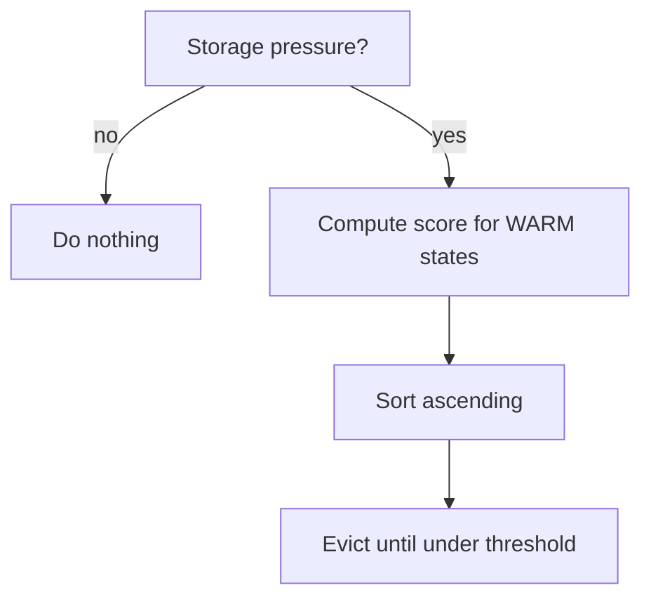

# Taidon + Kubernetes: архитектура с единой точкой входа

Этот документ описывает базовую архитектуру Taidon в Kubernetes, где
**каждое состояние БД поднимается в отдельном контейнере**, а доступ
снаружи кластера осуществляется **через единую точку входа (gateway)**.

Цель архитектуры:

- поддержать stateful workloads (БД с конкретным состоянием),
- обеспечить воспроизводимость и кэширование,
- не полагаться на стандартный Kubernetes autoscaling,
- сохранить простой и безопасный внешний доступ.

---

## 1. Ключевые понятия

### State (DB state)

**State** — это логически определённое состояние базы данных, полученное
применением конкретного набора prepare-операций (миграций, SQL-скриптов)
к базовому образу СУБД.

State идентифицируется:

- fingerprint’ом входных файлов (хеши контента),
- типом СУБД и её версией,
- параметрами исполнения prepare-драйвера.

### Snapshot

**Snapshot** — сохранённое представление state, из которого можно
быстро восстановить рабочий экземпляр БД.

Snapshot может существовать без активного контейнера.

### Active instance

**Active instance** — запущенный контейнер СУБД, обслуживающий подключения
к конкретному state.

---

## 2. Общая схема компонентов



---

## 3. Компоненты системы

### 3.1 sqlrs (CLI)

Роль:

- формирует prepare/run контекст,
- вычисляет state_id (совместно с controller),
- запрашивает состояние,
- получает DSN и токен доступа,
- запускает пользовательские команды (`psql`, `pytest`, и т.д.).

CLI **не взаимодействует напрямую с Kubernetes**.

---

### 3.2 Taidon Controller (Control Plane)

Роль:

- центральный “мозг” системы,
- принимает запросы от CLI/ботов,
- управляет жизненным циклом состояний,
- принимает решения об использовании кэша,
- создаёт и удаляет Kubernetes-ресурсы.

Основные функции:

- state resolution,
- snapshot management,
- lease / TTL управление,
- eviction policies,
- API для gateway.

---

### 3.3 Snapshot Store

Роль:

- хранение снапшотов состояний.

Варианты реализации:

- локальные диски нод,
- сетевое хранилище (NFS, Ceph),
- объектное хранилище (с восстановлением).

Controller рассматривает snapshot store как абстракцию.

---

### 3.4 DB Runner Pod

Роль:

- запуск конкретной СУБД (например PostgreSQL),
- монтирование snapshot’а,
- обслуживание TCP-подключений.

Особенности:

- pod соответствует **одному** state,
- pod считается disposable,
- масштабирование pod’ов — решение Taidon, не Kubernetes.

---

### 3.5 Taidon Gateway (единая точка входа)

Роль:

- единственный внешний TCP endpoint,
- приём подключений от клиентов,
- маршрутизация к нужному DB pod по токену/state_id,
- контроль TTL и прав доступа.

Gateway **не знает**, как создавать state — он только маршрутизирует.

---

## 4. Потоки взаимодействия

### 4.1 Поднятие состояния и запуск команды



---

### 4.2 Обработка входящего подключения в Gateway

Алгоритм:

1. Принять TCP-соединение.
2. Извлечь токен (из user/password или initial packet).
3. Проверить токен (подпись, TTL).
4. Запросить у controller:
   - существует ли active instance,
   - куда проксировать.
5. Установить TCP proxy до DB pod.
6. Обновить last_access для state.

---

### 4.3 Lease и остановка неиспользуемых состояний



---

## 5. Автоскейлинг в Taidon (подробно)

В Kubernetes “автоскейлинг” обычно означает увеличение/уменьшение количества pod’ов
для **stateless** сервисов по метрикам CPU/RAM/очередям. В Taidon ключевая единица
управления — **состояние (state)**, а не pod. Поэтому Taidon-автоскейлинг — это
**политики управления жизненным циклом состояний** (active instances и snapshots).

### 5.1 Что именно масштабируется

Taidon оперирует тремя “уровнями присутствия” состояния:

1. **Hot (active instance)** — запущенный DB pod, готовый принимать подключения.
2. **Warm (snapshot only)** — pod остановлен, но snapshot доступен для быстрого восстановления.
3. **Cold (evicted)** — snapshot удалён; восстановление потребует пересборки из более ранних опорных точек
   или полной прогонки prepare-цепочки.

Масштабирование в Taidon — это перевод состояний между Hot/Warm/Cold.



### 5.2 Какие “ресурсы” ограничены

Автоскейлер принимает решения исходя из ограничений:

- **CPU/RAM** на нодах (сколько DB pod’ов можно держать Hot).
- **I/O и throughput snapshot store** (сколько восстановлений/сборок параллельно).
- **Объём snapshot store** (сколько Warm состояний можно хранить).
- **Скорость восстановления** (latency SLO для `sqlrs run`).

### 5.3 Метаданные, которые нужны автоскейлеру

Для каждого state контроллер хранит метаданные (в собственной БД/CRD/индексе):

- `state_id`
- `inputs_fingerprint` (хеши файлов/параметров prepare)
- `engine_fingerprint` (тип/версия СУБД, важные флаги)
- `size_bytes` (оценка размера snapshot)
- `build_cost_ms` (оценка времени сборки “с нуля” или от ближайшего checkpoint)
- `restore_cost_ms` (оценка времени старта pod из snapshot)
- `last_access_ts`
- `access_count_1h/24h` (частота обращений)
- `pinned_reason` (main/tag/PR/ручной pin)
- `lease_expiry_ts` (если активен lease)
- `status`: `HOT | WARM | COLD | BUILDING | STARTING | FAILED`

### 5.4 Политики “скейлинга” (решения)

#### 5.4.1 Downscale: Hot → Warm (остановка pod)

Триггеры:

- истёк lease (TTL),
- idle timeout (нет соединений/запросов X минут),
- давление на CPU/RAM.

Решение:

- удалить DB pod,
- сохранить snapshot (Warm).

#### 5.4.2 Eviction: Warm → Cold (удаление snapshot)

Триггеры:

- давление на объём snapshot store,
- “старые” состояния без обращений,
- завершённый/закрытый PR (если не pinned).

Решение:

- удалить snapshot,
- оставить только метаданные и (опционально) ссылку на ближайший checkpoint.

#### 5.4.3 Upscale: Warm/Cold → Hot (поднятие pod)

Триггеры:

- запрос от CLI,
- warmup hook (PR/main/tag),
- предиктивный прогрев (частые обращения).

Решение:

- если Warm: старт pod из snapshot,
- если Cold: восстановить snapshot (из checkpoint) или пересобрать цепочку.

### 5.5 Алгоритм выбора кандидатов на eviction (набросок)

Один из простых и рабочих подходов — оценка “ценности удержания”:

- ценность ↑ при высокой частоте обращений и высоком build_cost
- ценность ↑ при pinned (main/tag/active PR)
- ценность ↓ при большом размере и низкой частоте

Пример скоринга (не как финальная формула, а как каркас):

```text
score(state) =
  + w1 * log(1 + access_count_24h)
  + w2 * log(1 + build_cost_ms)
  + w3 * pinned_bonus
  - w4 * log(1 + size_bytes)
  - w5 * age_penalty(last_access_ts)
```

Eviction выбирает состояния с минимальным score, пока не будет достигнут целевой объём.



### 5.6 Взаимодействие с Kubernetes autoscaling (HPA/VPA)

Kubernetes HPA/VPA применимы к **stateless** компонентам:

- Gateway: HPA по метрикам соединений/CPU
- Controller: HPA по RPS/CPU (если API нагружен)
- Background workers: HPA по длине очереди

Для DB pod’ов HPA **не подходит**, потому что:

- pod не является “репликой сервиса”, а представляет уникальный state,
- добавление pod’ов “по CPU” не решает проблему, если нужен другой state,
- ключевые решения — semantic (Hot/Warm/Cold), а не ресурсные.

### 5.7 Warmup как часть автоскейлинга

Warmup — это управляемый upscale (Warm/Cold → Warm/Hot) заранее. Его источники:

- CI/CD прогон (если использует общий snapshot store),
- GitHub hooks (PR opened/sync, merge to main, tags),
- ручной вызов `sqlrs warmup ...`.

Warmup полезен для снижения P95 latency, особенно когда кэш физически не общий между пользователями/CI.

## 6. Eviction и политики хранения

Для каждого state controller хранит метаданные:

- size,
- build_cost,
- last_access,
- access_frequency,
- pinned (PR, tag, main).

Примеры политик:

- удалять pod при простое > X минут,
- хранить snapshot, если build_cost высокий,
- пинить состояния `main` и `release tags`,
- удалять ephemeral PR states первыми.

---

## 7. Безопасность и внешний доступ

### 7.1 Почему одна точка входа

- меньше surface area,
- единая аутентификация,
- простая ротация секретов,
- нет explosion’а Service/LoadBalancer ресурсов.

### 7.2 Токены доступа и протокол Gateway ↔ Controller

Единая точка входа требует, чтобы Gateway мог безопасно определить:

- **какой state** запрашивает клиент,
- **разрешено ли** подключение,
- **куда проксировать** соединение.

#### 7.2.1 Формат токена (рекомендуемый)

Рекомендуется self-contained токен (подпись контроллером), чтобы Gateway мог проверять
валидность без обращения к внешним системам. Практически это может быть:

- JWT (HS256/EdDSA),
- или компактный бинарный токен (Base64URL) по вашему формату.

Минимальный payload токена:

- `sid`: `state_id`
- `exp`: время истечения (unix ts)
- `iat`: время выпуска
- `scope`: `ro | rw` (read-only / read-write)
- `aud`: идентификатор кластера/инсталляции (защита от “переноса” токена)
- `sub`: субъект (пользователь/CI job/бот), опционально
- `nonce`: случайность (опционально, для защиты от повторного использования в некоторых режимах)
- `limits`: лимиты сессии (опционально): max_conn, max_idle, max_duration

Подпись:

- секрет (HS256) проще для MVP,
- асимметричная подпись (EdDSA) удобнее при разделении ролей и ротации ключей.

Где хранить ключи:

- в Kubernetes Secret,
- с ротацией (ключи версионируются; Gateway принимает несколько активных ключей).

#### 7.2.2 Где передавать токен

Есть несколько практичных вариантов:

1. **В пароле DSN** (самый простой):
   - `postgres://taidon:<token>@db.taidon.example:5432/postgres`
2. **В имени пользователя** (если пароль занят):
   - `postgres://<token>@db.taidon.example:5432/postgres`
3. **Через отдельный стартовый протокол** (сложнее; обычно не нужно для MVP)

Для большинства клиентов Postgres DSN-в-пароле работает без дополнительных интеграций.

#### 7.2.3 Протокол Gateway ↔ Controller (минимальный)

Gateway использует Controller как источник правды для маппинга:
`state_id → endpoint active instance` и для управления lease/last_access.

**API (вариант):** HTTP/JSON или gRPC внутри кластера.

##### Метод 1: Resolve (на новое соединение)

Запрос:

- `Resolve(state_id, token_claims)`

Ответ:

- `status`: `READY | STARTING | MISSING | FORBIDDEN`
- `target`: `host:port` (обычно ClusterIP Service или Pod IP)
- `lease`: `lease_id`, `lease_expiry`
- `retry_after_ms` (если STARTING)

Поведение:

- если state HOT: вернуть target сразу
- если state WARM: инициировать старт pod (если политика позволяет), вернуть STARTING
- если state COLD: инициировать восстановление/сборку (если разрешено), вернуть STARTING
- если токен невалиден/нет прав: FORBIDDEN

##### Метод 2: Touch (обновление активности)

Опционально, если вы не хотите делать Resolve на каждую активность:

- `Touch(lease_id)` или `Touch(state_id)`
- продлевает TTL/lease, обновляет last_access

##### Метод 3: Release (закрытие соединения)

Опционально (можно жить и без него):

- `Release(lease_id)`
- уменьшает счётчик активных соединений для state

#### 7.2.4 Алгоритм обработки подключения в Gateway (с учётом протокола)

```mermaid
flowchart TD
    A[Accept TCP conn] --> B[Extract token from DSN]
    B --> C[Validate signature + exp + aud]
    C -->|invalid| X[Reject]
    C --> D[Resolve(state_id) via Controller]
    D -->|READY| E[Connect to target]
    D -->|STARTING| F[Wait + retry (bounded)]
    D -->|FORBIDDEN| X
    D -->|MISSING| Y[Fail fast (not found)]
    E --> G[Proxy TCP stream]
    G --> H[On close: optional Release]
```

#### 7.2.5 Важные практические ограничения

- **Latency:** Resolve должен быть быстрым (обычно один внутрикластерный запрос).
- **Backpressure:** если много коннектов к состоянию, Controller может ограничивать `max_conn`.
- **Security:** никогда не логировать токен целиком; логировать только `sid` и `sub`/короткий отпечаток.
- **DoS:** rate limiting на Gateway по IP/субъекту и ограничение “сколько STARTING ожиданий”.

---

## 8. Минимальный MVP архитектуры

Для первого рабочего варианта достаточно:

1. Controller (single replica).
2. Gateway (single replica, TCP LB).
3. DB runner pods (on demand).
4. Snapshot store (локальный или простой shared).
5. TTL-based pod cleanup.
6. CLI → Controller → Gateway → DB flow.

---

## 9. Что можно добавлять дальше

- Read-only реплики состояний.
- Multi-tenant quotas.
- Warmup hooks (PR / main).
- Более умные eviction policies.
- Placement-aware scheduling (storage locality).
- Metrics и observability.

---

## 10. Ключевая идея (резюме)

> Kubernetes управляет **контейнерами**.  
> Taidon управляет **состояниями**.

Единая точка входа позволяет:

- изолировать сеть,
- централизовать безопасность,
- масштабировать архитектуру без усложнения UX.
