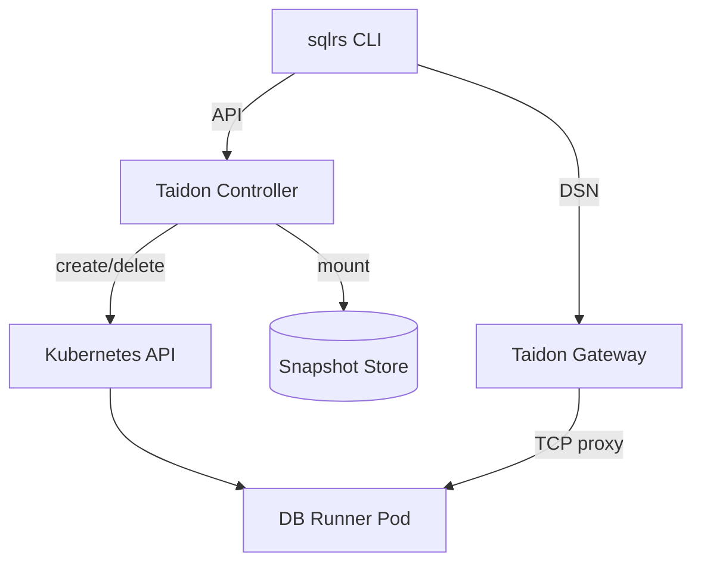
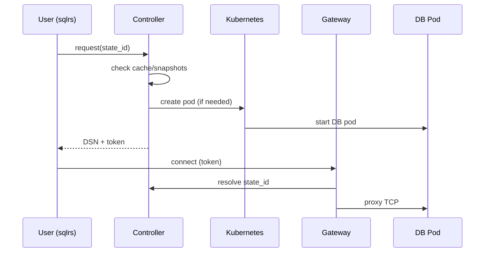
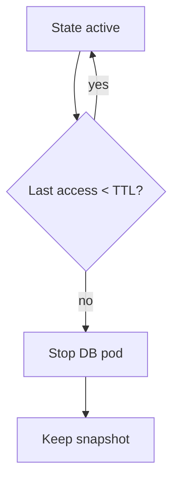
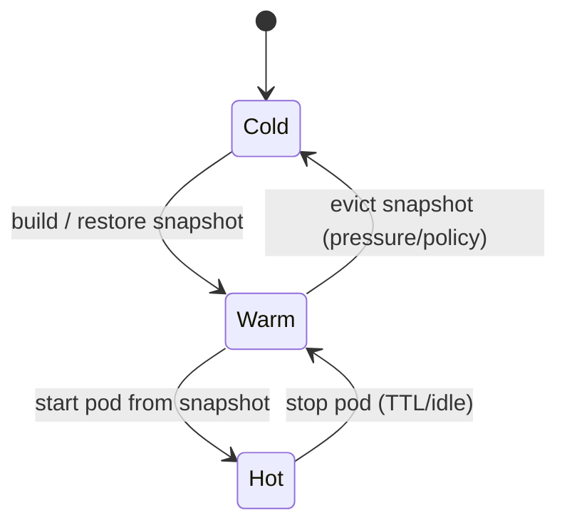
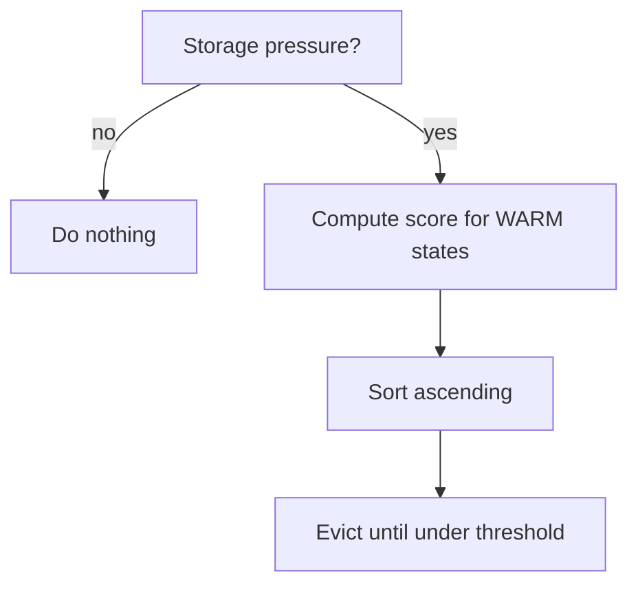

# Taidon + Kubernetes: architecture with a single entry point

This document describes a baseline Taidon architecture on Kubernetes where
**each DB state runs in its own container**, and external access to the cluster
goes **through a single entry point (gateway)**.

Architecture goals:

- support stateful workloads (DB with a specific state),
- ensure reproducibility and caching,
- avoid relying on standard Kubernetes autoscaling,
- keep external access simple and safe.

---

## 1. Key concepts

### State (DB state)

**State** is a logically defined database state obtained by applying a specific
set of prepare operations (migrations, SQL scripts) to a base DBMS image.

State is identified by:

- fingerprint of input files (content hashes),
- DBMS type and version,
- prepare driver execution parameters.

### Snapshot

**Snapshot** is a saved representation of a state from which a working DB
instance can be restored quickly.

A snapshot can exist without an active container.

### Active instance

**Active instance** is a running DB container that serves connections for a
specific state.

---

## 2. Component overview



---

## 3. System components

### 3.1 sqlrs (CLI)

Role:

- builds prepare/run context,
- computes state_id (together with controller),
- requests state,
- receives DSN and access token,
- runs user commands (`psql`, `pytest`, etc.).

The CLI **does not talk to Kubernetes directly**.

---

### 3.2 Taidon Controller (Control Plane)

Role:

- central "brain" of the system,
- accepts requests from CLI/bots,
- manages lifecycle of states,
- decides cache usage,
- creates and deletes Kubernetes resources.

Key functions:

- state resolution,
- snapshot management,
- lease / TTL control,
- eviction policies,
- API for gateway.

---

### 3.3 Snapshot Store

Role:

- storage for state snapshots.

Implementation options:

- local node disks,
- network storage (NFS, Ceph),
- object storage (with restore step).

Controller treats snapshot store as an abstraction.

---

### 3.4 DB Runner Pod

Role:

- run a specific DBMS (e.g., PostgreSQL),
- mount the snapshot,
- serve TCP connections.

Notes:

- pod maps to **one** state,
- pod is disposable,
- pod scaling is a Taidon decision, not Kubernetes.

---

### 3.5 Taidon Gateway (single entry point)

Role:

- single external TCP endpoint,
- accepts client connections,
- routes to the correct DB pod by token/state_id,
- enforces TTL and access policy.

Gateway **does not** know how to create state, it only routes.

---

## 4. Interaction flows

### 4.1 Bring up a state and run a command



---

### 4.2 Handling an incoming connection in Gateway

Algorithm:

1. Accept TCP connection.
2. Extract token (from user/password or initial packet).
3. Validate token (signature, TTL).
4. Ask controller:
   - whether an active instance exists,
   - where to proxy.
5. Establish TCP proxy to DB pod.
6. Update last_access for the state.

---

### 4.3 Lease and stopping unused states



---

## 5. Autoscaling in Taidon (detailed)

In Kubernetes, "autoscaling" usually means scaling stateless pods by
CPU/RAM/queue metrics. In Taidon, the key unit is a **state**, not a pod.
So Taidon autoscaling is **lifecycle policy for states** (active instances
and snapshots).

### 5.1 What is scaled

Taidon uses three "presence levels" for a state:

1. **Hot (active instance)**: running DB pod, ready for connections.
2. **Warm (snapshot only)**: pod stopped, snapshot available for quick restore.
3. **Cold (evicted)**: snapshot deleted; restore requires rebuild from checkpoint
   or full prepare chain replay.

Scaling in Taidon is moving states between Hot/Warm/Cold.



### 5.2 Constrained resources

Autoscaler decisions depend on constraints:

- **CPU/RAM** on nodes (how many DB pods can stay Hot).
- **I/O and throughput of snapshot store** (how many restores/builds in parallel).
- **Snapshot store capacity** (how many Warm states can be stored).
- **Restore speed** (latency SLO for `sqlrs run`).

### 5.3 Metadata required by the autoscaler

For each state the controller stores metadata (in its DB/CRD/index):

- `state_id`
- `inputs_fingerprint` (hashes of files/prepare params)
- `engine_fingerprint` (DB type/version, key flags)
- `size_bytes` (snapshot size estimate)
- `build_cost_ms` (build time from scratch or nearest checkpoint)
- `restore_cost_ms` (time to start pod from snapshot)
- `last_access_ts`
- `access_count_1h/24h` (access frequency)
- `pinned_reason` (main/tag/PR/manual pin)
- `lease_expiry_ts` (if lease is active)
- `status`: `HOT | WARM | COLD | BUILDING | STARTING | FAILED`

### 5.4 Scaling policies (decisions)

#### 5.4.1 Downscale: Hot -> Warm (stop pod)

Triggers:

- lease expired (TTL),
- idle timeout (no connections/queries for X minutes),
- CPU/RAM pressure.

Decision:

- delete DB pod,
- keep snapshot (Warm).

#### 5.4.2 Eviction: Warm -> Cold (delete snapshot)

Triggers:

- snapshot store capacity pressure,
- old states without access,
- closed PR (if not pinned).

Decision:

- delete snapshot,
- keep metadata and (optionally) pointer to nearest checkpoint.

#### 5.4.3 Upscale: Warm/Cold -> Hot (start pod)

Triggers:

- CLI request,
- warmup hook (PR/main/tag),
- predictive warmup (frequent access).

Decision:

- if Warm: start pod from snapshot,
- if Cold: restore snapshot from checkpoint or rebuild chain.

### 5.5 Eviction candidate selection (sketch)

One simple approach is a "retention value" score:

- higher value with high access frequency and high build_cost
- higher value when pinned (main/tag/active PR)
- lower value for large size and low frequency

Example scoring (not final formula, but a skeleton):

```text
score(state) =
  + w1 * log(1 + access_count_24h)
  + w2 * log(1 + build_cost_ms)
  + w3 * pinned_bonus
  - w4 * log(1 + size_bytes)
  - w5 * age_penalty(last_access_ts)
```

Eviction picks states with the lowest score until the target volume is reached.



### 5.6 Interaction with Kubernetes autoscaling (HPA/VPA)

Kubernetes HPA/VPA applies to **stateless** components:

- Gateway: HPA by connections/CPU
- Controller: HPA by RPS/CPU (if API is busy)
- Background workers: HPA by queue length

For DB pods HPA is **not suitable**, because:

- a pod is not a service replica but a unique state,
- adding pods "by CPU" does not solve a different state request,
- the key decisions are semantic (Hot/Warm/Cold), not purely resource-based.

### 5.7 Warmup as part of autoscaling

Warmup is a controlled upscale (Warm/Cold -> Warm/Hot) in advance. Sources:

- CI/CD runs (if they use a shared snapshot store),
- GitHub hooks (PR opened/sync, merge to main, tags),
- manual `sqlrs warmup ...`.

Warmup reduces P95 latency, especially when the cache is not physically shared
between users/CI.

## 6. Eviction and retention policies

For each state the controller stores:

- size,
- build_cost,
- last_access,
- access_frequency,
- pinned (PR, tag, main).

Policy examples:

- delete pod after idle > X minutes,
- keep snapshot if build_cost is high,
- pin `main` and `release tags`,
- evict ephemeral PR states first.

---

## 7. Security and external access

### 7.1 Why a single entry point

- less surface area,
- unified authentication,
- simple secret rotation,
- no explosion of Service/LoadBalancer resources.

### 7.2 Access tokens and Gateway <-> Controller protocol

Single entry point requires Gateway to securely determine:

- **which state** the client requests,
- **whether** the connection is allowed,
- **where** to proxy the connection.

#### 7.2.1 Token format (recommended)

A self-contained token (signed by controller) lets Gateway validate without
calling external systems. Practical options:

- JWT (HS256/EdDSA),
- or a compact binary token (Base64URL) in your own format.

Minimal token payload:

- `sid`: `state_id`
- `exp`: expiry time (unix ts)
- `iat`: issued at
- `scope`: `ro | rw` (read-only / read-write)
- `aud`: cluster/installation identifier (protects against token reuse)
- `sub`: subject (user/CI job/bot), optional
- `nonce`: random value (optional, for replay protection in some modes)
- `limits`: session limits (optional): max_conn, max_idle, max_duration

Signature:

- shared secret (HS256) is simpler for MVP,
- asymmetric signature (EdDSA) is better for role separation and key rotation.

Key storage:

- Kubernetes Secret,
- with rotation (versioned keys; Gateway accepts multiple active keys).

#### 7.2.2 Where to pass the token

Practical options:

1. **In DSN password** (simplest):
   - `postgres://taidon:<token>@db.taidon.example:5432/postgres`
2. **In username** (if password is taken):
   - `postgres://<token>@db.taidon.example:5432/postgres`
3. **Custom startup protocol** (harder; usually not needed for MVP)

For most Postgres clients, DSN password works without extra integrations.

#### 7.2.3 Gateway <-> Controller protocol (minimal)

Gateway uses Controller as the source of truth for mapping
`state_id -> active instance endpoint` and for managing lease/last_access.

**API option:** HTTP/JSON or gRPC within the cluster.

##### Method 1: Resolve (new connection)

Request:

- `Resolve(state_id, token_claims)`

Response:

- `status`: `READY | STARTING | MISSING | FORBIDDEN`
- `target`: `host:port` (usually ClusterIP Service or Pod IP)
- `lease`: `lease_id`, `lease_expiry`
- `retry_after_ms` (if STARTING)

Behavior:

- if state is HOT: return target immediately
- if state is WARM: initiate pod start (if policy allows), return STARTING
- if state is COLD: initiate restore/rebuild (if allowed), return STARTING
- if token invalid / no access: FORBIDDEN

##### Method 2: Touch (activity update)

Optional if you do not want Resolve on every activity:

- `Touch(lease_id)` or `Touch(state_id)`
- extends TTL/lease, updates last_access

##### Method 3: Release (connection close)

Optional (can live without it):

- `Release(lease_id)`
- decrements active connection count for the state

#### 7.2.4 Gateway connection handling algorithm

```mermaid
flowchart TD
    A[Accept TCP conn] --> B[Extract token from DSN]
    B --> C[Validate signature + exp + aud]
    C -->|invalid| X[Reject]
    C --> D[Resolve(state_id) via Controller]
    D -->|READY| E[Connect to target]
    D -->|STARTING| F[Wait + retry (bounded)]
    D -->|FORBIDDEN| X
    D -->|MISSING| Y[Fail fast (not found)]
    E --> G[Proxy TCP stream]
    G --> H[On close: optional Release]
```

#### 7.2.5 Practical constraints

- **Latency:** Resolve must be fast (usually one in-cluster call).
- **Backpressure:** if many conns to a state, Controller can enforce `max_conn`.
- **Security:** never log tokens; log only `sid` and `sub` or a short fingerprint.
- **DoS:** rate limit in Gateway by IP/subject and cap "STARTING wait" count.

---

## 8. Minimal MVP architecture

For the first working version:

1. Controller (single replica).
2. Gateway (single replica, TCP LB).
3. DB runner pods (on demand).
4. Snapshot store (local or simple shared).
5. TTL-based pod cleanup.
6. CLI -> Controller -> Gateway -> DB flow.

---

## 9. What to add next

- Read-only state replicas.
- Multi-tenant quotas.
- Warmup hooks (PR / main).
- Smarter eviction policies.
- Placement-aware scheduling (storage locality).
- Metrics and observability.

---

## 10. Key idea (summary)

> Kubernetes manages **containers**.  
> Taidon manages **states**.

Single entry point enables:

- network isolation,
- centralized security,
- scaling the architecture without UX complexity.
